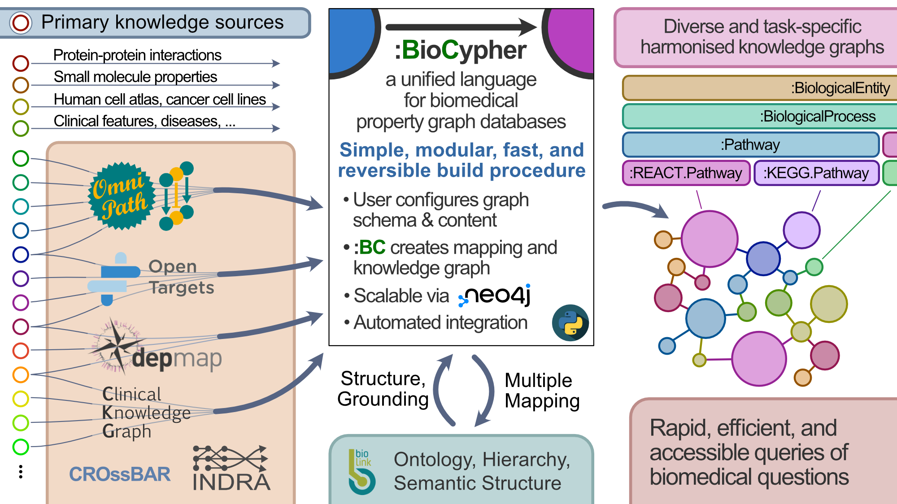

# BioCypher

This is the development repository for BioCypher, our proposal for a [unified
language of knowledge graph databases for systems
biology](whitepaper.md). It
shall serve as guideline and translation mechanism for both the creation of
knowledge graph databases from primary data as well as for the querying of these
databases. Our greater aim is to combine the computational power of graph
databases with the search for answers of our most pressing biological questions
and facilitate interfacing with cutting edge developments in the areas of
causal reasoning, representation learning, and natural language processing, all
of which depend on having a consistent descriptive vocabulary.

Ideally, BioCypher would enable "plug-and-play" functionality between
participating database systems, ie, arbitrary transfer of input or output from
one database to the other, and hybrid knowledge graphs made up of subsets of
different databases for specific purposes. We strive for being compliant with
the [openCypher](https://opencypher.org/) project. Technically, BioCypher will
be implemented as a python module, enforcing consensus nomenclature and graph
structure in creation of databases while providing translation facilities
between identifier systems.

## Usage

BioCypher is currently in prototype stage. To use it locally, please clone the
repository and use it as a local dependency or as a git submodule of your 
project. 

Exemplary usage of BioCypher to build a graph database is shown in the
[PyPath](https://github.com/saezlab/pypath) repository. The example
`PyPath->BioCypher` adapter is in the
[biocypher](https://github.com/saezlab/pypath/tree/master/pypath/biocypher)
directory, the example script for building a local database using the adapter
is located in the
[scripts](https://github.com/saezlab/pypath/blob/master/scripts/) directory.
The documentation can be found at https://saezlab.github.io/BioCypher/.

### Note for contributors

The project uses documentation format [Napoleon](
https://sphinxcontrib-napoleon.readthedocs.io/en/latest/example_google.html
) with a [Sphinx](https://www.sphinx-doc.org/en/master/) autodoc GitHub
Actions workflow. We use poetry for dependency management.
