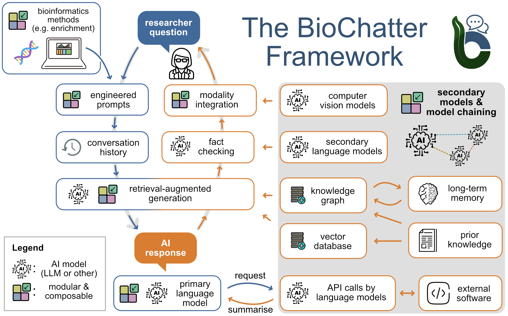

# Connect your Knowledge Graph to Large Language Models

BioChatter is a Python package implementing a generic backend library for the connection of biomedical applications to conversational AI. We describe the framework in this [paper](https://www.nature.com/articles/s41587-024-02534-3). BioChatter is part of the BioCypher ecosystem, connecting natively to BioCypher knowledge graphs. Find the docs [here](https://biochatter.org/).

### Abstract

-   :material-robot-excited:{ .lg .middle } __BioChatter Preview Web Apps__

    [:octicons-arrow-right-24: To BioChatter Web](https://chat.biocypher.org/)

-   :octicons-mark-github-24:{ .lg .middle } __BioChatter Repository__

    [:octicons-arrow-right-24: To BioChatter Repository](https://github.com/biocypher/biochatter)

