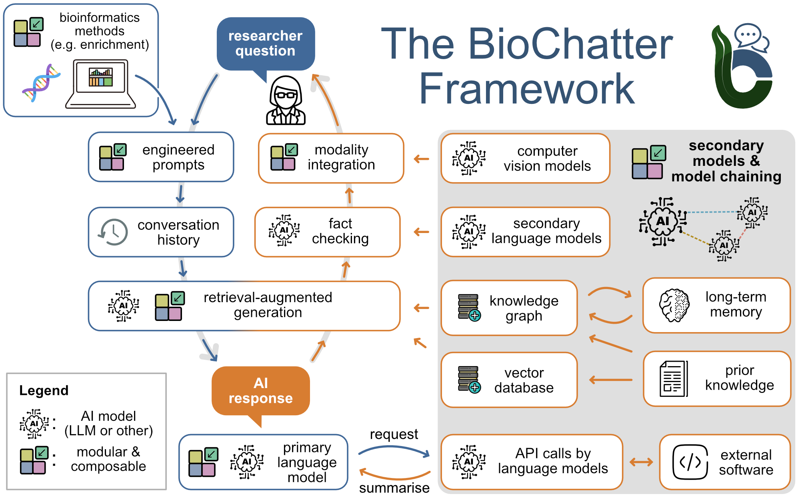

# Connect your Knowledge Graph to Large Language Models

BioChatter is a Python package implementing a generic backend library for the connection of biomedical applications to conversational AI. We describe the framework in this [paper](https://www.nature.com/articles/s41587-024-02534-3). BioChatter is part of the BioCypher ecosystem, connecting natively to BioCypher knowledge graphs. Find the docs [here](https://biochatter.org/).


### Abstract



<div class="grid cards" markdown>

-   :material-robot-excited:{ .lg .middle } __BioChatter Preview Web Apps__

    [:octicons-arrow-right-24: To BioChatter Web](https://chat.biocypher.org/)

-   :octicons-mark-github-24:{ .lg .middle } __BioChatter Repository__

    [:octicons-arrow-right-24: To BioChatter Repository](https://github.com/biocypher/biochatter)

</div>

## Connecting via Schema Info

To enable BioChatter to understand the structure of your knowledge graph, BioCypher
provides the `write_schema_info()` method. This generates a `schema_info.yaml` file
that extends your `schema_config.yaml` with runtime information about the actual
contents of the built KG.

The generated schema info includes:

- **`is_schema_info: true`** -- distinguishes this from a regular schema config
- **`present_in_knowledge_graph: true/false`** -- marks which entities were actually
  written during the build
- **`is_relationship: true/false`** -- indicates whether an entity is a relationship
  (important when relationships are represented as nodes via `label_as_edge`)

### Usage

Call `write_schema_info()` **after** writing all nodes and edges:

```python
from biocypher import BioCypher

bc = BioCypher()

# Build the knowledge graph
bc.write_nodes(node_generator())
bc.write_edges(edge_generator())

# Generate schema info as a YAML file
bc.write_schema_info()

# Generate the database import script
bc.write_import_call()
```

This writes a `schema_info.yaml` file to the output directory. You can then
point BioChatter to this file so it understands the KG structure for query
generation.

#### Writing Schema Info as a KG Node

Alternatively, you can embed the schema info directly into the knowledge graph
as a queryable node. This allows BioChatter to retrieve the schema by querying
the graph itself:

```python
bc.write_schema_info(as_node=True)
```

When `as_node=True`, a node with label `schema_info` is added to the KG, storing
the full schema as a JSON property. This also automatically re-runs
`write_import_call()` to include the new node in the import script.

!!! note
    `write_schema_info()` only works in offline mode or with in-memory DBMS
    (e.g., `pandas`, `networkx`). It requires data from the deduplication step,
    so it must be called after `write_nodes()` and `write_edges()`.

For more details on how BioChatter uses this information for LLM-powered
knowledge graph querying, see the [BioChatter documentation](https://biochatter.org/).
