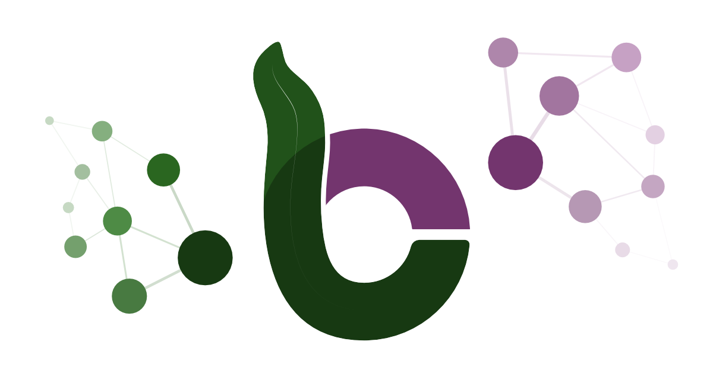

# How Researchers Are Leveraging BioCypher

BioCypher has been instrumental in advancing research around Knowledge Graphs. Teams have primarily used BioCypher for:

1. **Creation and maintenance of knowledge repositories ("storage"):** Ensuring structured, scalable, and easily accessible data storage.

2. **Project-specific knowledge graph creation ("analysis"):** Facilitating streamlined data integration and insightful analysis tailored to research needs.

We are excited to showcase some real-world use cases where BioCypher has made a significant impact. If BioCypher has helped your research, we’d love to hear about it—your use case could be the next one featured here!

## :dna: A Knowledge Graph for Impact of Genomic Variation on Function (IGVF)

-   __Impact of Genomic Variation on Function (IGVF)__

    ---

    **Description:** The impact of Genomic Variation on Function (IGVF) project aims to provide a comprenhensive and integrated view of the impact of genomic variation on human health and disease.

    **Resources:** The BioCypher pipeline used to build the knowledge graph uses several adapters for genetics data sources; an overview is available in our [meta-graph](https://biocypher.org/adapters.html#metagraph) and on the [GitHub Components Board](https://github.com/orgs/biocypher/projects/3) (pipelines column). The pipeline boasts a Docker Compose workflow that builds the graph and the API (using [tRPC](https://trpc.io/)), and is available on [GitHub](https://github.com/IGVF-DACC/igvf-catalog).

    [:octicons-arrow-right-24: To the project](https://www.igvf.org/)

!!! abstract "Testimonial"

    *"Our project, Impact of Genomic Variation on Function (IGVF, https://igvf.org), is building a massive biological knowledge graph to attempt to link human variation and disease with genomic datasets at the single-cell level. We are creating a user-facing API (and eventually UI) that will access this graph. BioCypher, which acts as an intermediary between Biolink and graph databases (we are using ArangoDB) has been instrumental in helping us design the schema and move our project forward. Specifically, it provides a framework we can use to parse the dozens of data files and formats into a Biolink-inspired schema".*

    - Ben Hitz, Director of Genomics Data Resources, Project Manager ENCODE, Stanford University

---

## :dna: Drug Repurposing with CROssBAR

-   __CROssBAR__

    ---

    **Description:** CROssBAR is a biomedical data integration and representation project. CROssBAR knowledge graphs incorporate relevant genes-proteins, molecular interactions, pathways, phenotypes, diseases, as well as known/predicted drugs and bioactive compounds, and they are constructred on-the-fly based on simple non-programmatic user queries.

    **Resources:** Using BioCypher, CROssBAR v2 will be a flexible property graph database comprised of single input adapters for each data source. As above, you can see its current state in the [meta-graph](https://biocypher.org/adapters.html#metagraph) and on the [GitHub Components Board](https://github.com/orgs/biocypher/projects/3) (pipelines column).

    [:octicons-arrow-right-24: To the project](https://crossbar.kansil.org/)

!!! abstract "Testimonial"

    *"We built CROssBAR v1 on NoSQL since property graph databases were quite new at the time and there was no framework to help us establish the system. We used an available NoSQL solution to house different layers of biological/biomedical data as independent collections. CROssBAR’s “small-scale knowledge graph (KG) construction module” queries each collection separately, collects the data, and merges the data points according to their mappings (which are held in the database as well, as cross-references), eliminates redundancy, queries each and every collection again with the entries retrieved in the previous step, and repeats all subsequent steps. Given that user queries can start with a single or multiple genes/proteins, compounds/drugs, diseases, phenotypes, pathways, or any combination of those, this procedure gets extremely complicated, requiring an average of 64 NoSQL queries to construct one single user-specific KG. The total number of lines of code required for this procedure alone is around 8000. This task could have been achieved significantly faster and more efficiently if we had had BioCypher five years ago".*

    - Tunca Doğan, Department of Computer Engineering and Artificial Intelligence Engineering, Hacettepe University and Protein Function Development Team (UniProt database), European Molecular Biology Laboratory, European Bioinformatics Institute (EMBL-EBI)

---

## :dna: Building a Knowledge Graph for Contextualised Metabolic-Enzymatic Interactions

-   __Metalinks__

    ---

    **Description:** The metalinks project aims to build a knowledge graph for contextualised metabolic-enzymatic interactions.

    **Resources:** The BioCypher pipeline used to build the knowledge graph uses several adapters, some of which overlap with the CROssBAR project, which helps synergising maintenance efforts. An overview is available in our [meta-graph](https://biocypher.org/adapters.html#metagraph) and on the [GitHub Components Board](https://github.com/orgs/biocypher/projects/3) (pipelines
    column).

    [:octicons-arrow-right-24: To the project](https://github.com/biocypher/metalinks)

!!! abstract "Testimonial"

    *"In the metalinks project, we build a knowledge graph (KG) that incorporates attributes of metabolites, proteins and their interactions to ultimately study cell-cell communication. We use two types of interaction between metabolites and proteins, I) production and degradation of metabolites by enzymes and II) interaction of metabolites with protein receptors. During the KG assembly we access multiple databases that provide information in diverse formats. BioCypher takes all of these inputs, gives them a reasonable, reproducible structure, and facilitates proper versioning. The KG produced by BioCypher can be easily contextualized to biological questions aiming for specific tissues, diseases or metabolite properties, which facilitates downstream analysis and interpretability. While spending 2.5 months to create a loose collection of scripts and directories for the initial project, I was able to obtain a structured result with BioCypher within 2 weeks.".*

    - Elias Farr, Institute for Computational Biomedicine, University Hospital Heidelberg
