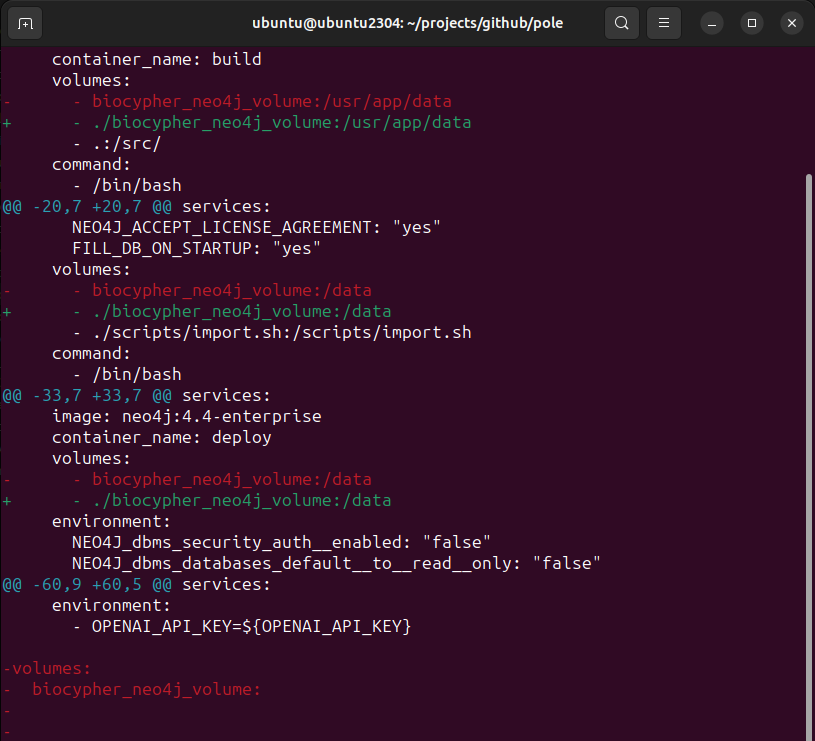

# How to build standalone pole image

1. Clone pole repository
```
git clone https://github.com/biocypher/pole.git
cd pole
```
2. Attach volumes to container by modifying docker-compose.yml 

3. Run stage deploy of docker-compose.yml
```
docker compose up deploy
```
4. Create pole standalone docker file pole-standalone.Dockerfile
```
# pole-standalone.Dockerfile

FROM neo4j:4.4-enterprise

COPY ./biocypher_neo4j_volume /data

RUN chown -R 7474:7474 /data

EXPOSE 7474
EXPOSE 7687
```
5. Build pole standalone image
```
docker build -t pole-standalone:latest -f pole-standalone.Dockerfile .
```

