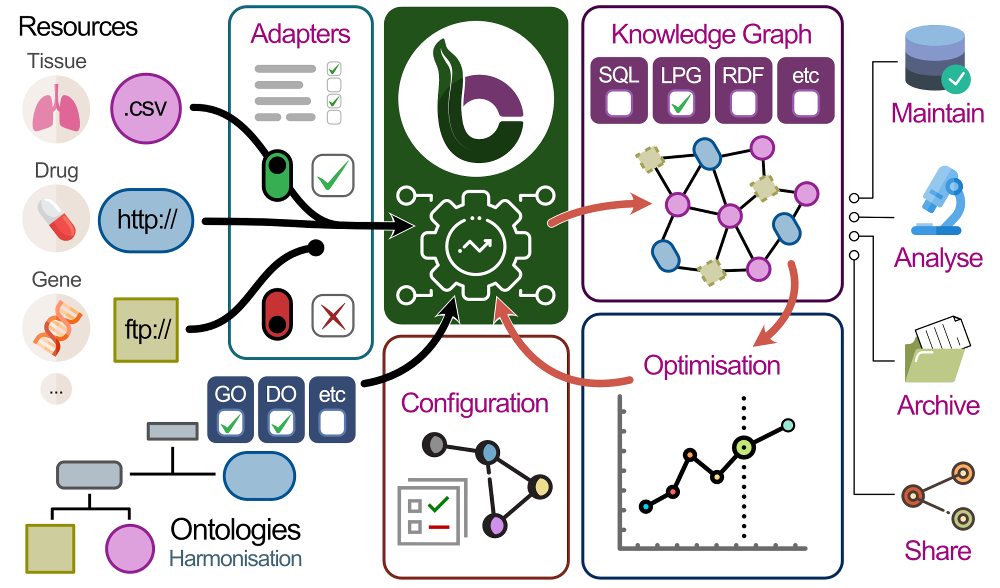

# Democratising Knowledge Graphs

    <blockquote style="font-family: 'Helvetica Neue', Arial, sans-serif; font-weight: 300; font-size: 1.2em; max-width: 800px; margin: 0 auto;">
        Building a biomedical knowledge graph often takes months or even years. 
        What if you could do it in just weeks or days?
    </blockquote>

We created **BioCypher** to revolutionise the process—making it easier than ever while maintaining **flexibility** and **transparency**.

At its core, BioCypher is designed around the principle of **threefold modularity**:

1. Modular data sources – Seamlessly integrate diverse biomedical datasets.
2. Modular ontology structures – Define flexible, structured knowledge representations.
3. Modular output formats – Adapt results to various applications and tools.

This modular approach maximises flexibility and reusability, empowering the biomedical community to accelerate research while streamlining efforts.

!!! tip "Hot Topics"

    Model Context Protocol has opened new avenues for accessibility. We have created a registry for biomedical MCP servers (see [https://biocontext.ai](https://biocontext.ai)) as well as a dedicated MCP server to help with implementing BioCypher solutions (see [here](llms.md)).

    BioCypher is the simplest way to create an AI-enabled knowledge graph for biomedical (or other) tasks. Check our [BioChatter](https://biochatter.org) documentation for more information.

    We have also recently published a perspective on connecting knowledge and machine learning to enable causal reasoning in biomedicine, with a particular focus on the currently emerging "foundation models." You can read it [here](https://www.embopress.org/doi/full/10.1038/s44320-024-00041-w).

## New to Knowledge Graphs?

If you’re new to knowledge graphs and want to familiarise with the concepts that drive BioCypher, we recommend to read [our paper](https://www.nature.com/articles/s41587-023-01848-y) (self-archived version [here on Zenodo](https://zenodo.org/records/10320714), online version [at this https link](https://biocypher.github.io/biocypher-paper/))!

### Additional Resources

- :simple-zulip: [Questions? Join our Zulip channel](https://biocypher.zulipchat.com/)
- :octicons-mark-github-24: [Find us on GitHub](https://github.com/biocypher/biocypher)
