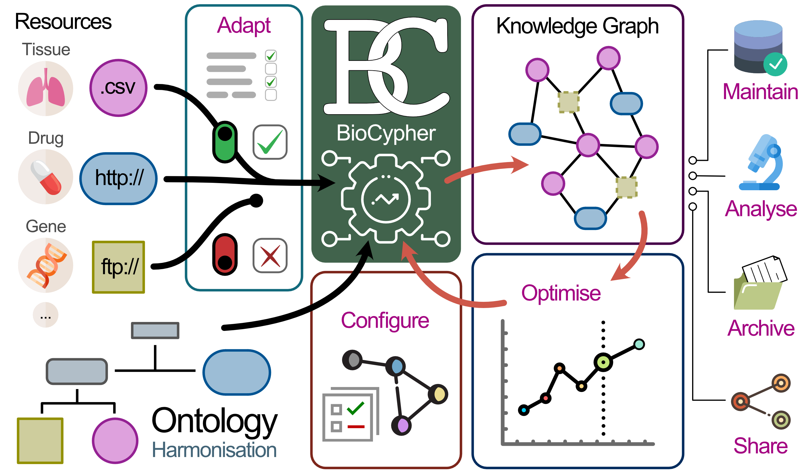

.. image:: banner.png

############
Introduction
############

Building a knowledge graph for biomedical tasks usually takes months or years.
What if you could do it in weeks or days? We created BioCypher to make the
process of creating a biomedical knowledge graph easier than ever, but still
flexible and transparent. BioCypher is built around the concept of a "threefold
modularity": modularity of data sources, modularity of structure-giving
ontology, and modularity of output formats.  This design allows for a high
degree of flexibility and reusability, rationalising efforts by leveraging the
biomedical community.

If you're new to knowledge graphs and want to familiarise with the concepts that
drive BioCypher, we recommend to check out the graphical abstract below and read
our paper!

.. grid:: 2
   :gutter: 2

   .. grid-item-card:: Find us on GitHub
      :link: https://github.com/biocypher/biocypher
      :text-align: center

      :octicon:`mark-github;3em` :octicon:`repo;3em`

   .. grid-item-card:: Read the paper
      :link: https://arxiv.org/abs/2212.13543
      :text-align: center

      :octicon:`book;3em` :octicon:`light-bulb;3em`

   .. grid-item-card:: Get in touch
      :link: https://biocypher.zulipchat.com/
      :text-align: center

      :octicon:`people;3em` :octicon:`comment-discussion;3em`

   .. grid-item-card:: Check out our adapters
      :link: https://github.com/orgs/biocypher/projects/3/views/2
      :text-align: center

      :octicon:`plug;3em` :octicon:`project;3em`

   .. grid-item-card:: Preconfigured project with BioCypher as a dependency, including docker integration
      :columns: 12
      :link: https://github.com/biocypher/project-template
      :text-align: center

      :octicon:`mark-github;3em` :octicon:`repo;3em` :octicon:`play;3em` :octicon:`container;3em`

.. Note::

   BioCypher is an inclusive community-driven project. If you have any
   questions, specific needs, or want to contribute to the project, please
   contact us over on our `Zulip channel <https://biocypher.zulipchat.com/>`_,
   on `GitHub <https://github.com/biocypher/biocypher>`_ or via email at
   sebastian.lobentanzer (at) uni-heidelberg.de.

   BioCypher uses a collection of reusable “adapters” for the different sources
   of biomedical knowledge, which can be flexibly recombined to fit various
   demands, thus reducing redundant maintenance work through
   quasi-standardisation.  Integrating the controlled vocabularies of ontologies
   into the process helps to harmonise the data from individual resources and
   yields a consistent semantic basis for downstream analyses. Through
   unambiguous and simple “low-code” configuration, a reproducible knowledge
   graph can be created and shared for every specific task.

=================
Mission Statement
=================

We aim to **enable access to versatile and powerful knowledge graphs for as many
researchers as possible**. Making biomedical knowledge "their own" is often a
privilege of the companies and groups that can afford individuals or teams
working on knowledge representation in a dedicated manner. With BioCypher, we
aim to change that. Creating a knowledge graph should be "as simple as possible,
but not any simpler." To achieve this, we have developed a framework that
facilitates the creation of knowledge graphs that are informed by the latest
developments in the field of biomedical knowledge representation. However, to
make this framework truly accessible and comprehensive, we need the input of the
biomedical community. We are therefore inviting you to join us in this
endeavour!