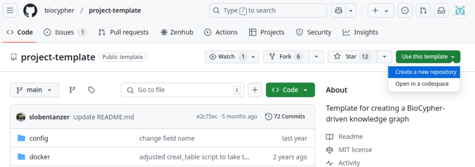
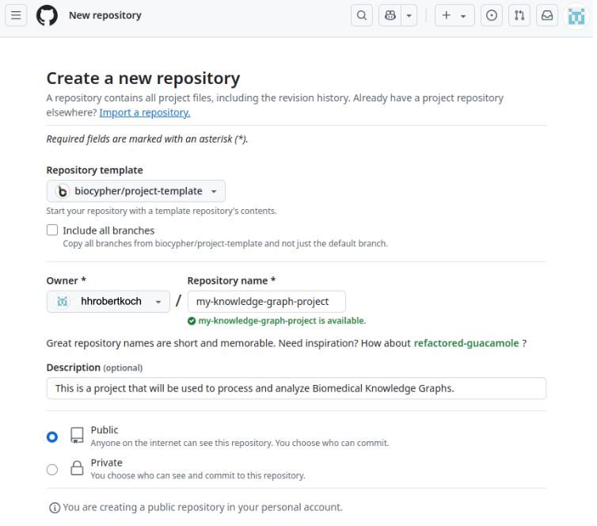

# Installation guide

Before diving into developing wonderful use cases with BioCypher, we strongly recommend installing a few prerequisites to ensure a smooth experience. These prerequisites are:

1. *Python 3* (version >= 3.10)
      - [Install Python 3](https://docs.python.org/3/using/index.html)
2. *uv* (Python packaging and dependency manager)
      - [Install uv](https://docs.astral.sh/uv/getting-started/installation/)
3. *git* (version control manager)
      - [Install git](https://git-scm.com/book/en/v2/Getting-Started-Installing-Git)
4. *Docker* (containerization technology) [optional]
      - [Install Docker](https://docs.docker.com/engine/)

!!! tip "Tip"
    If you are missing any of those pre-requisites, **please follow the installation guide in each resource before you continue**.


## Checking prerequisites

You can verify access to these components in your terminal:

1. `python` version 3.10 or higher.
   ```bash
   python --version
   ```
2. `uv`
   ```bash
   uv --version
   ```
3. `git`
   ```bash
   git --version
   ```
4. `docker`
   ```bash
   docker --version
   ```

## **Option 1.** Use a project pre-configured with BioCypher

The easiest way to start using BioCypher is with a pre-configured project that
includes all the essential code, dependencies, environment settings, and the
recommended directory structure. This setup allows you to focus solely on
implementing your use case, with minimal modifications to a few existing files,
depending on your needs. If this approach suits you, follow the instructions
below to get started.

=== "GitHub repo from template (recommended)"
    **Step  1:** Go to Biocypher [project template repository](https://github.com/biocypher/project-template), click on "Use this template", then click on "Create a new repository".

    

    **Step 2:** Complete the information on owner (GitHub username or organisation), name, description, and visibility of your repository.

    { loading=lazy }

    **Step 3:**  Now, you can clone the repository and navigate into it. Replace user name (alternatively, GitHub organisation) and repository name with your own.

    ```bash
    git clone https://github.com/<your-github-username>/<your-project-name>.git
    cd <your-project-name>
    ```

    **Step 4:** Open the `pyproject.toml` file, change the following sections, and **do not forget to save your changes**.

    - `name`: replace the default project's name (`biocypher-project-template`) with the name you want to use for your project. This name does not need to be equal to the repository name (but often it is).
    - `description`: change the default description to a meaningful one based on your use case.

    **Step 5:** Install the dependencies using *uv*.

    ```bash
    uv sync --all-extras
    ```

    **Step 6:** Run the script `create_workflow.py`

    ```bash
    uv run python create_workflow.py
    ```

=== "Cloning the project template directly"

    **Step  1:** Clone the [project template repository](https://github.com/biocypher/project-template), rename it, and navigate to the project folder.

    ```bash
    git clone https://github.com/biocypher/project-template.git
    mv project-template my-knowledge-graph-project
    cd my-project
    ```

    **Step  2:** Make the repository your own.

    ```bash
    rm -rf .git
    git init
    git add .
    git commit -m "Initial commit"
    # (you can add your remote repository here)
    ```

    **Step 3:** Open the `pyproject.toml` file, change the following sections, and **do not forget to save your changes**.

    - `name`: replace the default project's name (`biocypher-project-template`) with the name you want to use for your project. This name does not need to be equal to the repository name (but often it is).
    - `description`: change the default description to a meaningful one based on your use case.

    **Step 4:** Install the dependencies using *uv*.

    ```bash
    uv sync --all-extras
    ```

    **Step 5:** Run the script `create_workflow.py`

    ```bash
    uv run python create_workflow.py
    ```


## **Option 2**. Install from a Package Manager

=== "uv (recommended)"
    !!! note "Note: about uv"

        uv is a fast Python package installer and resolver, written in Rust.
        It allows you to declare the libraries your project depends on
        and will manage (install/update) them for you. uv offers a lock
        file to ensure reproducible environments and allows you to easily build
        your project for distribution. For information about the installation
        process, see [here](https://docs.astral.sh/uv/getting-started/installation/).

    ```bash
    # Create a new uv project, i.e. my-awesome-kg-project.
    uv init <name-of-the-project>

    # Navigate into the recently created folder's project
    cd <name-of-the-project>

    # Install the BioCypher package with all the dependencies automatically
    uv add biocypher

    # Or install with optional dependencies:
    # - For Neo4j online mode support
    uv add "biocypher[neo4j]"
    # - For AIRR functionality
    uv add "biocypher[scirpy]"
    ```

=== "pip"

    !!! Note "Note: Virtual environment and best practices"
        To follow best practices in software engineering and prevent issues with your Python installation, we highly recommend installing packages in a separate virtual environment instead of directly in the base Python installation.

    1. **Create and activate** a virtual environment. Replace `<name-of-environment>` with the name of the environment you desire, i.e. `biocypher_env`

        === "conda"

            ```bash
            # Create a conda environment with Python 3.10
            conda create --name <name-of-environment> python=3.10

            # Activate the new created environment
            conda activate <name-of-environment>
            ```

        === "venv"

            ```bash
            # Create a virtualenv environment
            python3 -m venv <name-of-environment>

            # Activate the new created environment
            source ./<name-of-environment>/bin/activate
            ```

    2. Install BioCypher package from `pip`. Type the following command to install BioCypher package. **Note:** do not forget to activate a virtual environment before do it.

        ```shell
        # Basic installation (no Neo4j driver)
        pip install biocypher

        # With Neo4j online mode support (optional)
        pip install biocypher[neo4j]
        ```

    !!! note "Neo4j Driver is Optional"
        The Neo4j Python driver is only required if you plan to use BioCypher
        with Neo4j in online mode (`offline: false`). For offline mode or other
        output formats, it is not needed.

## :material-docker: **Option 3.** Docker

!!! tip "Play with your data in Neo4j with this Docker container"

    The project template includes a Docker compose workflow that allows to:

    1. Create an example database using BioCypher.
    2. Load the data into a dockerized **Neo4j** instance automatically.

Once you have created your project using one of the template options ([option 1](#option-1-use-a-project-pre-configured-with-biocypher)), please follow the steps below:

**Step 1:** Start a single detached Docker container running a Neo4j instance, which contains the knowledge graph built by BioCypher as the default Neo4j database.

```bash
docker compose up -d
```

**Step 2:** Open the Neo4j instance in a web browser by typing the address and port: [localhost:7474](http://localhost:7474).

Authentication is deactivated by default and can be modified in the **`docker_variables.env`** file (in which case you need to provide the .env file to the deploy stage of the `docker-compose.yml`).

### Docker Workflow

The Docker Compose file creates three containers: **build**, **import**, and **deploy**. These containers share files using a Docker Volume. In the BioCypher build procedure, the `biocypher_docker_config.yaml` file is used instead of `biocypher_config.yaml`, as specified in `scripts/build.sh`.

- Containers and their functions
    - **build:** Installs and runs the BioCypher pipeline.
    - **import:** installs Neo4j and executes the data import.
    - **deploy:** deploys the Neo4j instance on localhost.

This three-stage setup strictly is not necessary for the mounting of a read-write instance of Neo4j, but is required if the purpose is to provide a read-only instance (e.g. for a web app) that is updated regularly;for an example, see the meta graph repository. The read-only setting is configured in the **docker-compose.yml** file (`NEO4J_dbms_databases_default__to__read__only: "false"`) and is deactivated by default.

## For Developers

If you want to directly install BioCypher, here are the steps (requires [uv](https://docs.astral.sh/uv/getting-started/installation/)):

```bash title="Execute in bash"
git clone https://github.com/biocypher/biocypher
cd BioCypher
uv sync --all-extras
```
uv creates a virtual environment for you and installs all dependencies.

If you want to run the tests that use a local Neo4j or PostgreSQL DBMS (database management system) instance:

- **For Neo4j tests**: Make sure that you have a Neo4j instance (version 4.4.x or 5.x) with the APOC plugin installed and a database named `test` running on standard bolt port `7687`. The Neo4j Python driver will be installed automatically with `uv sync --all-extras`.

- **For PostgreSQL tests**: A PostgreSQL instance with the psql command line tool should be installed locally and running on standard port `5432`

- Run the tests using `uv run pytest` in the root directory of the repository with the command line argument `--password=<your DBMS password>`.

Once this is set up, you can go through the [tutorial](./learn/tutorials/tutorial001_basics.md) or use it in your project as a local dependency.
