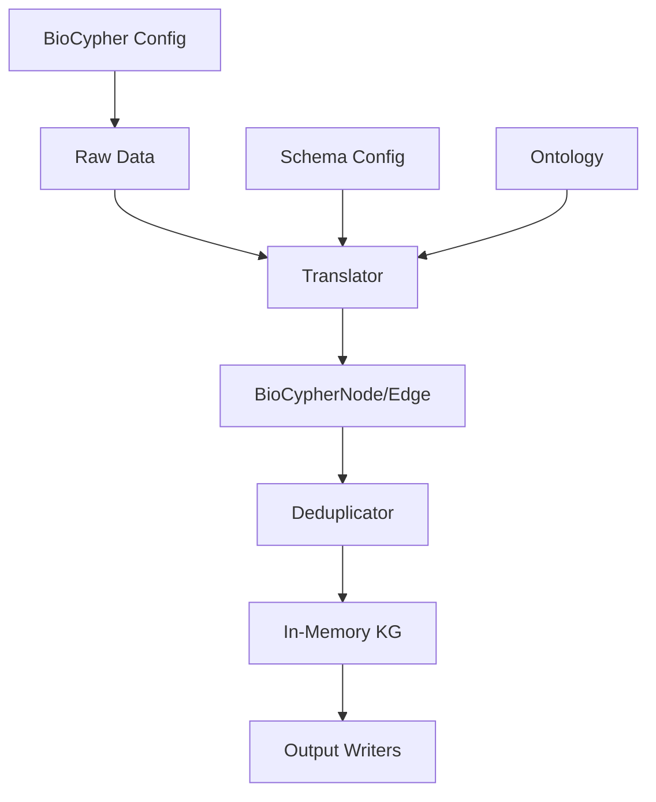
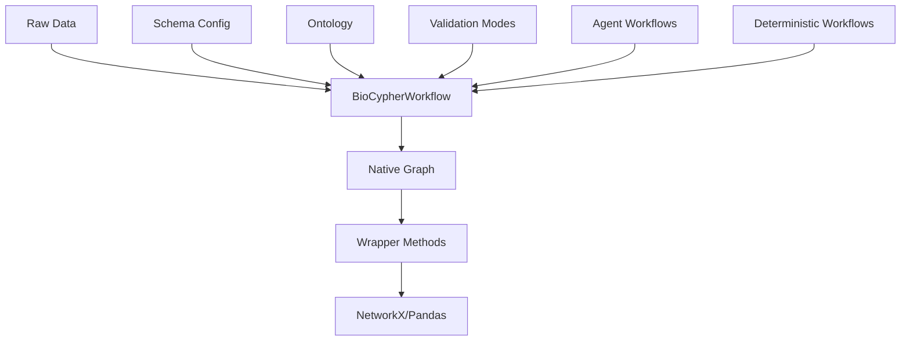

# BioCypher Architecture Migration Guide

This document provides a comprehensive overview of the new BioCypher architecture, the differences between legacy and new implementations, and the roadmap for future integration.

## Overview

BioCypher is evolving from an ETL pipeline to a modular, agentic-first knowledge graph framework. This migration introduces new components while maintaining backward compatibility and providing a clear path forward.

## Architecture Comparison

### Legacy BioCypher Architecture



**Characteristics:**

- **Monolithic**: Single `BioCypher` class orchestrates everything
- **ETL-Focused**: Designed for batch processing of large datasets
- **Strict Validation**: Mandatory schema validation and deduplication
- **Complex Pipeline**: Multi-step translation and processing
- **Global State**: Singleton deduplicator across all operations

### New BioCypher Architecture



**Characteristics:**

- **Modular**: Separate `BioCypherWorkflow` and `Graph` classes
- **Agentic-First**: Optimized for LLM agent workflows
- **Progressive Validation**: Optional validation with flexible modes
- **Zero Dependencies**: Pure Python implementation
- **Local State**: Per-workflow validation and deduplication

## Key Differences

### 1. Object Models

| Aspect | Legacy BioCypher | New Implementation |
|--------|------------------|-------------------|
| **Node Objects** | `BioCypherNode` (complex) | `Node` (simple dataclass) |
| **Edge Objects** | `BioCypherEdge` (complex) | `Edge` (simple dataclass) |
| **Properties** | Rich metadata + properties | Simple properties dict |
| **Methods** | `get_id()`, `get_label()`, etc. | Direct attribute access |
| **Serialization** | Complex internal format | Simple JSON serialization |

### 2. Validation and Deduplication

| Aspect | Legacy BioCypher | New Implementation |
|--------|------------------|-------------------|
| **Validation** | Warn / strict | None / warn / strict |
| **Deduplication** | Global singleton | Per-workflow tracking |
| **Schema** | Mandatory | Optional |
| **Error Handling** | Fail-fast | Configurable (warn/continue) |
| **Performance** | Overhead for all operations | Zero overhead in "none" mode |

### 3. API Design

| Aspect | Legacy BioCypher | New Implementation |
|--------|------------------|-------------------|
| **Entry Point** | `BioCypher()` class | `create_workflow()` function |
| **Configuration** | Complex config files | Simple parameters |
| **Workflow** | Batch ETL pipeline | Interactive graph building |
| **Output** | Multiple output formats | Native graph + wrappers |
| **Learning Curve** | Steep (many concepts) | Gentle (progressive complexity) |

### 4. Use Cases

| Use Case | Legacy BioCypher | New Implementation |
|----------|------------------|-------------------|
| **ETL Pipelines** | ✅ Excellent | ❌ Not suitable |
| **Agent Workflows** | ❌ Too rigid | ✅ Excellent |
| **Interactive Exploration** | ❌ Batch-only | ✅ Excellent |
| **Large Datasets** | ✅ Optimized | ❌ Memory-bound |
| **Schema Validation** | ✅ Comprehensive | ⚠️ Basic only |
| **Research Prototyping** | ❌ Overkill | ✅ Perfect |
| **Database Integration** | ✅ Full support | ❌ Not supported |
| **Ontology Integration** | ✅ Advanced | ❌ Basic only |
| **Batch Processing** | ✅ Optimized | ❌ Not supported |
| **Metadata Handling** | ✅ Rich support | ❌ Basic only |

## Implementation Details

### New Components

#### 1. `BioCypherWorkflow` Class

```python
# Simple, clean API
workflow = create_workflow(
    name="my_graph",
    validation_mode="warn",  # none/warn/strict
    deduplication=True
)

# Add nodes and edges
workflow.add_node("protein_1", "protein", name="TP53")
workflow.add_edge("interaction_1", "interaction", "protein_1", "protein_2")
```

**Key Features:**

- Progressive validation modes
- Optional schema support
- Wrapper methods for compatibility
- Agentic workflow optimization

#### 2. `Graph` Class

```python
# Unified graph representation
graph = Graph(name="my_graph", directed=True)

# Simple operations
graph.add_node("node_1", "protein", {"name": "TP53"})
graph.add_edge("edge_1", "interaction", "node_1", "node_2")
```

**Key Features:**

- Zero dependencies
- Simple, extensible design
- Native BioCypher objects
- Built-in deduplication

#### 3. Native Objects

```python
@dataclass
class Node:
    id: str
    type: str
    properties: dict[str, Any] = field(default_factory=dict)

@dataclass
class Edge:
    id: str
    type: str
    source: str
    target: str
    properties: dict[str, Any] = field(default_factory=dict)
```

**Key Features:**

- Simple dataclasses
- Direct attribute access
- JSON serializable
- Extensible for agentic features

### Progressive Validation

The new implementation provides three validation modes:

#### Mode: "none" (Default)
```python
workflow = create_workflow(validation_mode="none")
# No validation overhead
# Maximum flexibility for agents
# Any node/edge types allowed
```

#### Mode: "warn"
```python
workflow = create_workflow(validation_mode="warn", deduplication=True)
# Logs warnings for violations
# Continues processing
# Good for debugging
```

#### Mode: "strict"
```python
workflow = create_workflow(validation_mode="strict", deduplication=True)
# Enforces schema validation
# Fails fast on violations
# Legacy BioCypher behavior
```

## Migration Roadmap

### Phase 1: Parallel Development (Current)
**Status: ✅ Complete**

- [x] New `BioCypherWorkflow` and `Graph` classes
- [x] Progressive validation system
- [x] Wrapper methods for compatibility
- [x] Comprehensive test suite
- [x] Documentation and examples

**Goals:**

- Keep new functionality separate from legacy code
- Provide compatibility wrappers
- Establish clear migration path

### Phase 2: Feature Parity (Next)
**Status: 🔄 Planned**

- [ ] Advanced schema validation
- [ ] Ontology integration improvements
- [ ] Performance optimizations
- [ ] Extended wrapper methods
- [ ] Migration utilities

**Goals:**

- Match legacy functionality where needed
- Improve performance for large datasets
- Provide migration tools

### Phase 3: Agentic Features (Future)
**Status: 🔮 Future**

- [ ] Computable functions on nodes/edges
- [ ] Decision logging and reasoning traces
- [ ] Counterfactual inference capabilities
- [ ] MCP (Model Context Protocol) integration
- [ ] Local graph computation

**Goals:**

- Enable advanced agentic workflows
- Support LLM integration
- Provide reasoning capabilities

### Phase 4: Unified Interface (Future)
**Status: 🔮 Future**

- [ ] Integrate with main `BioCypher` class
- [ ] Unified configuration system
- [ ] Backward compatibility layer
- [ ] Legacy API deprecation
- [ ] Single entry point

**Goals:**

- Provide unified interface
- Maintain backward compatibility
- Simplify user experience

## Migration Guide

### For New Users

**Start with the new implementation:**

```python
from biocypher import create_workflow

# Simple start
workflow = create_workflow("my_graph")
workflow.add_node("protein_1", "protein", name="TP53")

# Add validation as needed
workflow = create_workflow(
    "my_graph",
    validation_mode="warn",
    deduplication=True
)
```

### For Existing Users

**Gradual migration approach:**

1. **Start with "none" mode** for existing workflows
2. **Add validation gradually** as needed
3. **Use wrapper methods** for compatibility
4. **Migrate to native objects** over time

```python
# Legacy approach
from biocypher import BioCypher
bc = BioCypher(offline=True, dbms="neo4j")

# New approach (gradual migration)
from biocypher import create_workflow
workflow = create_workflow(validation_mode="strict")  # Legacy-like behavior

# Use wrapper for compatibility
nx_graph = workflow.to_networkx()
```

### For Agent Developers

**Optimized for agentic workflows:**

```python
# Maximum flexibility for agents
workflow = create_workflow(validation_mode="none")

# Add nodes/edges dynamically
for entity in agent_discovered_entities:
    workflow.add_node(entity.id, entity.type, **entity.properties)

# Convert to analysis format when needed
analysis_graph = workflow.to_networkx()
```

## Compatibility

### Wrapper Methods

The new implementation provides compatibility wrappers:

```python
# Convert to NetworkX
nx_graph = workflow.to_networkx()

# Convert to Pandas DataFrames
nodes_df, edges_df = workflow.to_pandas()

# JSON serialization
json_str = workflow.to_json()
```

### Legacy Integration

Legacy BioCypher can be used alongside new implementation:

```python
# Legacy for ETL
from biocypher import BioCypher
legacy_bc = BioCypher(offline=True, dbms="neo4j")

# New for interactive work
from biocypher import create_workflow
workflow = create_workflow("interactive_graph")
```

## Performance Considerations

### Memory Usage

| Scenario | Legacy BioCypher | New Implementation |
|----------|------------------|-------------------|
| **Small Graphs** (< 1K nodes) | High overhead | Minimal overhead |
| **Medium Graphs** (1K-100K nodes) | Moderate overhead | Low overhead |
| **Large Graphs** (> 100K nodes) | Optimized | Memory-bound |

### Validation Overhead

| Mode | Overhead | Use Case |
|------|----------|----------|
| **"none"** | Zero | Agent workflows, prototyping |
| **"warn"** | Low | Development, debugging |
| **"strict"** | Moderate | Production, ETL |

## Best Practices

### Choosing the Right Approach

**Use Legacy BioCypher for:**

- Large-scale ETL pipelines
- Batch processing of big datasets
- Complex schema validation requirements
- Production systems requiring proven stability

**Use New Implementation for:**

- Agent workflows and LLM integration
- Interactive graph exploration
- Research prototyping
- Small to medium datasets
- When you need flexibility

### Migration Strategy

1. **Start Small**: Begin with simple use cases
2. **Progressive Validation**: Start with "none", add validation as needed
3. **Use Wrappers**: Leverage compatibility methods during transition
4. **Test Thoroughly**: Validate behavior matches expectations
5. **Plan Gradually**: Don't rush the migration

## Future Vision

The new BioCypher architecture is designed to support the future of biomedical knowledge graphs:

- **Agentic Workflows**: LLM agents can dynamically build and reason over graphs
- **Interactive Exploration**: Researchers can explore data interactively
- **Flexible Validation**: Users choose their validation level
- **Extensible Design**: Easy to add new features and capabilities
- **Unified Interface**: Eventually, one API for all use cases

## Limitations and Trade-offs

While the new implementation provides significant advantages for agentic workflows, it comes with important limitations compared to the legacy ETL pipeline:

### 1. Limited Ontology Integration

**Legacy BioCypher:**

- Full ontology loading and processing (OWL, OBO, RDF/XML)
- Hybrid ontology support (head + tail ontologies)
- Complex ontology mapping and inheritance
- Automatic ontology-based validation
- Support for multiple ontology formats and namespaces

**New Implementation:**

- Basic ontology URL support (head_ontology_url parameter)
- No tail ontology support
- No complex ontology mapping
- No automatic ontology-based validation
- Limited to simple ontology references

**Impact:** Users requiring complex ontology integration should continue using legacy BioCypher.

### 2. Simplified Deduplication

**Legacy BioCypher:**

- Global singleton deduplicator across all operations
- Rich duplicate tracking and reporting
- Per-edge-type deduplication logic
- Comprehensive duplicate statistics
- Integration with batch processing

**New Implementation:**

- Per-workflow deduplication tracking
- Simple duplicate detection (ID-based only)
- No global duplicate statistics
- No integration with batch processing
- Optional deduplication (can be disabled)

**Impact:** Large-scale ETL pipelines may miss duplicates that legacy BioCypher would catch.

### 3. Reduced Validation Capabilities

**Legacy BioCypher:**

- Comprehensive schema validation
- Property whitelist/blacklist filtering
- Complex inheritance validation
- Source, license, and version enforcement
- Multi-level validation pipeline

**New Implementation:**

- Basic property type validation
- Simple required property checking
- No inheritance validation
- No metadata enforcement
- Single-level validation

**Impact:** Production systems requiring strict data quality should use legacy BioCypher.

### 4. Limited Output Format Support

**Legacy BioCypher:**

- 15+ output formats (Neo4j, PostgreSQL, ArangoDB, SQLite, RDF, OWL, CSV, NetworkX, AIRR)
- Batch writers with optimized performance
- Database connectivity and online mode
- Custom import scripts and configurations
- Multi-format export capabilities

**New Implementation:**

- 3 output formats (JSON, NetworkX, Pandas)
- No database connectivity
- No batch processing
- No custom import scripts
- Limited to in-memory formats

**Impact:** Users needing database integration or specific output formats must use legacy BioCypher.

### 5. No Batch Processing

**Legacy BioCypher:**

- Optimized batch processing for large datasets
- Memory-efficient streaming
- Progress tracking and logging
- Error handling and recovery
- Configurable batch sizes

**New Implementation:**

- In-memory processing only
- No streaming capabilities
- No progress tracking
- Basic error handling
- Memory-bound by design

**Impact:** Large datasets (>100K nodes) may cause memory issues.

### 6. Limited Metadata Handling

**Legacy BioCypher:**

- Rich metadata support (source, license, version)
- Automatic metadata injection
- Metadata validation and enforcement
- Configurable metadata requirements
- Integration with provenance tracking

**New Implementation:**

- Basic property support only
- No automatic metadata injection
- No metadata validation
- No provenance tracking
- User must handle metadata manually

**Impact:** Research requiring provenance tracking should use legacy BioCypher.

### 7. No Data Source Integration

**Legacy BioCypher:**

- Built-in data source adapters
- Download and caching mechanisms
- API integration capabilities
- File format support (CSV, JSON, XML, etc.)
- Data source configuration management

**New Implementation:**

- No data source integration
- No download capabilities
- No caching mechanisms
- No API integration
- Manual data loading required

**Impact:** Users must handle data acquisition separately.

### 8. Simplified Configuration

**Legacy BioCypher:**

- Complex configuration system
- Multiple config files (biocypher_config.yaml, schema_config.yaml)
- Environment-specific configurations
- Advanced parameter tuning
- Configuration validation

**New Implementation:**

- Simple parameter-based configuration
- No config file support
- No environment-specific settings
- Limited parameter options
- No configuration validation

**Impact:** Complex deployments may require legacy BioCypher's configuration system.

### 9. No Advanced Graph Features

**Legacy BioCypher:**

- Relationship-as-node support
- Complex relationship types
- Multi-graph support
- Advanced indexing
- Graph analytics integration

**New Implementation:**

- Basic node/edge/hyperedge support
- Simple relationship types
- Single graph per workflow
- Basic indexing
- Limited analytics

**Impact:** Complex graph structures may not be supported.

### 10. Limited Error Handling

**Legacy BioCypher:**

- Comprehensive error handling
- Graceful degradation
- Error recovery mechanisms
- Detailed error reporting
- Logging and monitoring

**New Implementation:**

- Basic error handling
- Fail-fast approach
- No error recovery
- Simple error messages
- Basic logging

**Impact:** Production systems may need more robust error handling.

### 11. Technical Limitations

**Legacy BioCypher:**

- Supports 15+ database systems and output formats
- Handles multiple ontology formats (OWL, OBO, RDF/XML)
- Complex inheritance and mapping logic
- Relationship-as-node representation
- Multi-graph support
- Advanced indexing and querying

**New Implementation:**

- Limited to 3 output formats (JSON, NetworkX, Pandas)
- Basic ontology URL support only
- Simple inheritance (no complex mapping)
- No relationship-as-node support
- Single graph per workflow
- Basic indexing only

**Impact:** Complex biomedical knowledge representation may not be fully supported.

### 12. Performance Limitations

**Legacy BioCypher:**

- Optimized for large-scale processing
- Memory-efficient streaming
- Batch processing with configurable sizes
- Progress tracking and monitoring
- Error recovery and retry mechanisms

**New Implementation:**

- In-memory processing only
- No streaming capabilities
- No batch processing
- No progress tracking
- Basic error handling

**Impact:** Performance degrades significantly with large datasets.

## When to Use Each Approach

### Use Legacy BioCypher for:

- **Large-scale ETL pipelines** (>100K nodes)
- **Database integration** (Neo4j, PostgreSQL, etc.)
- **Complex ontology requirements**
- **Production systems** requiring robust validation
- **Batch processing** of large datasets
- **Multiple output formats**
- **Provenance tracking** and metadata management
- **Data source integration**
- **Complex configuration** requirements

### Use New Implementation for:

- **Agent workflows** and LLM integration
- **Interactive exploration** and prototyping
- **Small to medium datasets** (<100K nodes)
- **Research and development**
- **Simple graph operations**
- **Maximum flexibility** requirements
- **Rapid prototyping**
- **Educational purposes**

## Migration Strategy

### Gradual Migration Approach

1. **Start with New Implementation** for new projects
2. **Use Legacy BioCypher** for existing ETL pipelines
3. **Migrate incrementally** as features are added
4. **Use wrapper methods** for compatibility
5. **Plan for Phase 2** feature additions

### Hybrid Approach

```python
# Use both approaches together
from biocypher import BioCypher, create_workflow

# Legacy for ETL
legacy_bc = BioCypher(offline=True, dbms="neo4j")
# ... process large dataset ...

# New for interactive work
workflow = create_workflow("interactive_graph")
# ... explore and analyze ...
```

## Future Roadmap

The limitations identified above will be addressed in future phases:

- **Phase 2**: Enhanced ontology support, batch processing, more output formats
- **Phase 3**: Advanced validation, metadata handling, data source integration
- **Phase 4**: Unified interface with full legacy compatibility

This migration represents BioCypher's evolution from a batch ETL tool to a comprehensive knowledge graph framework for the AI era, with a clear path for addressing current limitations.
