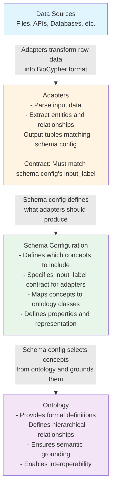

# Schema Configuration: Philosophy and Concepts

The schema configuration file (`schema_config.yaml`) is the **central contract** in BioCypher that bridges two fundamental concerns: **grounding** your knowledge graph in well-defined ontological concepts, and defining the **pragmatic context** of what your specific project needs. Understanding this dual role is essential to effectively using BioCypher.

## The Bridge: Grounding and Pragmatic Context

### Grounding: Connecting to Ontological Reality

**Grounding** refers to anchoring your knowledge graph in formally defined, machine-readable concepts from biomedical ontologies (like the Biolink model, Sequence Ontology, or others). This provides:

- **Semantic clarity**: Every concept has a precise, well-defined meaning
- **Interoperability**: Your knowledge graph can be understood and integrated with other systems using the same ontological foundation
- **Machine readability**: Automated reasoning and querying become possible
- **Biological accuracy**: Concepts are grounded in domain expertise and community consensus

The ontology provides a vast universe of possible concepts—thousands of classes organized in hierarchical relationships. However, your specific project doesn't need all of them.

### Pragmatic Context: Selecting What Matters

**Pragmatic context** refers to the practical, project-specific decisions about what concepts are actually relevant and useful for your particular use case. This includes:

- **Selectivity**: Which concepts from the ontology are needed?
- **Granularity**: How specific do you need to be? (E.g., do you need `protein isoform` or is `protein` sufficient?)
- **Representation**: How should concepts be represented? (Nodes, edges, reified relationships?)
- **Properties**: What attributes are relevant for your use case?
- **Identifiers**: Which identifier systems are most appropriate?

### The Schema Configuration as Bridge

The schema configuration file serves as the **bridge** between these two concerns:

```
┌─────────────────┐
│   Ontology      │  ← Grounding: Well-defined concepts
│  (Biolink, SO,  │     from formal ontologies
│   MONDO, etc.)  │
└────────┬────────┘
         │
         │ Schema Configuration selects
         │ and filters concepts
         │
         ▼
┌─────────────────┐
│ Schema Config   │  ← Bridge: Project-specific
│ (schema_config  │     selection of ontology
│    .yaml)       │     concepts
└────────┬────────┘
         │
         │ Defines contract for
         │ adapters and output
         │
         ▼
┌─────────────────┐
│  Adapters &     │  ← Pragmatic Context: What
│  Data Sources   │     your project actually
│                 │     needs and uses
└─────────────────┘
```

The schema configuration **selects** a subset of concepts from the ontology that are relevant to your project, while maintaining the **grounding** connection to the formal ontological definitions. This means:

1. Your knowledge graph is grounded in well-defined concepts (not arbitrary labels)
2. You only include what you need (pragmatic selection)
3. The selection is explicit and transparent (documented in the schema config)
4. The grounding connection is preserved (inheritance, hierarchical labels)

## Selecting Concepts from Ontologies

### The Selection Process

When you define a concept in your schema configuration, you're making an explicit choice to include that concept from the ontology in your knowledge graph. For example:

```yaml
protein:
  represented_as: node
  preferred_id: uniprot
  input_label: uniprot_protein
```

This configuration:

1. **Selects** the `protein` concept from the Biolink ontology
2. **Grounds** your knowledge graph nodes in this well-defined concept
3. **Inherits** all parent concepts from the ontology hierarchy (e.g., `polypeptide`, `biological entity`, `named thing`, `entity`)
4. **Defines** the pragmatic context: how proteins will be represented (`node`), identified (`uniprot`), and referenced in input data (`uniprot_protein` as the label element of the tuples from the adapter)

### Why Selection Matters

The ontology might contain thousands of concepts, but your project likely needs only dozens or less. Less is more in this case. By explicitly selecting concepts in the schema configuration:

- **You control scope**: Only selected concepts appear in your knowledge graph
- **You maintain grounding**: Selected concepts remain connected to their ontological definitions
- **You enable inheritance**: Hierarchical relationships from the ontology are preserved
- **You document intent**: The schema config serves as documentation of what your project considers relevant

### Example: Selective Grounding

Consider a project focused on protein-protein interactions. The Biolink ontology contains concepts like:

- `protein`
- `gene`
- `pathway`
- `disease`
- `chemical entity`
- `anatomical entity`
- ... and hundreds more

Your schema configuration might select only:

- `protein` (for the proteins involved)
- `protein protein interaction` (for the interactions)
- `pathway` (if pathways are relevant)

Even though you're only using three concepts, each one is **grounded** in the full ontological hierarchy. A `protein` node in your graph will inherit labels from `polypeptide` → `biological entity` → `named thing` → `entity`, maintaining the semantic grounding while keeping your graph focused on what matters.

## The Agility of Inheritance Mechanisms

One of the most powerful aspects of schema configuration is its **flexible inheritance system**, which allows you to balance ontological grounding with project-specific needs.

### Explicit Inheritance: Extending the Ontology

When the ontology doesn't have exactly what you need, you can create project-specific extensions while maintaining grounding:

```yaml
protein isoform:
  is_a: protein
  inherit_properties: true
  represented_as: node
  preferred_id: uniprot
  input_label: uniprot_isoform
```

This creates a new concept `protein isoform` that:

- **Is grounded** in the ontology through `is_a: protein`
- **Inherits** properties and hierarchical relationships from `protein`
- **Extends** the ontology with a project-specific concept
- **Maintains** the connection to the ontological backbone

### Implicit Inheritance: Automatic Subclassing

When you have multiple data sources for the same concept, implicit inheritance creates subclasses automatically:

```yaml
pathway:
  represented_as: node
  preferred_id: [reactome, wikipathways]
  input_label: [reactome, wikipathways]
```

This automatically creates:
- `reactome.pathway` (grounded in `pathway`)
- `wikipathways.pathway` (grounded in `pathway`)

Both inherit from `pathway` in the ontology, maintaining grounding while allowing source-specific distinctions.

### Multiple Inheritance: Flexible Hierarchies

You can even create multiple inheritance chains:

```yaml
dsDNA sequence:
  is_a: [DNA sequence, nucleic acid entity]
  inherit_properties: True
  represented_as: node
```

This maintains grounding through multiple ontological paths, providing maximum flexibility while preserving semantic connections.

### The Balance: Grounding vs. Flexibility

The inheritance mechanisms provide a **spectrum of flexibility**:

- **Direct mapping**: Use ontology concepts directly (maximum grounding, minimal flexibility)
- **Explicit inheritance**: Extend with `is_a` (strong grounding, moderate flexibility)
- **Implicit inheritance**: Auto-create subclasses (strong grounding, high flexibility for data sources)
- **Multiple inheritance**: Combine multiple paths (strong grounding, maximum flexibility)

At every point on this spectrum, **grounding is preserved**—your concepts remain connected to the ontological foundation, even as you adapt them to your specific needs.

## The Adapter–Schema Config–Ontology Link {#the-adapter-schema-config-ontology-link}

Understanding how adapters, schema configuration, and ontologies work together is crucial to the BioCypher workflow.

### The Three-Layer Architecture



### The Contract: Adapters ↔ Schema Config

The schema configuration serves as a **contract** between adapters and the rest of the system:

1. **Adapters promise**: "I will produce data tuples with labels matching the `input_label` fields in the schema config"
2. **Schema config promises**: "I will map those `input_label`s to ontology-grounded concepts"

For example, if your schema config says:

```yaml
protein:
  input_label: uniprot_protein
  properties:
    name: str
    sequence: str
```

Then your adapter must produce tuples like:

```python
("P12345", "uniprot_protein", {"name": "TP53", "sequence": "MEEPQ..."})
```

The `input_label` (`uniprot_protein`) is the **contract**—it's what connects the adapter output to the schema configuration.

### The Grounding: Schema Config ↔ Ontology

The schema configuration **grounds** concepts in the ontology:

1. **Schema config selects**: `protein` from the ontology
2. **Schema config maps**: `input_label: uniprot_protein` → ontology concept `protein`
3. **Ontology provides**: Hierarchical relationships, semantic definitions, interoperability

When BioCypher processes the adapter output:

- It sees `input_label: uniprot_protein`
- It looks up this label in the schema config
- It finds the mapping to `protein`
- It connects to the ontology to get the full hierarchy
- It creates nodes with labels: `Protein`, `Polypeptide`, `BiologicalEntity`, `NamedThing`, `Entity`

### The Complete Flow

Here's how data flows through the system:

1. **Raw data** arrives from a source (e.g., UniProt database)
2. **Adapter** transforms it into BioCypher tuples:
   ```python
   ("P12345", "uniprot_protein", {"name": "TP53", ...})
   ```
3. **Schema config** maps `uniprot_protein` → `protein` concept
4. **Ontology** provides grounding: `protein` is a `polypeptide` is a `biological entity`...
5. **Knowledge graph** is created with properly grounded, hierarchically labeled nodes

### Why This Architecture Matters

This three-layer architecture provides:

- **Separation of concerns**: Adapters handle data parsing, schema config handles project structure, ontology handles semantics
- **Flexibility**: Change adapters without changing ontology; change schema config without changing adapters
- **Reusability**: Same adapter can work with different schema configs; same schema config can work with different adapters
- **Grounding**: Everything remains connected to formal ontological definitions
- **Pragmatic control**: You select exactly what you need for your project

## Summary

The schema configuration is not just a technical configuration file—it's a **philosophical bridge** that:

1. **Grounds** your knowledge graph in well-defined ontological concepts
2. **Selects** a pragmatic subset of concepts relevant to your project
3. **Enables** flexible inheritance mechanisms to balance grounding and project needs
4. **Serves** as a contract between adapters (data sources) and ontologies (semantic foundation)

By understanding this dual role—grounding and pragmatic context—you can effectively design schema configurations that are both semantically sound and practically useful for your specific knowledge graph project.

!!! tip "Further Reading"
    - For technical details on schema configuration fields, see the [Schema Configuration Reference](../../reference/schema-config.md)
    - For practical examples of using schema configuration, see the [Basics Tutorial](../tutorials/tutorial001_basics.md)
    - For extending ontologies with inheritance, see [Handling Ontologies](ontologies.md)

!!! abstract "Future Vision: Complete Separation of Technical Metadata and Semantics"
    We are working towards making the separation between technical metadata and semantics even more complete. In the future:

    - **Adapters will be autogenerated** from technical metadata descriptions of source data using formats like [Croissant ML](https://mlcommons.org/croissant/) (Machine Learning Metadata Schema)
    - **Schema configuration will focus purely on semantics**—selecting and grounding concepts from ontologies, without needing to specify technical details like `input_label`
    - **No synchronization needed**—the adapter generation process will automatically align with the semantic configuration, eliminating the need to manually synchronize adapter outputs and schema config `input_label` fields

    This vision represents a cleaner separation of concerns: technical metadata (data formats, field names, data types) will be handled automatically through standardized metadata descriptions, while schema configuration will focus exclusively on the semantic layer—what concepts mean and how they relate to ontologies. This will make BioCypher even more accessible and reduce the potential for errors in the adapter–schema config contract.
