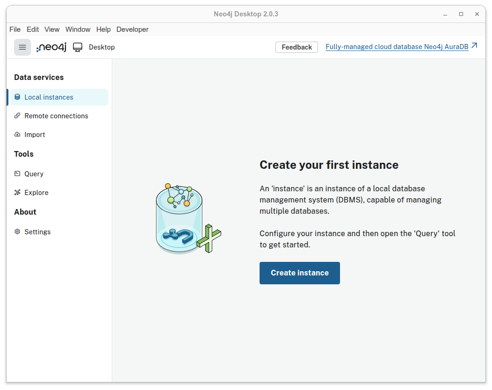
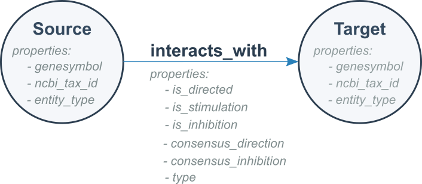
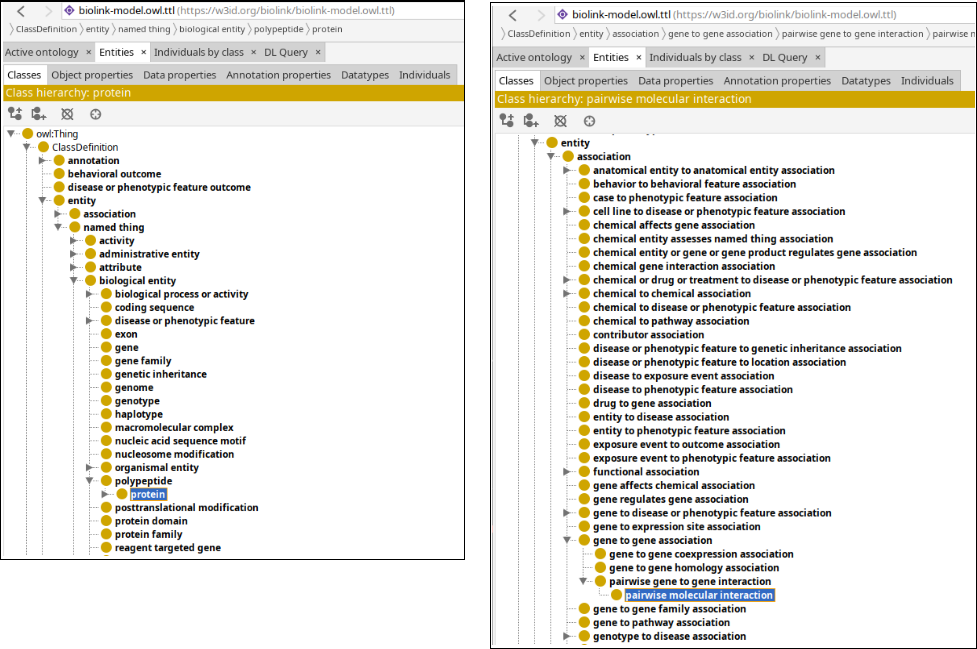
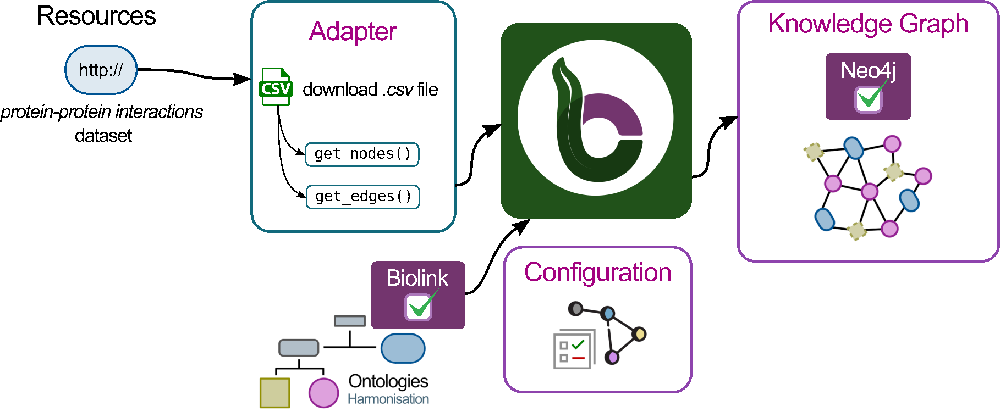
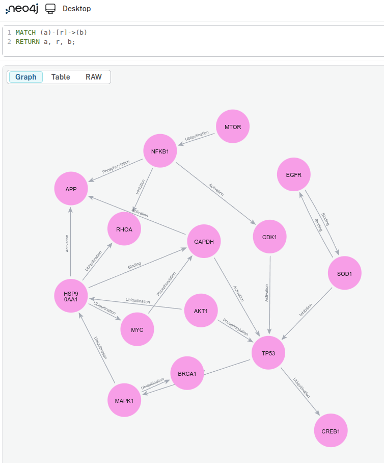
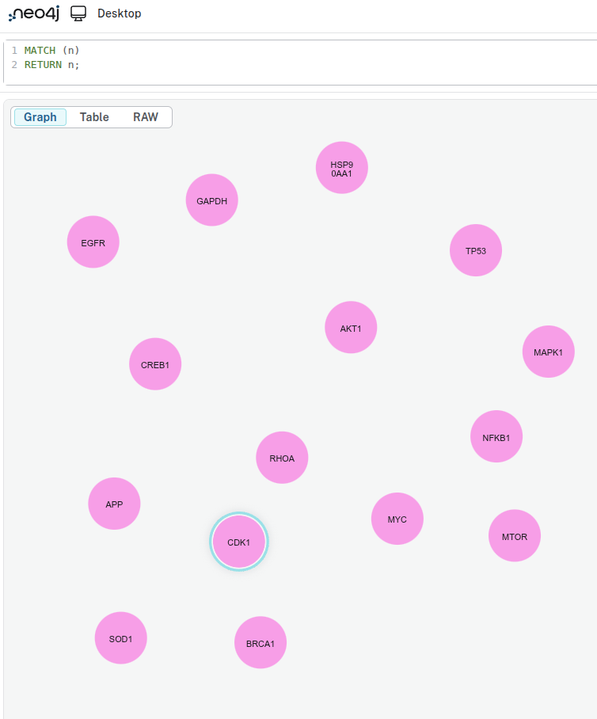
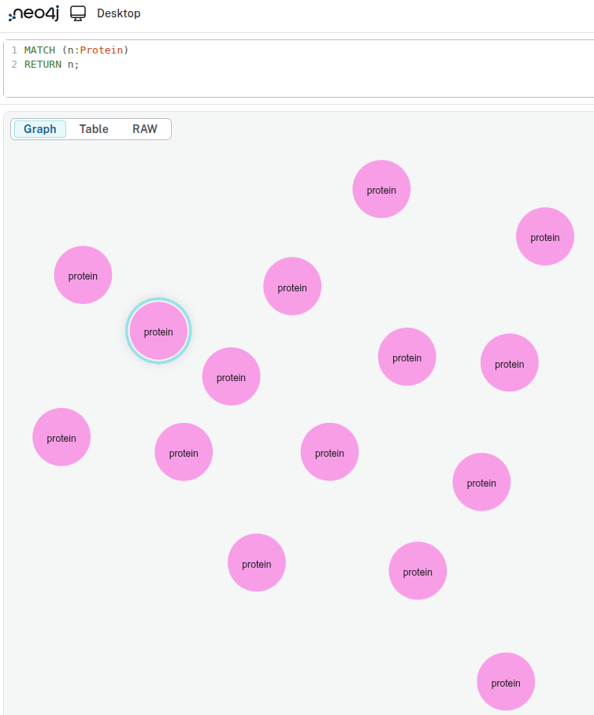
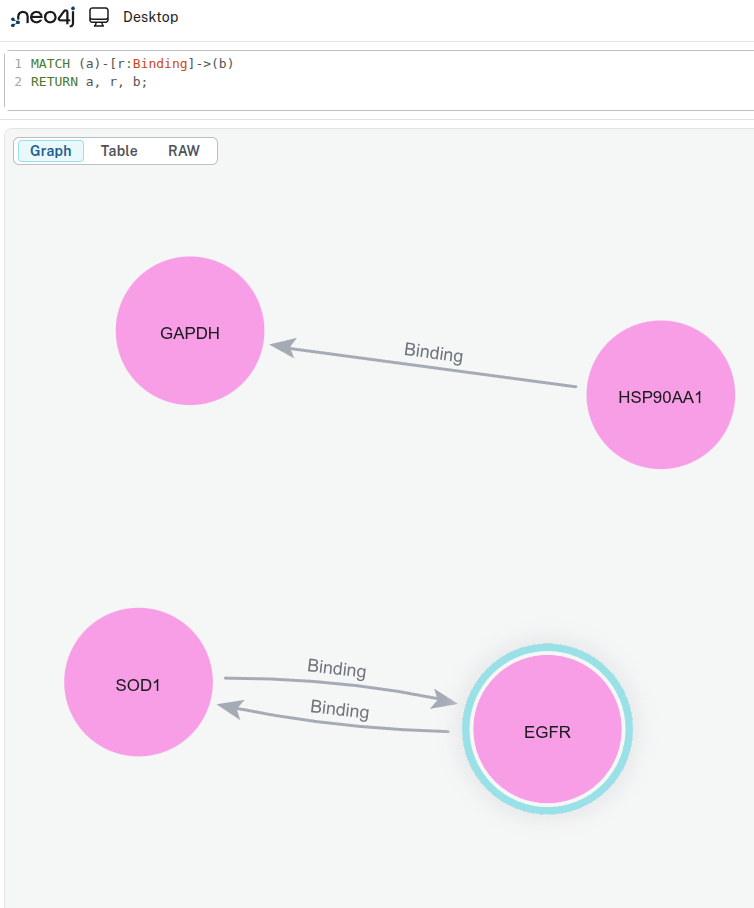

# 🧑‍💻 Hands-on Building Graphs with BioCypher (offline mode) and Neo4j

## Overview

This tutorial will help you get started with BioCypher in offline mode. You will learn how to create a simple knowledge graph with a synthetic dataset that contains information about proteins and its interactions.

By the end of this tutorial, you will be able to:

- Set up BioCypher for a basic project.
- Explore a synthetic dataset and how to obtain a graph model from it.
- Build a small knowledge graph from the data.
- View and query the graph using Neo4j.


## Pre-requisites

> **Note:** Ensure you have the following prerequisites before continue with the tutorial.

| Tool               | Version/Requirement | Installation Link                                                  | Notes                                  |
| ------------------ | ------------------- | ------------------------------------------------------------------ | -------------------------------------- |
| Git                | Any                 | [Git Docs](https://git-scm.com/downloads)                          | For version control                    |
| Neo4j              | >=1.6               | [Neo4j Desktop](https://neo4j.com/download/)                       | For querying graphs                    |
| uv                 | >=0.7.x             | [uv Docs](https://docs.astral.sh/uv/getting-started/installation/) | For dependency management              |
| Python             | >= 3.11             | [Python.org](https://www.python.org/downloads/)                    | Required for BioCypher                 |
| Jupyter (optional) | Any                 | [Jupter](https://jupyter.org/)                                     | Required for exploring the sample data |


## Setup

### Setup Python project

In this section, you will set up your working environment using the BioCypher Project Template. This template provides a ready-to-use folder structure and example files, so you can focus on building your application.

**Steps:**

1. Go to the [BioCypher Project Template](https://github.com/biocypher/project-template) and click on "Use this template". Name your repository as `tutorial-basics-biocypher`. Then clone your repository to obtain a local copy:
    ```bash
    git clone <your-repository-url>
    ```

2. Check the current project structure. Below, we list the most important folders and files for this tutorial.

    ```
    /tutorial-basics-biocypher
        ├── config
        │   ├── biocypher_config.yaml
        │   ├── biocypher_docker_config.yaml
        │   └── schema_config.yaml
        ├── create_knowledge_graph.py
        ├── pyproject.toml
        ├── template_package
        │   └── adapters
        │       └── example_adapter.py
        ...
    ```


3. Install the dependencies using your preferred package manager (e.g. uv, Poetry or pip):

You should always first create a dedicated Python environment for your project, and then install the dependencies into the environment. Environments can be managed by [conda](https://docs.conda.io/projects/conda/en/stable/user-guide/tasks/manage-environments.html), [uv](https://docs.astral.sh/uv/pip/environments/) ,[poetry](https://python-poetry.org/docs/managing-environments/) or [venv](https://docs.python.org/3/library/venv.html), for example.

After you have created your environment, activate the environment and install the required packages using your preferred package manager.

**Using uv: (recommended)**
```bash
uv sync
```

**Using Poetry:**
```bash
poetry install --no-root
```

**Using pip:**
```bash
pip install .
```

You also need to install Jupyter into your environment, i.e. `pip install jupyter`, if later you want to explore the sample data in a Jupyter notebook.

### Setup Neo4j

In this section, we will create a Neo4j instance to use later in the tutorial. It is important to set this up now.

1. Execute Neo4j Desktop, if this the first time you should see a window like this one.

    <figure markdown="span">
    { width="800" }
    <figcaption>Figure 1. Neo4j Desktop start screen.</figcaption>
    </figure>

2. Create a new instance in Neo4j. For this tutorial, name it `neo4j-tutorial-instance` and choose a password you can remember.

    <figure markdown="span">
    { width="800" }
    <figcaption>Figure 2. Create Instance window. This may vary depending on your Neo4j version.</figcaption>
    </figure>

3. Access details in the option *Overview*.

    <figure markdown="span">
    { width="800" }
    <figcaption>Figure 3. *Overview* option to check details related to your Neo4j instance.</figcaption>
    </figure>

4. Save the path to your Neo4j instance, we are going to use this path later in this tutorial.

    <figure markdown="span">
    { width="800" }
    <figcaption>Figure 4. Neo4j instance with its path location highlighted.</figcaption>
    </figure>


## Section 1. Exploratory Data Analysis

For this tutorial we are going to use a [synthetic dataset](https://zenodo.org/records/16902349) that contains information about the interaction between proteins. The dataset is contained in a `tsv` file, similar to a `csv` file but using tabs instead of commas as delimiters.

- First, download the dataset:

    ```bash
    mkdir -p ./data/in/
    curl -o ./data/in/synthetic_protein_interactions.tsv \
    https://zenodo.org/records/16902349/files/synthetic_protein_interactions.tsv
    ```

- Create a folder called `notebooks` under `tutorial-basics-biocypher`
    ```bash
    mkdir -p ./notebooks/
    ```
- Create and run either a Python file or a Jupyter notebook containing the following code.

    ??? example "**File: `notebooks/eda_synthetic_data.py`**"

        ```python
        import pandas as pd

        # Load the dataset
        df = pd.read_table('../data/in/synthetic_protein_interactions.tsv', sep='\t')

        # Show the first few rows
        print("\n---- First 10 rows in the dataset")
        print(df.head(10))

        # List the columns in the dataset
        print("\n---- Columns in the dataset")
        for column in df.columns:
            print(f"\t{column}")

        # Get basic info about the datasets
        print("\n---- Summary Dataframe")
        print(df.info())

        # Check for missing values
        print("\n---- Check missing values")
        print(df.isnull().sum())

        # Show summary statistics for numeric columns
        print("\n---- Describe Dataframe statistics")
        print(df.describe())

        # Count the unique number of proteins in each column
        print("\n---- Number of unique proteins per column.")
        print('Unique proteins in column protein_a:', df['source'].nunique())
        print('Unique proteins in column protein_b:', df['target'].nunique())

        ```

> 📝 **Exercise:**
>
> a. How many unique proteins do we have in the dataset? Hint: count unique proteins in the source and target columns.
>
> b. How many interactions exist in our dataset? Hint: count unique interactions between sources and targets.
>
> c. Some columns contain boolean values represented as "1" and "0". Can you detect which ones?

??? success "Answer:"
    a. Number of unique proteins: 15.

    b. Number of unique interactions: there are 22 unique interactions. One interaction is repeated, with a difference in one of its properties.

    c. `is_directed`, `is_stimulation`, `is_inhibition`, `consensus_direction`, `consensus_stimulation`,`consensus_inhibition`.


## Section 2. Graph Modeling
### Graph Modeling

By looking at the `tsv` file, we can see that there are two columns called `source` and `target`, which represent proteins. This means that each row represents an interaction between a source protein and a target protein. For now, our graph could look like this.

<figure markdown="span">
{ width="400" }
<figcaption>Figure 5. Simple graph model for representing interactions between proteins.</figcaption>
</figure>

Can we improve the graph? Absolutely! Understanding the data is essential for building an effective graph. By examining the other columns in the table, we can identify additional details:

- The `source` and `target` columns represent **nodes** in the graph, with each node corresponding to a protein.

- Each protein listed in the `source` column has associated properties found in other columns:
    - `source_genesymbol`: the gene symbol of the source protein.
    - `ncbi_tax_id_source`: the NCBI taxonomy identifier of the source protein.
    - `entity_type_source`: the type of entity for the source protein.

- Each protein in the `target` column has associated properties found in other columns:
    - `target_genesymbol`
    - `ncbi_tax_id_target`
    - `entity_type_target`

<figure markdown="span">
{ width="400" }
<figcaption>Figure 6. Simple protein interaction graph with properties in nodes.</figcaption>
</figure>

We know that a `source` protein interacts with a `target` protein, but do we know **how**?

Remaining columns in the table describe properties of these protein-protein interactions:

**Interaction properties**

- `is_directed`
- `is_stimulation`
- `is_inhibition`
- `consensus direction`
- `consensus stimulation`
- `consensus inhibition`
- `type`

It is these protein-protein interactions that form the **edges** in the graph. Here, `is_directed`, `is_stimulation`, and `is_inhibition` describe properties that characterize each interaction `type`, while `consensus direction`, `consensus stimulation`, and `consensus inhibition` indicate the aggregated or consensus value derived from multiple sources in OmniPath for each property.

We are ready to model our second version of our graph. It is like follows:

<figure markdown="span">
{ width="400" }
<figcaption>Figure 7. Protein interaction graph showing node and edge properties.</figcaption>
</figure>

Finally, we can model a more detailed graph using our dataset. Rather than representing all interactions in a generic way, we can use the `type` field to show the specific type of interaction occurring between each pair of proteins.

<figure markdown="span">
{ width="550" }
<figcaption>Figure 8. Graph model for representing different interactions between proteins.</figcaption>
</figure>

### Exercise 1. Example of a graph we expect with our data

> 📝 **Exercise:**
> Sketch a portion of the knowledge graph using the provided dataset.


??? success "Answer:"
    If you include all the nodes and edges from your TSV file, your sketch should look like the following example:

    ```mermaid
    graph LR
        SOD1((SOD1))   -- binding --> EGFR((EGFR))
        CDK1((CDK1))   -- activation --> TP53((TP53))
        MYC((MYC))     -- phosporylation --> GAPDH((GAPDH))
        MTOR((MTOR))   -- ubiquitination --> NFKB1((NFKB1))
        NFKB1((NFKB1)) -- activation --> CDK1((CDK1))
        MAPK1((MAPK1)) -- ubiquitination --> HSP90((HSP90))
        TP53((TP53))     -- ubiquitination --> CREB1((CREB1))
        HSP90((HSP90)) -- activation --> APP((APP))
        HSP90((HSP90)) -- ubiquitination --> RHOA((RHOA))
        SOD1((SOD1))   -- inhibition --> TP53((TP53))
        AKT1((AKT1))   -- ubiquitination --> HSP90((HSP90))
        HSP90((HSP90)) -- ubiquitination --> MYC((MYC))
        MAPK1((MAPK1)) -- ubiquitination --> BRCA1((BRCA1))
        NFKB1((NFKB1)) -- inhibition --> RHOA((RHOA))
        NFKB1((NFKB1)) -- phosphorylation --> APP((APP))
        HSP90((HSP90)) -- binding --> GAPDH((GAPDH))
        GAPDH((GAPDH)) -- activation --> TP53((TP53))
        AKT1((AKT1))   -- phosphorylation --> TP53((TP53))
        GAPDH((GAPDH)) -- activation --> APP((APP))
        TP53((TP53))     -- activation --> MAPK1((MAPK1))
        TP53((TP53))     -- ubiquitination --> CREB1((CREB1))
        MYC((MYC))     -- phosphorylation --> GAPDH((GAPDH))
        EGFR((EGFR))   -- binding --> SOD1((SOD1))
    ```

## Section 3. Graph creation with BioCypher

We aim to create a knowledge graph using the data we found in the `tsv` file. Let's recap our exercise:

- Create a **graph** with the following characteristics:
    - One node type: `Protein`.
    - Five edge types: `activation`, `binding`, `inhibition`, `phosphorylation`, `ubiquitination`.

- Each **node** has properties:
    - *genesymbol*
    - *ncbi_tax_id*
    - *entity_type*

- Each **edge** has properties:
    - *is_directed*
    - *is_stimulation*
    - *is_inhibition*
    - *consensus_direction*
    - *consensus_stimulation*
    - *consensus_inhibition*

- We must export the knowledge graph to Neo4j.

To achieve this, we can divide the process into three sections:

1. [Configuration](#step-1-configuration).
    - [Schema configuration](#create-a-schema-for-your-graph)
    - [BioCypher configuration](#configure-biocypher-behavior)

2. [Adapter creation](#step-2-create-an-adapter).
     - Read/connect to input data
     - Process data
     - Stream processed data

3. [Knowledge Graph script](#step-3-create-a-knowledge-graph-script)


### Step 1. Configuration

<figure markdown="span">
{ width="1000" }
<figcaption>Figure 9. Configuration step in the BioCypher pipeline.</figcaption>
</figure>

#### Create a schema for your graph

**Rationale:** the schema file allows us to define the skeleton for our knowledge graph. Nodes, edges, properties are defined here.

The following is an example of how our schema file should look like, all of this is based on how we defined the graph structure (nodes, edges and their properties).

??? example "**File: `config/schema_config.yaml`**"

    ```yaml
    #-------------------------------------------------------------------
    #-------------------------      NODES      -------------------------
    #-------------------------------------------------------------------
    #=========    PARENT NODES
    protein:
        represented_as: node
        preferred_id: uniprot
        input_label: uniprot_protein

    #-------------------------------------------------------------------
    #------------------      RELATIONSHIPS (EDGES)     -----------------
    #-------------------------------------------------------------------
    #=========    PARENT EDGES
    protein protein interaction:
        is_a: pairwise molecular interaction
        represented_as: edge
        input_label: protein_protein_interaction
        properties:
            is_directed: bool
            is_stimulation: bool
            is_inhibition: bool
            consensus_direction: bool
            consensus_stimulation: bool
            consensus_inhibition: bool

    #=========    INHERITED EDGES
    binding:
        is_a: protein protein interaction
        inherit_properties: true
        represented_as: edge
        input_label: binding

    # ...rest of schema_config.yaml omitted for brevity...
    ```

##### Nodes

The `protein` top-level key in the YAML snippet identifies our entity and connects it to the ontological backbone.

| Key              | Value             | Description                                                                                                                                               |
| ---------------- | ----------------- | --------------------------------------------------------------------------------------------------------------------------------------------------------- |
| `represented_as` | `node`            | Specifies how BioCypher should represent each entity in the graph; in this case, as a node.                                                               |
| `preferred_id`   | `uniprot`         | Defines a namespace for our proteins. In this example, all proteins follow the UniProt convention—a 5-character alphanumeric string (e.g., P00533).       |
| `input_label`    | `uniprot_protein` | Indicates the expected label in the node tuple. All other input nodes without this label are ignored unless they are defined in the schema configuration. |

For more information about which other keywords you can use to configure your nodes in the schema file consult [Fields reference](https://biocypher.org/BioCypher/reference/schema-config/#fields-reference).


##### Edges (relationships)

As shown in [Figure 7](#graph-modeling), each edge has the same set of properties (`is_directed`, `consensus_direction`, etc.). At this stage, we have two options for defining the edges:

- Option 1: Create each edge and explicitly define the same set of property fields for every edge.

??? example "**File: `config/schema_config.yaml`**"

    ```yaml
    #-------------------------------------------------------------------
    #------------------      RELATIONSHIPS (EDGES)     -----------------
    #-------------------------------------------------------------------
    activation:
        is_a: pairwise molecular interaction
        represented_as: edge
        input_label: protein_protein_interaction
        properties:
            is_directed: bool
            is_stimulation: bool
            is_inhibition: bool
            consensus_direction: bool
            consensus_stimulation: bool
            consensus_inhibition: bool

    binding:
        is_a: pairwise molecular interaction
        represented_as: edge
        input_label: protein_protein_interaction
        properties:
            is_directed: bool
            is_stimulation: bool
            is_inhibition: bool
            consensus_direction: bool
            consensus_stimulation: bool
            consensus_inhibition: bool

    # ...rest of schema_config.yaml omitted for brevity...
    ```

- Option 2 (**recommended**): Create a base edge with the properties, and then create edges that inherit the behavior of this base edge. This approach reduces lines of code and avoids repetition. For example, if you have more than 20 edges, Option 1 would likely not be practical.

??? example "**File: `config/schema_config.yaml`**"

    ```yaml
    #-------------------------------------------------------------------
    #------------------      RELATIONSHIPS (EDGES)     -----------------
    #-------------------------------------------------------------------
    #====   BASE EDGE or PARENT EDGE
    protein protein interaction:
        is_a: pairwise molecular interaction
        represented_as: edge
        input_label: protein_protein_interaction
        properties:
            is_directed: bool
            is_stimulation: bool
            is_inhibition: bool
            consensus_direction: bool
            consensus_stimulation: bool
            consensus_inhibition: bool

    #====   INHERITED EDGES
    activation:
        is_a: protein protein interaction
        inherit_properties: true
        represented_as: edge
        input_label: activation

    binding:
        is_a: protein protein interaction
        inherit_properties: true
        represented_as: edge
        input_label: binding

    # ...rest of schema_config.yaml omitted for brevity...
    ```

Let's explain the keys and values for the second case (Option 2), because we are going to use the second option approach.

**Base Edge**
The `protein protein interaction` top-level key in the YAML snippet identifies our edge entity.

| Key              | Value                                             | Description                                                                                             |
| ---------------- | ------------------------------------------------- | ------------------------------------------------------------------------------------------------------- |
| `is_a`           | `pairwise molecular interaction`                  | Defines the type of entity based on the ontology.                                                       |
| `represented_as` | `edge`                                            | Explicitly specifies that this entity is an edge.                                                       |
| `input_label`    | `protein_protein_interaction`                     | Defines a namespace for our relationships.                                                              |
| `properties`     | *property*: *datatype* (i.e. `is_directed: bool`) | Contains all properties associated with this edge; each property has a name and an associated datatype. |


**Inherited Edges**
The `activation:` top-level key in the YAML snippet identifies our edge entity.

| Key                  | Value                         | Description                                                                                           |
| -------------------- | ----------------------------- | ----------------------------------------------------------------------------------------------------- |
| `is_a`               | `protein protein interaction` | Defines the type of entity; in this case, it is a child of the base edge we defined previously.       |
| `inherit_properties` | `true`                        | Indicates whether all properties defined in the base edge should be inherited.                        |
| `represented_as`     | `edge`                        | Specifies that BioCypher will treat this entity (`activation`) as an edge.                            |
| `input_label`        | `binding`                     | Specifies the expected edge label; edges without this label are ignored unless defined in the schema. |

#### A comment about the connection between BioCypher and Ontologies

In BioCypher, ontologies are integrated through the schema configuration file. This YAML file defines the structure of the graph by specifying which entities and relationships should be included. At the same time, it links those entities to the biomedical domain by aligning them with an ontological hierarchy. In this tutorial, we use the Biolink Model as the backbone of that hierarchy. The guiding principle is simple: only entities that are defined in the schema configuration **and** present in the input data are incorporated into the final knowledge graph.

Figure 10 illustrates the Biolink Model and some of its components organized in a hierarchy. Notice that entities such as *protein* (nodes) and *pairwise molecular interaction* (edges) appear both in the schema configuration and in the ontology. This alignment ensures that BioCypher graphs are not only structured consistently but also grounded in standardized biomedical concepts. For a deeper exploration of ontologies in BioCypher, see our [ontology tutorial](https://biocypher.org/BioCypher/learn/tutorials/tutorial002_handling_ontologies/).

<figure markdown="span">
{ width="1000" }
<figcaption>Figure 10. The Biolink Model as an ontology backbone. On the right, <b>protein</b> is represented as an entity; on the left, <b>pairwise molecular interaction</b> is defined as an association. Together, these demonstrate how the schema anchors graph components to standardized biomedical concepts.</figcaption>
</figure>


> 📝 **Exercise:**
> Revise and complete the `schema_config.yaml` file, and make sure it is located in the `config` folder.

??? success "Answer:"
    See the example below for a completed <code>schema_config.yaml</code>.

    **File: `config/schema_config.yaml`**

    ```yaml
    #-------------------------------------------------------------------
    #-------------------------      NODES      -------------------------
    #-------------------------------------------------------------------
    #====   PARENT NODES
    protein:
        represented_as: node
        preferred_id: uniprot
        input_label: uniprot_protein

    #-------------------------------------------------------------------
    #------------------      RELATIONSHIPS (EDGES)     -----------------
    #-------------------------------------------------------------------
    #====   PARENT EDGES
    protein protein interaction:
        is_a: pairwise molecular interaction
        represented_as: edge
        input_label: protein_protein_interaction
        properties:
            is_directed: bool
            is_stimulation: bool
            is_inhibition: bool
            consensus_direction: bool
            consensus_stimulation: bool
            consensus_inhibition: bool

    #====   INHERITED EDGES
    activation:
        is_a: protein protein interaction
        inherit_properties: true
        represented_as: edge
        input_label: activation

    binding:
        is_a: protein protein interaction
        inherit_properties: true
        represented_as: edge
        input_label: binding

    inhibition:
        is_a: protein protein interaction
        inherit_properties: true
        represented_as: edge
        input_label: inhibition

    phosphorylation:
        is_a: protein protein interaction
        inherit_properties: true
        represented_as: edge
        input_label: phosphorylation

    ubiquitination:
        is_a: protein protein interaction
        inherit_properties: true
        represented_as: edge
        input_label: ubiquitination

    ```

#### Configure BioCypher behavior

**Rationale:** The purpose of writing a `biocypher_config.yaml` is to define how BioCypher should operate for your project—specifying settings for data import, graph creation, and database interaction—all in one place for clarity and easy customization.

??? example "**File: `config/biocypher_config.yaml`**"

    ```yaml
    #---------------------------------------------------------------
    #--------        BIOCYPHER GENERAL CONFIGURATION        --------
    #---------------------------------------------------------------
    biocypher:
        offline: true
        debug: false
        schema_config_path: config/schema_config.yaml
        cache_directory: .cache

    #----------------------------------------------------
    #--------        OUTPUT CONFIGURATION        --------
    #----------------------------------------------------
    neo4j:
        database_name: neo4j
        delimiter: '\t'
        array_delimiter: '|'
        skip_duplicate_nodes: true
        skip_bad_relationships: true
        import_call_bin_prefix: <path to your Neo4j instance from Setup Neo4j section>/bin/
    ```

The first block is the BioCypher Core Settings, which starts with `biocypher:`

| key                  | value                       | description                                                          |
| -------------------- | --------------------------- | -------------------------------------------------------------------- |
| `offline`            | `true`                      | Whether to run in offline mode (no running DBMS or in-memory object) |
| `debug`              | `false`                     | Whether to enable debug logging                                      |
| `schema_config_path` | `config/schema_config.yaml` | Path to the schema configuration file                                |
| `cache_directory`    | `.cache`                    | Path to the schema configuration file                                |


The second block is the Database Management System Settings, which starts with the name of the DBMS, in this case it's `neo4j:`

| key                      | value             | description                                          |
| ------------------------ | ----------------- | ---------------------------------------------------- |
| `delimiter`              | `'\t'`            | Field delimiter for TSV import files                 |
| `array_delimiter`        | `';'`             | Delimiter for array values                           |
| `skip_duplicate_nodes`   | `true`            | Whether to skip duplicate nodes during import        |
| `skip_bad_relationships` | `true`            | Whether to skip relationships with missing endpoints |
| `import_call_bin_prefix` | i.e., `/usr/bin/` | Prefix for the import command binary (optional)      |

The `import_call_bin_prefix` is the path to your Neo4j instance that you looked up in [section Setup Neo4j](#setup-neo4j) together with the prefix `/bin`.

The default configuration that comes with BioCypher and more configuration parameters for the Settings are listed in [BioCypher Configuration Reference](https://biocypher.org/BioCypher/reference/biocypher-config/).

> 📝 **Exercise:**
> Revise and complete the `biocypher_config.yaml` file, and make sure it is located in the `config` folder.

??? success "Answer:"
    See the example below for a completed <code>biocypher_config.yaml</code>. Note, the path in the  <code>import_call_bin_prefix</code> correspond to my personal instance, <strong>you MUST update this path with yours, do not forget to add /bin/</strong> as in my example

    **File: `biocypher_config.yaml`**

    ```yaml
    #---------------------------------------------------------------
    #--------        BIOCYPHER GENERAL CONFIGURATION        --------
    #---------------------------------------------------------------
    biocypher:
        offline: true
        debug: false
        schema_config_path: config/schema_config.yaml
        cache_directory: .cache

    #----------------------------------------------------
    #--------        OUTPUT CONFIGURATION        --------
    #----------------------------------------------------
    neo4j:
        database_name: neo4j
        delimiter: '\t'
        array_delimiter: '|'
        skip_duplicate_nodes: true
        skip_bad_relationships: true
        import_call_bin_prefix: /home/egcarren/.config/neo4j-desktop/Application/Data/dbmss/dbms-08155706-b96e-4e74-a965-7d6d27b78db8/bin/
    ```

### Step 2. Create an adapter

<figure markdown="span">
{ width="1000" }
<figcaption>Figure 11. Adapter creation in the BioCypher pipeline.</figcaption>
</figure>

**Rationale:** An adapter allows you to efficiently transform, integrate, combine data from different sources ensuring compatibility with BioCypher's schema and streamlining the import process.

a. Create a file called `adapter_synthetic_proteins.py` under the folder `/template_package/adapters/`, in this file we are going to create our adapter.

b. Define Enums for the different types of nodes in our graph and their properties. An Enum is simply a list of allowed values for a category — for example, all possible node types in the graph. Using Enums helps ensure that only valid types are used, makes the code easier to read, and avoids typos. For now, just focus on analyzing the snippet and compare its values with the node elements expected in the schema file(`schema_config.yaml`).

??? example "**File: `/template_package/adapters/adapter_synthetic_proteins.py`**"

    ```python
    class AdapterNodeType(Enum):
        """
        Define types of nodes the adapter can provide.
        """

        PROTEIN = auto()

    class AdapterProteinField(Enum):
        """
        Define possible fields the adapter can provide for proteins.
        """

        ID = "id"
        PREFERRED_ID = "preferred_id"
        GENE_SYMBOL = "genesymbol"
        NCBI_TAX_ID = "ncbi_tax_id"
    ```
c. Similarly, define Enums for the different types of edges in our graph and their properties. For now, analyze the following snippet and compare the listed types with the edge elements expected in our schema file (`schema_config.yaml`).

??? example "**File: `/template_package/adapters/adapter_synthetic_proteins.py`**"

    ```python
    class AdapterEdgeType(Enum):
        """
        Enum for the types of the protein adapter.
        """

        PROTEIN_PROTEIN_INTERACTION = "protein_protein_interaction"
        BINDING = "binding"
        ACTIVATION = "activation"
        PHOSPHORYLATION = "phosphorylation"
        UBIQUITINATION = "ubiquitination"
        INHIBITION = "inhibition"

    class AdapterProteinProteinEdgeField(Enum):
        """
        Define possible fields the adapter can provide for protein-protein edges.
        """

        INTERACTION_TYPE = "interaction_type"
        INTERACTION_SOURCE = "interaction_source"
        IS_DIRECTED = "is_directed"
        IS_STIMULATION = "is_stimulation"
        IS_INHIBITION = "is_inhibition"
        CONSENSUS_DIRECTION = "consensus_direction"
        CONSENSUS_STIMULATION = "consensus_stimulation"
        CONSENSUS_INHIBITION = "consensus_inhibition"
    ```

Now you are ready to write functions that load the data into a dataframe and extract nodes and edges. Before doing this you need to understand that BioCypher expect a certain format. Let's discuss this:

BioCypher expects each node or edge being a tuple (datastructure) as explained in the next section.

#### Nodes Convention
BioCypher expects each node being a **3-element tuple**, with elements in the following order:
1. [*mandatory*]  `ID`: this is a unique identifier for the node (i.e., `P53`)
2. [*mandatory*]  `LABEL`: this is a namespace for the node (i.e, `uniprot`)
3. [*mandatory*]   `PROPERTIES`: a dictionary containing properties for the node, which may be empty (i.e., have no entries).

For example:

```python
#  ✅ This is a 3-element tuple
# 1     2          3
("TP53", "uniprot", {"entity_type": "protein", "ncbi_tax_id":9096})
```

```python
# ✖️ This is NOT a 3-element tuple
#1      2          3              4          5              6
("TP53", "uniprot", "entity_type", "protein", "ncbi_tax_id", 9096)
```

#### Edges Convention

BioCypher expects each edge being a **5-element tuple**, with elements in the following order:

1. [*optional*]  `ID`: this is a unique identifier for the edge (i.e., `P53CREB1`)
2. [*mandatory*]  `SOURCE`: this is the ID for the source node (i.e, `TP53`)
3. [*mandatory*]  `TARGET`: this is the ID for the source node (i.e, `CREB1`)
4. [*mandatory*]  `LABEL`: this is a namespace for the edge (i.e, `activation`, `inhibition`)
5. [*mandatory*] `PROPERTIES`: a dictionary containing properties for the edge, which may be empty (i.e., have no entries).


```python
#  ✅ This is a 5-element tuple for BioCypher
#1   2      3        4                 5
(None, "TP53", "CREB1", "ubiquitination", {"is_directed": True})
```

```python
# ✖️ This is NOT the 5-element tuple format that BioCypher expects. Can you explain why?
#1           2      3                 4              5
("TP53CREB1", "TP53", "ubiquitination", "is_directed", True)
```

Finally, write the functions that read the data as a DataFrame and override the functions to extract nodes and edges in the formats expected by BioCypher. This is illustrated in the next snippet.

??? example "**File: `/template_package/adapters/adapter_synthetic_proteins.py`**"

    ```python
    def _read_tsv(self) -> pd.DataFrame:
        """
        Reads and validates the TSV file.
        Returns:
            pd.DataFrame: DataFrame containing the TSV data.
        Raises:
            FileNotFoundError: If the file does not exist.
            ValueError: If required columns are missing.
        """
        if not Path(self.tsv_path).exists():
            logger.error(f"TSV file not found: {self.tsv_path}")
            raise FileNotFoundError(f"TSV file not found: {self.tsv_path}")
        df = pd.read_table(self.tsv_path, sep="\t", header=0)
        required_columns = [
            'source', 'target', 'source_genesymbol', 'target_genesymbol',
            'ncbi_tax_id_source', 'ncbi_tax_id_target', 'type',
            'is_directed', 'is_stimulation', 'is_inhibition', 'consensus_direction',
            'consensus_stimulation', 'consensus_inhibition'
        ]
        missing = [col for col in required_columns if col not in df.columns]
        if missing:
            logger.error(f"Missing columns in TSV: {missing}")
            raise ValueError(f"TSV must contain columns: {missing}")
        return df

    def get_nodes(self) -> 'Generator[tuple[str, str, dict], None, None]':
        """
        Yields node tuples for node types specified in the adapter constructor.

        Returns:
            Generator[tuple[str, str, dict], None, None]:
                Each tuple is (id, label, properties).
        """
        logger.info("Reading nodes.")
        df = self._read_tsv()

        # Generator for nodes in the `source` column
        for row in df.itertuples(index=False):
            id = row.source
            input_label = "uniprot_protein"

            properties = {
                'genesymbol': row.source_genesymbol,
                'ncbi_tax_id': row.ncbi_tax_id_source,
                'entity_type': row.entity_type_source,
            }

            yield(
                id,
                input_label,
                properties
            )

        # Generator for nodes in the `target` column
        for row in df.itertuples(index=False):
            id = row.target
            input_label = "uniprot_protein"

            properties = {
                'genesymbol': row.target_genesymbol,
                'ncbi_tax_id': row.ncbi_tax_id_target,
                'entity_type': row.entity_type_target,
            }

            yield(
                id,
                input_label,
                properties
            )

    def get_edges(self) -> 'Generator[tuple[str, str, str, str, dict], None, None]':
        """
        Yields edge tuples for edge types specified in the adapter constructor.

        Returns:
            Generator[tuple[str, str, str, str, dict], None, None]:
                Each tuple is (id, source, target, type, properties).
        """
        logger.info("Generating edges.")
        df = self._read_tsv()

        for row in df.itertuples(index=False):
            # Concatenate source and target, i.e., "SOD1EGFR"
            id = f"{row.source}{row.target}"

            source = row.source

            target = row.target

            type = row.type

            properties = {
                'is_directed': row.is_directed,
                'is_stimulation': row.is_stimulation,
                'is_inhibition': row.is_inhibition,
                'consensus_direction': row.consensus_direction,
                'consensus_stimulation': row.consensus_stimulation,
                'consensus_inhibition': row.consensus_inhibition
            }

            yield (
                id,
                source,
                target,
                type,
                properties
            )

    ```


> 📝 **Exercise:**
> Integrate the aforementioned snippets in a single file call `adapter_synthetic_proteins.py`.

??? success "Answer:"
    See the example below for a completed <code>adapter_synthetic_proteins.py</code>.

    **File: `/template_package/adapters/adapter_synthetic_proteins.py`**

    ```python
    import os
    from enum import Enum, auto
    from itertools import chain
    from typing import Optional, Generator
    from pathlib import Path


    import pandas as pd
    from biocypher import BioCypher
    from biocypher._logger import logger


    TSV_FILE_PATH_SYNTHETIC_PROTEINS = Path("./cache/synthetic_protein_interactions.tsv")

    class AdapterNodeType(Enum):
        """
        Define types of nodes the adapter can provide.
        """

        PROTEIN = auto()

    class AdapterProteinField(Enum):
        """
        Define possible fields the adapter can provide for proteins.
        """

        ID = "id"
        PREFERRED_ID = "preferred_id"
        GENE_SYMBOL = "genesymbol"
        NCBI_TAX_ID = "ncbi_tax_id"

    class AdapterEdgeType(Enum):
        """
        Enum for the types of the protein adapter.
        """

        PROTEIN_PROTEIN_INTERACTION = "protein_protein_interaction"
        BINDING = "binding"
        ACTIVATION = "activation"
        PHOSPHORYLATION = "phosphorylation"
        UBIQUITINATION = "ubiquitination"
        INHIBITION = "inhibition"

    class AdapterProteinProteinEdgeField(Enum):
        """
        Define possible fields the adapter can provide for protein-protein edges.
        """

        INTERACTION_TYPE = "interaction_type"
        INTERACTION_SOURCE = "interaction_source"
        IS_DIRECTED = "is_directed"
        IS_STIMULATION = "is_stimulation"
        IS_INHIBITION = "is_inhibition"
        CONSENSUS_DIRECTION = "consensus_direction"
        CONSENSUS_STIMULATION = "consensus_stimulation"
        CONSENSUS_INHIBITION = "consensus_inhibition"

    class Adapter:
        def __init__(
            self,
            tsv_path: str = TSV_FILE_PATH_SYNTHETIC_PROTEINS,
            node_types: Optional[list] = None,
            node_fields: Optional[list] = None,
            edge_types: Optional[list] = None,
            edge_fields: Optional[list] = None,
        ):
            self.tsv_path = tsv_path
            self._set_types_and_fields(node_types, node_fields, edge_types, edge_fields)

        def _read_tsv(self) -> pd.DataFrame:
            """
            Reads and validates the TSV file.
            Returns:
                pd.DataFrame: DataFrame containing the TSV data.
            Raises:
                FileNotFoundError: If the file does not exist.
                ValueError: If required columns are missing.
            """
            if not Path(self.tsv_path).exists():
                logger.error(f"TSV file not found: {self.tsv_path}")
                raise FileNotFoundError(f"TSV file not found: {self.tsv_path}")
            df = pd.read_table(self.tsv_path, sep="\t", header=0)
            required_columns = [
                'source', 'target', 'source_genesymbol', 'target_genesymbol',
                'ncbi_tax_id_source', 'ncbi_tax_id_target', 'type',
                'is_directed', 'is_stimulation', 'is_inhibition', 'consensus_direction',
                'consensus_stimulation', 'consensus_inhibition'
            ]
            missing = [col for col in required_columns if col not in df.columns]
            if missing:
                logger.error(f"Missing columns in TSV: {missing}")
                raise ValueError(f"TSV must contain columns: {missing}")
            return df

        def get_nodes(self) -> 'Generator[tuple[str, str, dict], None, None]':
            """
            Yields node tuples for node types specified in the adapter constructor.

            Returns:
                Generator[tuple[str, str, dict], None, None]:
                    Each tuple is (id, label, properties).
            """
            logger.info("Reading nodes.")
            df = self._read_tsv()

            # Generator for nodes in the `source` column
            for row in df.itertuples(index=False):
                id = row.source
                input_label = "uniprot_protein"

                properties = {
                    'genesymbol': row.source_genesymbol,
                    'ncbi_tax_id': row.ncbi_tax_id_source,
                    'entity_type': row.entity_type_source,
                }

                yield(
                    id,
                    input_label,
                    properties
                )

            # Generator for nodes in the `target` column
            for row in df.itertuples(index=False):
                id = row.target
                input_label = "uniprot_protein"

                properties = {
                    'genesymbol': row.target_genesymbol,
                    'ncbi_tax_id': row.ncbi_tax_id_target,
                    'entity_type': row.entity_type_target,
                }

                yield(
                    id,
                    input_label,
                    properties
                )

        def get_edges(self) -> 'Generator[tuple[str, str, str, str, dict], None, None]':
            """
            Yields edge tuples for edge types specified in the adapter constructor.

            Returns:
                Generator[tuple[str, str, str, str, dict], None, None]:
                    Each tuple is (id, source, target, type, properties).
            """
            logger.info("Generating edges.")
            df = self._read_tsv()

            for row in df.itertuples(index=False):
                # Concatenate source and target, i.e., "SOD1EGFR"
                id = f"{row.source}{row.target}"

                source = row.source

                target = row.target

                type = row.type

                properties = {
                    'is_directed': row.is_directed,
                    'is_stimulation': row.is_stimulation,
                    'is_inhibition': row.is_inhibition,
                    'consensus_direction': row.consensus_direction,
                    'consensus_stimulation': row.consensus_stimulation,
                    'consensus_inhibition': row.consensus_inhibition
                }

                yield (
                    id,
                    source,
                    target,
                    type,
                    properties
                )

        def get_node_count(self) -> int:
            """
            Returns the number of nodes generated by the adapter.

            Returns:
                int: Number of nodes generated.
            """
            return sum(1 for _ in self.get_nodes())

        def _set_types_and_fields(self, node_types, node_fields, edge_types, edge_fields) -> None:
            """
            Sets the node and edge types and fields for the adapter.

            Args:
                node_types (Optional[list]): List of node types.
                node_fields (Optional[list]): List of node fields.
                edge_types (Optional[list]): List of edge types.
                edge_fields (Optional[list]): List of edge fields.
            """
            if node_types:
                self.node_types = node_types
            else:
                self.node_types = [type for type in AdapterNodeType]

            if node_fields:
                self.node_fields = node_fields
            else:
                self.node_fields = [
                    field
                    for field in chain(
                        AdapterProteinField,
                    )
                ]

            if edge_types:
                self.edge_types = edge_types
            else:
                self.edge_types = [type for type in AdapterEdgeType]

            if edge_fields:
                self.edge_fields = edge_fields
            else:
                self.edge_fields = [field for field in chain()]
    ```

### Step 3. Create a knowledge graph script

<figure markdown="span">
{ width="1000" }
<figcaption>Figure 12. BioCypher pipeline</figcaption>
</figure>

**Rationale:** Integrating all steps—downloading the dataset, loading the data, extracting nodes and edges, and exporting graph assets—into a single script streamlines the entire process. This approach makes it easier to build and manage the knowledge graph pipeline efficiently and reproducibly.

1. Create a BioCypher object

    ??? example "**File: `create_knowledge_graph.py`**"

        ```python
        from biocypher import BioCypher, FileDownload

        # Create an instance of BioCypher
        bc = BioCypher()
        ```

2.  Use BioCypher to automatically download the file with cache capabilities.

    ??? example "**File: `create_knowledge_graph.py`**"

        ```python
        # Download the file with cache capabilities
        url_dataset = (
            "https://zenodo.org/records/16902349/files/synthetic_protein_interactions.tsv"
        )

        resource = FileDownload(
            name="protein-protein-interaction-dataset",  # Name of the resource
            url_s=url_dataset,  # URL to the resource(s)
            lifetime=7,  # seven days cache lifetime
        )
        paths = bc.download(resource)  # Downloads to '.cache' by default

        print(f"Path to the resouce: {paths}")
        ```


3. Instantiate your adapter from the classes you created previously in your adapter file.

    ??? example  "**File: `create_knowledge_graph.py`**"
        ```python

        from template_package.adapters.adapter_synthetic_proteins import (
            AdapterNodeType,
            AdapterProteinField,
            AdapterEdgeType,
            Adapter,
        )

        # Choose the node type you want appear in the Knowledge Graph
        node_types = [
            AdapterNodeType.PROTEIN
        ]

        # Choose protein adapter fields to include in the knowledge graph.
        node_fields = [
            AdapterProteinField.ID,
            AdapterProteinField.PREFERRED_ID,
            AdapterProteinField.GENE_SYMBOL,
            AdapterProteinField.NCBI_TAX_ID
        ]

        # Choose the node type you want appear in the Knowledge Graph
        edge_types = [
            AdapterEdgeType.PROTEIN_PROTEIN_INTERACTION,
            AdapterEdgeType.BINDING,
            AdapterEdgeType.ACTIVATION,
            AdapterEdgeType.PHOSPHORYLATION,
            AdapterEdgeType.UBIQUITINATION,
            AdapterEdgeType.INHIBITION
        ]

        # (there is not code here!) Choose interaction adapter fields to include in the knowledge graph.
        # By default, in case of not specifying this, BioCypher will bring all the fields defined in the adapter

        # Create an adapter instance
        adapter = Adapter(
            tsv_path = paths[0],
            node_types=node_types,
            node_fields=node_fields,
            edge_types=edge_types,
        )
        ```

4. Write data from your adapter to BioCypher

    ??? example "**File: `create_knowledge_graph.py`**"
        ```python
        # Create a knowledge graph from the adapter
        bc.write_nodes(adapter.get_nodes())
        bc.write_edges(adapter.get_edges())
        ```

5. Export your graph to Neo4j (generation of TSV files and import script)

    ??? example "**File: `create_knowledge_graph.py`**"
        ```python
        # Generate assets for Neo4j exportation
        bc.write_import_call()
        ```

6. Print summary

    ??? example "**File: `create_knowledge_graph.py`**"
        ```python
        # Print a summary when
        bc.summary()
        ```

> 📝 **Exercise:**
> Integrate the aforementioned snippets in a single file called `create_knowledge_graph.py` script and **RUN IT**!

??? success "Answer:"
    See the example below for a completed <code>create_knowledge_graph.yaml</code>.

    **File: `create_knowledge_graph.py`**

    ```python
    from biocypher import BioCypher, FileDownload
    from template_package.adapters.adapter_synthetic_proteins import (
        AdapterNodeType,
        AdapterProteinField,
        AdapterEdgeType,
        Adapter,
    )

    # Create an instance of BioCypher
    bc = BioCypher()

    # Download the file with cache capabilities
    url_dataset = (
        "https://zenodo.org/records/16902349/files/synthetic_protein_interactions.tsv"
    )

    resource = FileDownload(
        name="protein-protein-interaction-dataset",  # Name of the resource
        url_s=url_dataset,  # URL to the resource(s)
        lifetime=7,  # seven days cache lifetime
    )
    paths = bc.download(resource)  # Downloads to '.cache' by default

    print(f"Path to the resouce: {paths}")


    # Choose the node type you want appear in the Knowledge Graph
    node_types = [AdapterNodeType.PROTEIN]

    # Choose protein adapter fields to include in the knowledge graph.
    node_fields = [
        AdapterProteinField.ID,
        AdapterProteinField.PREFERRED_ID,
        AdapterProteinField.GENE_SYMBOL,
        AdapterProteinField.NCBI_TAX_ID,
    ]

    # Choose the node type you want appear in the Knowledge Graph
    edge_types = [
        AdapterEdgeType.PROTEIN_PROTEIN_INTERACTION,
        AdapterEdgeType.BINDING,
        AdapterEdgeType.ACTIVATION,
        AdapterEdgeType.PHOSPHORYLATION,
        AdapterEdgeType.UBIQUITINATION,
        AdapterEdgeType.INHIBITION,
    ]

    # (there is not code here!) Choose interaction adapter fields to include in the knowledge graph.
    # By default, in case of not specifying this, BioCypher will bring all the fields defined in the adapter

    # Create an adapter instance
    adapter = Adapter(
        tsv_path=paths[0],
        node_types=node_types,
        node_fields=node_fields,
        edge_types=edge_types,
    )

    # Create a knowledge graph from the adapter
    bc.write_nodes(adapter.get_nodes())
    bc.write_edges(adapter.get_edges())

    # Generate assets for Neo4j exportation
    bc.write_import_call()

    # Print a summary when
    bc.summary()

    ```


#### Run the script

You can execute the entire pipeline that loads, processes, and builds the graph by running the following command from the root folder of your project. The example below uses `uv`.
```bash
uv run python create_knowledge_graph.py
```

> 🏆 **Note:** Once you complete the process, your terminal output should look similar to the following:

??? info "Terminal output:"
    ```markdown
    INFO -- This is BioCypher v0.10.1.
    INFO -- Logging into `biocypher-log/biocypher-20250818-153024.log`.
    INFO -- Running BioCypher with schema configuration from config/schema_config.yaml.
    INFO -- Loading cache file .cache/cache.json.
    INFO -- Use cached version from .cache/protein-protein-interaction-dataset.
    Path to the resouce: ['.cache/protein-protein-interaction-dataset/synthetic_protein_interactions.tsv']
    INFO -- Loading ontologies...
    INFO -- Instantiating OntologyAdapter class for https://github.com/biolink/biolink-model/raw/v3.2.1/biolink-model.owl.ttl.
    INFO -- Reading nodes.
    INFO -- Creating output directory `/home/hostname/tutorial-basics-biocypher/biocypher-out/20250818153026`.
    WARNING -- Duplicate node type protein found.
    INFO -- Writing 15 entries to Protein-part000.csv
    INFO -- Generating edges.
    WARNING -- Duplicate edge type ubiquitination found.
    WARNING -- Duplicate edge type phosphorylation found.
    INFO -- Writing 3 entries to Binding-part000.csv
    INFO -- Writing 6 entries to Activation-part000.csv
    INFO -- Writing 3 entries to Phosphorylation-part000.csv
    INFO -- Writing 7 entries to Ubiquitination-part000.csv
    INFO -- Writing 2 entries to Inhibition-part000.csv
    INFO -- Writing neo4j import call to `/home/hostname/tutorial-basics-biocypher/biocypher-out/20250818153026/neo4j-admin-import-call.sh`.
    INFO -- Showing ontology structure based on https://github.com/biolink/biolink-model/raw/v3.2.1/biolink-model.owl.ttl
    INFO --
    entity
    ├── association
    │   └── gene to gene association
    │       └── pairwise gene to gene interaction
    │           └── pairwise molecular interaction
    │               └── protein protein interaction
    │                   ├── activation
    │                   ├── binding
    │                   ├── inhibition
    │                   ├── phosphorylation
    │                   └── ubiquitination
    └── named thing
        └── biological entity
            └── polypeptide
                └── protein

    INFO -- Duplicate node types encountered (IDs in log):
        protein

    INFO -- Duplicate edge types encountered (IDs in log):
        ubiquitination
        phosphorylation

    INFO -- No missing labels in input.
    ```

Note that BioCypher creates logging information and output files in a subdirectory relative to where it is executed, `biocypher-log/biocyper-<TIMESTAMP>.log` and `biocypher-out/<TIMESTAMP>`. This allows you to look up details from the biocypher run and compare with the generated output.

## Section 4. Interacting with your graph using Neo4j

### Load the graph using an import script

When you run the `create_knowledge_graph.py` script and it completes successfully, it generates several CSV files and an import script to load the graph data into Neo4j.

a. Look for a folder whose name starts with `biocypher-out`. Each time you run the script, a new folder is created inside `biocypher-out` with a timestamp. Inside this folder, you should see the following:

🟨 CSV files associated to **nodes**.

🟦 CSV files associated to **edges**.

🟥 admin import script

```
/biocypher-out
└── 20250818153026
    ├── 🟦 Activation-header.csv
    ├── 🟦 Activation-part000.csv
    ├── 🟦 Binding-header.csv
    ├── 🟦 Binding-part000.csv
    ├── 🟦 Inhibition-header.csv
    ├── 🟦 Inhibition-part000.csv
    ├── 🟥 neo4j-admin-import-call.sh
    ├── 🟦 Phosphorylation-header.csv
    ├── 🟦 Phosphorylation-part000.csv
    ├── 🟨 Protein-header.csv
    ├── 🟨 Protein-part000.csv
    ├── 🟦 Ubiquitination-header.csv
```

b. Stop the neo4j instance. You can do this on the GUI or in terminal. In terminal, you must locate the `neo4j` executable in the Neo4j instance path.

```bash
<path of your Neo4j instance>/bin/neo4j stop
```

c. Run the  `neo4j-admin-import-call.sh` script in your `biocypher-output/`:
```bash
bash ./biocypher-out/20250818153026/neo4j-admin-import-call.sh
```

d. If everything has been successfully, you should see in terminal something similar to this:

??? info "Terminal output:"

    ```
    Starting to import, output will be saved to: /home/egcarren/.config/neo4j-desktop/Application/Data/dbmss/dbms-08155706-b96e-4e74-a965-7d6d27b78db8/logs/neo4j-admin-import-2025-08-18.15.54.59.log
    Neo4j version: 2025.07.1
    Importing the contents of these files into /home/egcarren/.config/neo4j-desktop/Application/Data/dbmss/dbms-08155706-b96e-4e74-a965-7d6d27b78db8/data/databases/neo4j:
    Nodes:
    /home/egcarren/Downloads/sandbox_edwin/tutorial-basics-biocypher/biocypher-out/20250818153026/Protein-header.csv
    /home/egcarren/Downloads/sandbox_edwin/tutorial-basics-biocypher/biocypher-out/20250818153026/Protein-part000.csv

    Relationships:
    null:
    /home/egcarren/Downloads/sandbox_edwin/tutorial-basics-biocypher/biocypher-out/20250818153026/Phosphorylation-header.csv
    /home/egcarren/Downloads/sandbox_edwin/tutorial-basics-biocypher/biocypher-out/20250818153026/Phosphorylation-part000.csv
    /home/egcarren/Downloads/sandbox_edwin/tutorial-basics-biocypher/biocypher-out/20250818153026/Ubiquitination-header.csv
    /home/egcarren/Downloads/sandbox_edwin/tutorial-basics-biocypher/biocypher-out/20250818153026/Ubiquitination-part000.csv
    /home/egcarren/Downloads/sandbox_edwin/tutorial-basics-biocypher/biocypher-out/20250818153026/Inhibition-header.csv
    /home/egcarren/Downloads/sandbox_edwin/tutorial-basics-biocypher/biocypher-out/20250818153026/Inhibition-part000.csv
    /home/egcarren/Downloads/sandbox_edwin/tutorial-basics-biocypher/biocypher-out/20250818153026/Activation-header.csv
    /home/egcarren/Downloads/sandbox_edwin/tutorial-basics-biocypher/biocypher-out/20250818153026/Activation-part000.csv
    /home/egcarren/Downloads/sandbox_edwin/tutorial-basics-biocypher/biocypher-out/20250818153026/Binding-header.csv
    /home/egcarren/Downloads/sandbox_edwin/tutorial-basics-biocypher/biocypher-out/20250818153026/Binding-part000.csv


    Available resources:
    Total machine memory: 15.27GiB
    Free machine memory: 1.112GiB
    Max heap memory : 910.5MiB
    Max worker threads: 12
    Configured max memory: 541.5MiB
    High parallel IO: true

    Import starting
    Page cache size: 539.4MiB
    Number of worker threads: 12
    Estimated number of nodes: 15
    Estimated number of relationships: 21

    Importing nodes
    .......... .......... .......... .......... ..........   5% ∆295ms [295ms]
    .......... .......... .......... .......... ..........  10% ∆2ms [298ms]
    .......... .......... .......... .......... ..........  15% ∆0ms [298ms]
    .......... .......... .......... .......... ..........  20% ∆0ms [299ms]
    .......... .......... .......... .......... ..........  25% ∆0ms [299ms]
    .......... .......... .......... .......... ..........  30% ∆0ms [299ms]
    .......... .......... .......... .......... ..........  35% ∆0ms [300ms]
    .......... .......... .......... .......... ..........  40% ∆0ms [300ms]
    .......... .......... .......... .......... ..........  45% ∆0ms [300ms]
    .......... .......... .......... .......... ..........  50% ∆0ms [301ms]
    .......... .......... .......... .......... ..........  55% ∆0ms [301ms]
    .......... .......... .......... .......... ..........  60% ∆0ms [301ms]
    .......... .......... .......... .......... ..........  65% ∆0ms [302ms]
    .......... .......... .......... .......... ..........  70% ∆0ms [302ms]
    .......... .......... .......... .......... ..........  75% ∆0ms [302ms]
    .......... .......... .......... .......... ..........  80% ∆0ms [303ms]
    .......... .......... .......... .......... ..........  85% ∆0ms [303ms]
    .......... .......... .......... .......... ..........  90% ∆0ms [303ms]
    .......... .......... .......... .......... ..........  95% ∆0ms [304ms]
    .......... .......... .......... .......... .......... 100% ∆0ms [304ms]
    Prepare ID mapper
    .......... .......... .......... .......... ..........   5% ∆33ms [33ms]
    .......... .......... .......... .......... ..........  10% ∆0ms [33ms]
    .......... .......... .......... .......... ..........  15% ∆0ms [33ms]
    .......... .......... .......... .......... ..........  20% ∆0ms [34ms]
    .......... .......... .......... .......... ..........  25% ∆0ms [34ms]
    .......... .......... .......... .......... ..........  30% ∆0ms [34ms]
    .......... .......... .......... .......... ..........  35% ∆46ms [81ms]
    .......... .......... .......... .......... ..........  40% ∆0ms [81ms]
    .......... .......... .......... .......... ..........  45% ∆0ms [81ms]
    .......... .......... .......... .......... ..........  50% ∆0ms [82ms]
    .......... .......... .......... .......... ..........  55% ∆0ms [82ms]
    .......... .......... .......... .......... ..........  60% ∆0ms [82ms]
    .......... .......... .......... .......... ..........  65% ∆0ms [82ms]
    .......... .......... .......... .......... ..........  70% ∆0ms [82ms]
    .......... .......... .......... .......... ..........  75% ∆0ms [83ms]
    .......... .......... .......... .......... ..........  80% ∆0ms [83ms]
    .......... .......... .......... .......... ..........  85% ∆0ms [83ms]
    .......... .......... .......... .......... ..........  90% ∆0ms [83ms]
    .......... .......... .......... .......... ..........  95% ∆1ms [85ms]
    .......... .......... .......... .......... .......... 100% ∆0ms [85ms]
    Imported 15 nodes in 458ms
    using configuration:Configuration[numberOfWorkers=12, temporaryPath=/home/egcarren/.config/neo4j-desktop/Application/Data/dbmss/dbms-08155706-b96e-4e74-a965-7d6d27b78db8/data/databases/neo4j/temp, applyBatchSize=64, sorterSizeSwitchFactor=0.3]
    Importing relationships
    .......... .......... .......... .......... ..........   5% ∆35ms [35ms]
    .......... .......... .......... .......... ..........  10% ∆0ms [35ms]
    .......... .......... .......... .......... ..........  15% ∆0ms [35ms]
    .......... .......... .......... .......... ..........  20% ∆0ms [35ms]
    .......... .......... .......... .......... ..........  25% ∆0ms [35ms]
    .......... .......... .......... .......... ..........  30% ∆0ms [36ms]
    .......... .......... .......... .......... ..........  35% ∆28ms [64ms]
    .......... .......... .......... .......... ..........  40% ∆0ms [64ms]
    .......... .......... .......... .......... ..........  45% ∆0ms [64ms]
    .......... .......... .......... .......... ..........  50% ∆0ms [64ms]
    .......... .......... .......... .......... ..........  55% ∆0ms [64ms]
    .......... .......... .......... .......... ..........  60% ∆0ms [64ms]
    .......... .......... .......... .......... ..........  65% ∆0ms [64ms]
    .......... .......... .......... .......... ..........  70% ∆0ms [64ms]
    .......... .......... .......... .......... ..........  75% ∆0ms [64ms]
    .......... .......... .......... .......... ..........  80% ∆0ms [64ms]
    .......... .......... .......... .......... ..........  85% ∆0ms [64ms]
    .......... .......... .......... .......... ..........  90% ∆0ms [64ms]
    .......... .......... .......... .......... ..........  95% ∆0ms [65ms]
    .......... .......... .......... .......... .......... 100% ∆0ms [65ms]
    Imported 21 relationships in 248ms
    Flushing stores
    Flush completed in 18ms
    IMPORT DONE in 1s 488ms.
    ```

### Visualize the graph
a. Connect to your instance by running Neo4j desktop again. Select your instance and click on "Connect" - the little arrow on the button allows you to expand a menu. Select the option *Query*.

<figure markdown="span">
{ width="1000" }
<figcaption>Figure 13. Query and Explore options to run on a Neo4j instance.</figcaption>
</figure>

b. Now, click on the asterisk under the Relationships category. You now should see your graph! Compare to the sketch you did previosly in this tutorial

<figure markdown="span">
{ width="1000" }
<figcaption>Figure 14. Neo4j graph based on our data.</figcaption>
</figure>


### Execute cypher queries

Try the following queries:

1. Find relationships between two nodes
```cypher
MATCH (a)-[r]->(b)
RETURN a, r, b;
```
Result:

<figure markdown="span">
{ width="500" }
</figure>

2. Find all the nodes

```cypher
MATCH (n)
RETURN n;
```
Result:

<figure markdown="span">
{ width="500" }
</figure>

3. Find all nodes of a specific type(e.g. `Protein` in the following query)

```cypher
MATCH (n:Protein)
RETURN n;
```
Result:

<figure markdown="span">
{ width="500" }
</figure>

4. Find all relationships of a specific type(e.g. `Binding` in the following query)

```cypher
MATCH (a)-[r:Binding]->(b)
RETURN a, r, b;
```
Result:

<figure markdown="span">
{ width="500" }
</figure>

5. Count relationships of a given type(e.g. `Binding` in the following query)

```cypher
MATCH (a)-[r:Binding]->(b)
RETURN COUNT(r) AS totalBindings;
```
Result:

<figure markdown="span">
{ width="250" }
</figure>

---

## Next Steps
- Explore more advanced queries and graph analytics in Neo4j.
- Try integrating additional datasets or expanding your graph model. For guidance, see the [Basics](https://biocypher.org/BioCypher/learn/tutorials/tutorial001_basics/) tutorial.
- Review the [BioCypher documentation](https://biocypher.org/) for deeper insights.

## Feedback & Contributions

If you found this tutorial helpful or have suggestions for improvement, please **open an issue** or **submit a pull request** in the [BioCypher repository](https://github.com/biocypher/biocypher/issues/new/choose). Specific feedback on examples, clarity of instructions, or missing details is especially appreciated.

---

| Last Update | Developed by                                            | Affiliation                                                                                                                                                                  |
| :---------: | :------------------------------------------------------ | ---------------------------------------------------------------------------------------------------------------------------------------------------------------------------- |
| 2025.20.18  | Shuangshuang Li <br> Edwin Carreño (GH @ecarrenolozano) | [Scientific Software Center](https://www.ssc.uni-heidelberg.de/en) <br> [Saezlab](https://saezlab.org/) - [Scientific Software Center](https://www.ssc.uni-heidelberg.de/en) |
