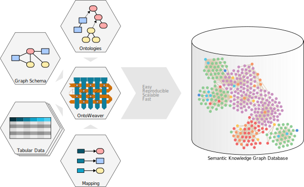

# Hands-on Building Graphs with OntoWeaver (offline mode) and Neo4j

## Overview

This tutorial demonstrates how to create a semantic knowledge graph with OntoWeaver and load it into Neo4j.

<p align="center">
  
</p>

The workflow is:

```text
CSV/TSV data
    ↓
YAML mapping
    ↓
OntoWeaver
    ↓
BioCypher offline files
    ↓
Neo4j
```

---

## Pre-requisites

| Tool | Version/Requirement | Installation Link | Notes |
|------|-------------------|------------------|------|
| Git | Any | Git Docs | For version control |
| Neo4j | 4.x or 5.x | Neo4j Desktop | For querying graphs |
| uv | >=0.7.x | uv Docs | For dependency management |
| Python | >= 3.11 | Python.org | Required for BioCypher |
| Jupyter (optional) | Any | Jupyter | Required for exploring the sample data |

---

## Project setup

```bash
mkdir tutorial-ontoweaver
cd tutorial-ontoweaver
mkdir -p config data/in
```

---

## Install OntoWeaver

```bash
python3 -m venv .venv
source .venv/bin/activate

pip install ontoweaver pandas
```

If you prefer UV, you can run:

```bash
uv sync
```

Then call the CLI with:

```bash
uv run ./src/ontoweaver/ontoweave --help
```

Check installation:

```bash
ontoweave --help
```

---

## Download the dataset

```bash
curl -L -o data/in/synthetic_protein_interactions.tsv \
https://zenodo.org/records/16902349/files/synthetic_protein_interactions.tsv
```

---

## Create the mapping

Create:

```bash
touch config/protein_interactions_mapping.yaml
```

Add:

```yaml
row: # The meaning of an entry in the input table.
   map:
      column: source
      to_subject: protein

transformers: # How to map cells to nodes and edges.
    - map: # Map a column to a node.
        column: target
        to_object: protein
        via_relation: protein protein interaction

    - map: # Map a column to a property.
        column: type
        to_property: interaction_type
        for_object: protein protein interaction

metadata: # Optional properties added to every node and edge.
    - source: "Synthetic protein interaction dataset"
    - version: "tutorial-example"
```

---

## Mapping structure explanation

```yaml
row: # The meaning of an entry in the input table.
   map:
      column: <column name in your CSV>
      to_subject: <ontology node type to use for representing a row>

transformers: # How to map cells to nodes and edges.
    - map: # Map a column to a node.
        column: <column name>
        to_object: <ontology node type to use for representing a column>
        via_relation: <edge type for linking subject and object nodes>

    - map: # Map a column to a property.
        column: <another name>
        to_property: <property name>
        for_object: <type holding the property>

metadata: # Optional properties added to every node and edge.
    - source: "My OntoWeaver adapter"
    - version: "v1.2.3"
```

---

## Create the schema

Create:

```bash
touch config/schema_config.yaml
```

Add:

```yaml
protein:
  represented_as: node
  input_label: protein

protein protein interaction:
  represented_as: edge
  input_label: protein protein interaction
  properties:
    interaction_type: str
```

---

## Configure Neo4j offline output

Create:

```bash
touch config/biocypher_config.yaml
```

Add:

```yaml
biocypher:
  offline: true
  schema_config_path: config/schema_config.yaml

neo4j:
  database_name: neo4j
  delimiter: '\t'
  array_delimiter: '|'
  import_call_bin_prefix: /PATH/TO/NEO4J/bin/
```

The path should point to the folder containing `neo4j-admin`. If your Neo4j path contains spaces, wrap the path in quotes or create a symlink without spaces.

---

## Run OntoWeaver

```bash
ontoweave \
  --biocypher-config config/biocypher_config.yaml \
  --biocypher-schema config/schema_config.yaml \
  data/in/synthetic_protein_interactions.tsv:config/protein_interactions_mapping.yaml
```

Output files will be generated in:

```text
biocypher-out/<timestamp>/
```

---

## Import into Neo4j

Stop Neo4j:

```bash
/path/to/neo4j/bin/neo4j stop
```

!!! warning "Neo4j Java version"

    Recent Neo4j versions may require Java 21 or newer for offline imports.

    Check your Java version:

    ```bash
    java -version
    ```

    If needed, install and activate Java 21 before running
    `neo4j-admin-import-call.sh`.

Run the import script:

```bash
bash biocypher-out/<timestamp>/neo4j-admin-import-call.sh
```

Start Neo4j:

```bash
/path/to/neo4j/bin/neo4j start
```

---

## Query the graph

```cypher
MATCH (n)
RETURN n
LIMIT 25;
```

```cypher
MATCH (a)-[r]->(b)
RETURN a, r, b
LIMIT 25;
```

---

## Summary

In this tutorial, you:

- installed OntoWeaver,
- downloaded a dataset,
- created a mapping,
- created a schema,
- configured Neo4j offline output,
- generated import files,
- imported the graph into Neo4j,
- queried the graph.
