---
tags:
  - beginner
---

# Hands-on Building Graphs with OntoWeaver, BioCypher and Neo4j

## Overview

This tutorial will help you get started with OntoWeaver as a replacement for an adapter in BioCypher, thus creating knowledge graphs automatically. You will learn how to use OntoWevaer to create a simple knowledge graph with a synthetic dataset that contains information about proteins and its interactions.

By the end of this tutorial, you will be able to:

- Set up OntoWeaver for a basic project.
- Explore a synthetic dataset and how to obtain a graph model from it.
- Build a small knowledge graph from the data.
- View and query the graph using Neo4j.

<figure markdown="span">
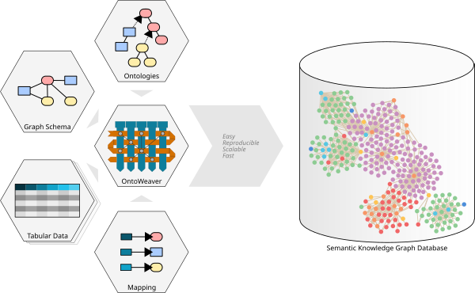{ width="800" }
<figcaption>Use OntoWeaver to create a semantic knowledge graph from relational data using a yaml-based no-code approach.</figcaption>
</figure>

The workflow in this tutorial is:

```text
CSV/TSV data
    ↓
YAML mapping
    ↓
OntoWeaver
    ↓
BioCypher offline files
    ↓
Neo4j
```

## Pre-requisites

> **Note:** Ensure you have the following prerequisites before continue with the tutorial.

| Tool               | Version/Requirement | Installation Link                                                  | Notes                                  |
| ------------------ | ------------------- | ------------------------------------------------------------------ | -------------------------------------- |
| Git                | Any                 | [Git Docs](https://git-scm.com/downloads)                          | For version control                    |
| Neo4j              | >=1.6               | [Neo4j Desktop](https://neo4j.com/download/)                       | For querying graphs                    |
| uv                 | >=0.7.x             | [uv Docs](https://docs.astral.sh/uv/getting-started/installation/) | For dependency management              |
| Python             | >= 3.11             | [Python.org](https://www.python.org/downloads/)                    | Required for BioCypher                 |
| Jupyter (optional) | Any                 | [Jupter](https://jupyter.org/)                                     | Required for exploring the sample data |


## Setup

### Setup Python project

In this section, you will set up your working environment. 

1. Create a folder that will become your repository for our OntoWeaver adapter with the correct folder structure:

```bash
mkdir tutorial-ontoweaver
cd tutorial-ontoweaver
mkdir -p config data/in
```
Here, the folder `config` will contain all the configuration (schema) files, while the folder `data/in` will contain the tabular data that will be converted into a semantic knowledge graph. 

2. Install the dependencies using your preferred package manager (e.g. uv, Poetry or pip):

You should always first create a dedicated Python environment for your project, and then install the dependencies into the environment. Environments can be managed by [conda](https://docs.conda.io/projects/conda/en/stable/user-guide/tasks/manage-environments.html), [uv](https://docs.astral.sh/uv/pip/environments/) ,[poetry](https://python-poetry.org/docs/managing-environments/) or [venv](https://docs.python.org/3/library/venv.html), for example.

After you have created your environment, activate the environment and install the required packages using your preferred package manager.

**Using uv: (recommended)**
```bash
uv add ontoweaver
uv sync
```

**Using pip:**
```bash
pip install ontoweaver
```

You also need to install Jupyter into your environment, i.e. `pip install jupyter`, if later you want to explore the sample data in a Jupyter notebook.

3. Test the OntoWeaver installation:

You can test if OntoWeaver is installed correctly by calling the CLI with:

```bash
uv run ontoweave --help
```
if you are using uv, or 
```bash
ontoweave --help
```
for a pip installation.

### Setup Neo4j
> **Note:**

In this section, we will create a Neo4j instance to use later in the tutorial. It is important to set this up now.

1. Execute Neo4j Desktop, if this the first time you should see a window like this one.

    <figure markdown="span">
    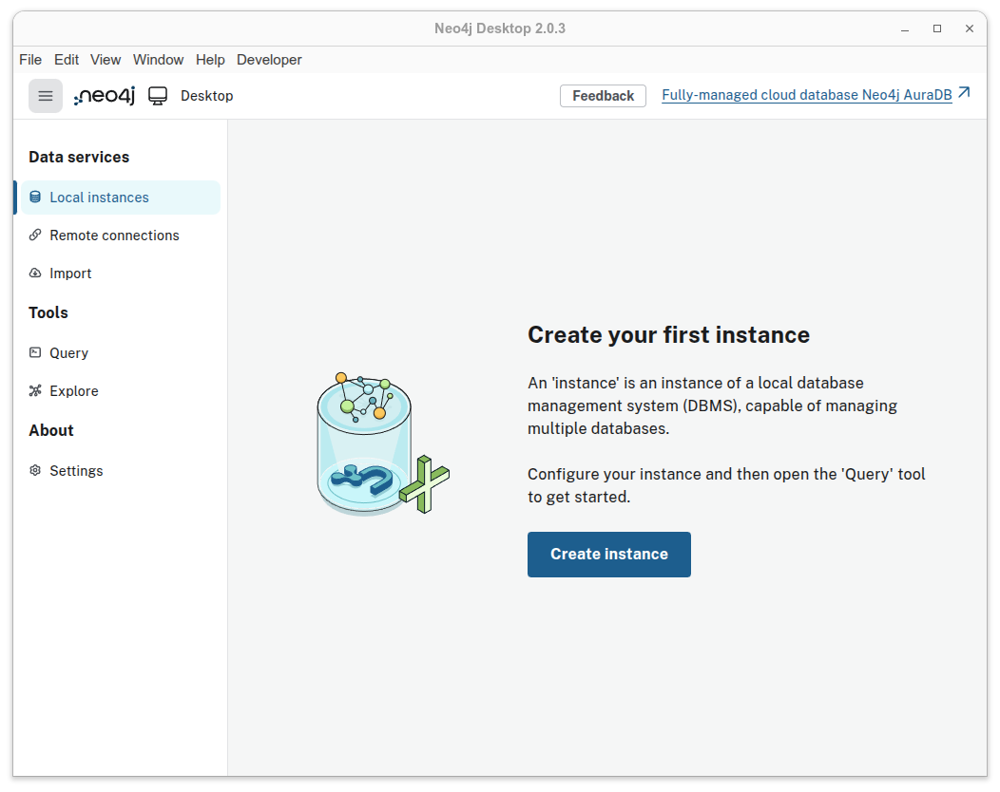{ width="800" }
    <figcaption>Figure 1. Neo4j Desktop start screen.</figcaption>
    </figure>

2. Create a new instance in Neo4j. For this tutorial, name it `neo4j-tutorial-instance` and choose a password you can remember.

    <figure markdown="span">
    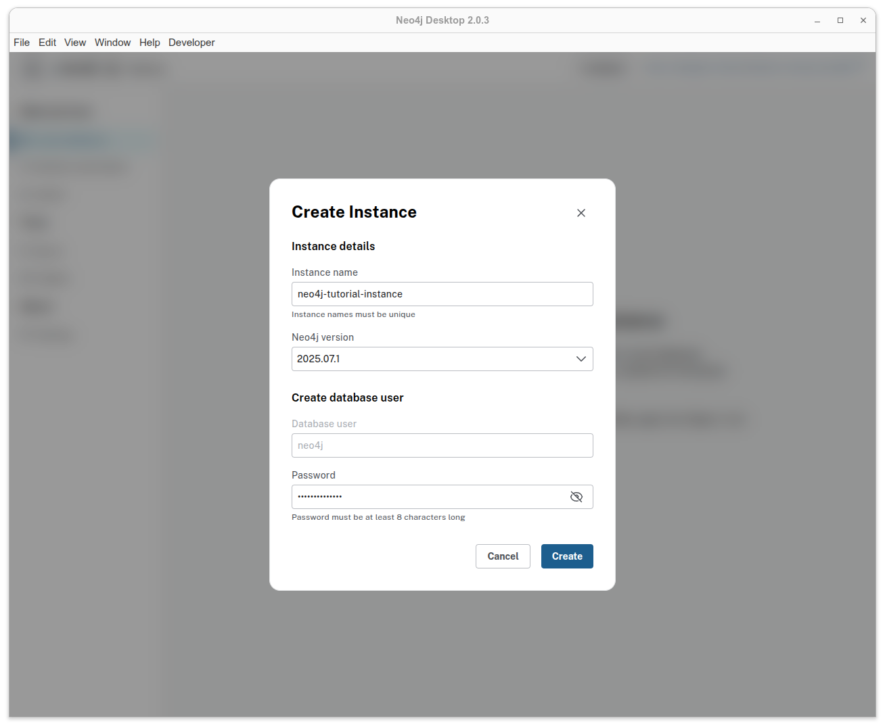{ width="800" }
    <figcaption>Figure 2. Create Instance window. This may vary depending on your Neo4j version.</figcaption>
    </figure>

3. Access details in the option *Overview*.

    <figure markdown="span">
    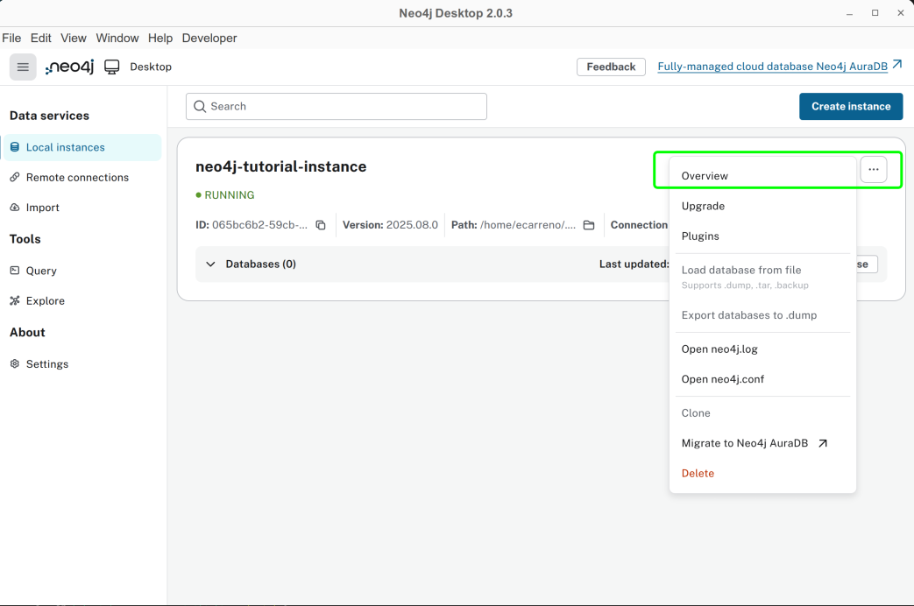{ width="800" }
    <figcaption>Figure 3. *Overview* option to check details related to your Neo4j instance.</figcaption>
    </figure>

4. Save the path to your Neo4j instance, we are going to use this path later in this tutorial.

    <figure markdown="span">
    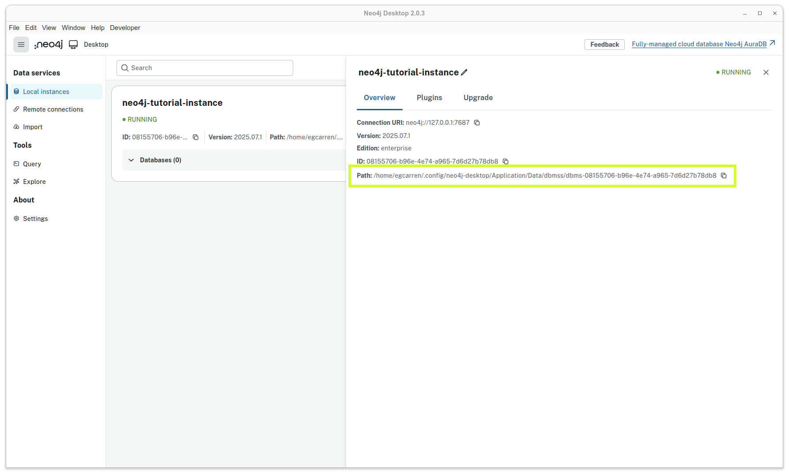{ width="800" }
    <figcaption>Figure 4. Neo4j instance with its path location highlighted.</figcaption>
    </figure>


## Section 1. Exploratory Data Analysis

For this tutorial we are going to use a [synthetic dataset](https://zenodo.org/records/16902349) that contains information about the interaction between proteins. The dataset is contained in a `tsv` file, similar to a `csv` file but using tabs instead of commas as delimiters.

- First, download the dataset:

    ```bash
    curl -o ./data/in/synthetic_protein_interactions.tsv \
    https://zenodo.org/records/16902349/files/synthetic_protein_interactions.tsv
    ```

- Create a folder called `notebooks`
    ```bash
    mkdir -p ./notebooks/
    ```
- Create and run either a Python file or a Jupyter notebook containing the following code.

    ??? example "**File: `notebooks/eda_synthetic_data.py`**"

        ```python
        import pandas as pd

        # Load the dataset
        df = pd.read_table('../data/in/synthetic_protein_interactions.tsv', sep='\t')

        # Show the first few rows
        print("\n---- First 10 rows in the dataset")
        print(df.head(10))

        # List the columns in the dataset
        print("\n---- Columns in the dataset")
        for column in df.columns:
            print(f"\t{column}")

        # Get basic info about the datasets
        print("\n---- Summary Dataframe")
        print(df.info())

        # Check for missing values
        print("\n---- Check missing values")
        print(df.isnull().sum())

        # Show summary statistics for numeric columns
        print("\n---- Describe Dataframe statistics")
        print(df.describe())

        # Count the unique number of proteins in each column
        print("\n---- Number of unique proteins per column.")
        print('Unique proteins in column protein_a:', df['source'].nunique())
        print('Unique proteins in column protein_b:', df['target'].nunique())

        ```

> 📝 **Exercise:**
>
> a. How many unique proteins do we have in the dataset? Hint: count unique proteins in the source and target columns.
>
> b. How many interactions exist in our dataset? Hint: count unique interactions between sources and targets.
>
> c. Some columns contain boolean values represented as "1" and "0". Can you detect which ones?

??? success "Answer:"
    a. Number of unique proteins: 15.

    b. Number of unique interactions: there are 22 unique interactions. One interaction is repeated, with a difference in one of its properties.

    c. `is_directed`, `is_stimulation`, `is_inhibition`, `consensus_direction`, `consensus_stimulation`,`consensus_inhibition`.


## Section 2. Graph Modeling
### Graph Modeling

By looking at the `tsv` file, we can see that there are two columns called `source` and `target`, which represent proteins. This means that each row represents an interaction between a source protein and a target protein. For now, our graph could look like this.

<figure markdown="span">
{ width="400" }
<figcaption>Figure 5. Simple graph model for representing interactions between proteins.</figcaption>
</figure>

Can we improve the graph? Absolutely! Understanding the data is essential for building an effective graph. By examining the other columns in the table, we can identify additional details:

- The `source` and `target` columns represent **nodes** in the graph, with each node corresponding to a protein.

- Each protein listed in the `source` column has associated properties found in other columns:
    - `source_genesymbol`: the gene symbol of the source protein.
    - `ncbi_tax_id_source`: the NCBI taxonomy identifier of the source protein.
    - `entity_type_source`: the type of entity for the source protein.

- Each protein in the `target` column has associated properties found in other columns:
    - `target_genesymbol`
    - `ncbi_tax_id_target`
    - `entity_type_target`

<figure markdown="span">
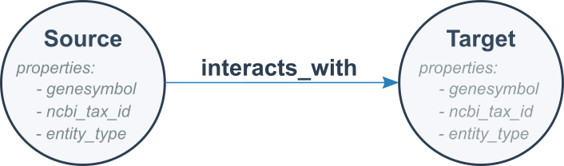{ width="400" }
<figcaption>Figure 6. Simple protein interaction graph with properties in nodes.</figcaption>
</figure>

We know that a `source` protein interacts with a `target` protein, but do we know **how**?

Remaining columns in the table describe properties of these protein-protein interactions:

**Interaction properties**

- `is_directed`
- `is_stimulation`
- `is_inhibition`
- `consensus direction`
- `consensus stimulation`
- `consensus inhibition`
- `type`

It is these protein-protein interactions that form the **edges** in the graph. Here, `is_directed`, `is_stimulation`, and `is_inhibition` describe properties that characterize each interaction `type`, while `consensus direction`, `consensus stimulation`, and `consensus inhibition` indicate the aggregated or consensus value derived from multiple sources in OmniPath for each property.

We are ready to model our second version of our graph. It is like follows:

<figure markdown="span">
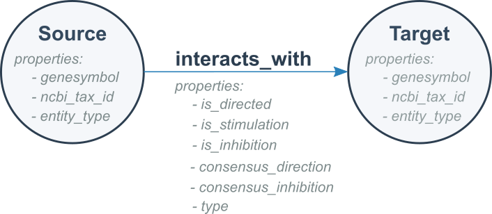{ width="400" }
<figcaption>Figure 7. Protein interaction graph showing node and edge properties.</figcaption>
</figure>

Finally, we can model a more detailed graph using our dataset. Rather than representing all interactions in a generic way, we can use the `type` field to show the specific type of interaction occurring between each pair of proteins.

<figure markdown="span">
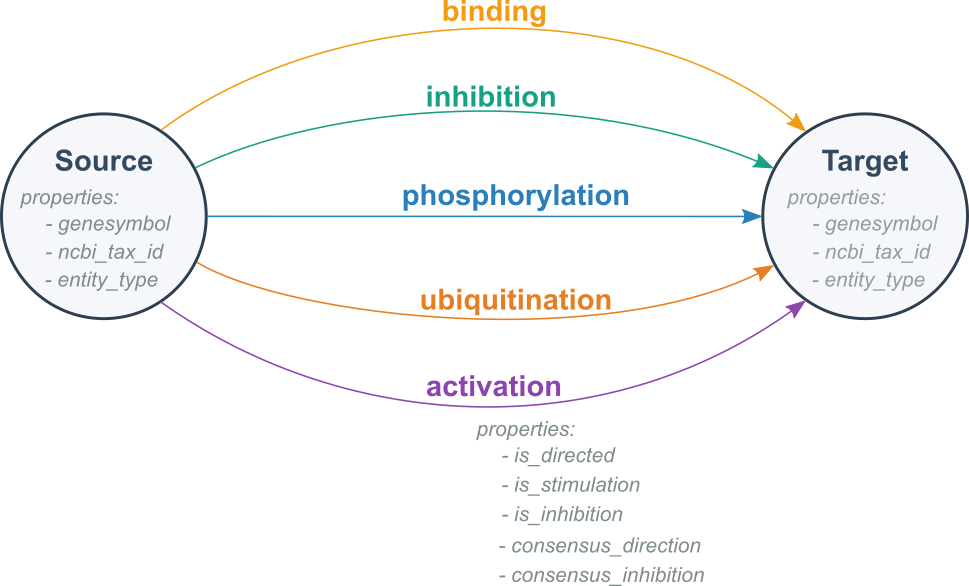{ width="550" }
<figcaption>Figure 8. Graph model for representing different interactions between proteins.</figcaption>
</figure>

### Exercise 1. Example of a graph we expect with our data

> 📝 **Exercise:**
> Sketch a portion of the knowledge graph using the provided dataset.


??? success "Answer:"
    If you include all the nodes and edges from your TSV file, your sketch should look like the following example:

    ```mermaid
    graph LR
        SOD1((SOD1))   -- binding --> EGFR((EGFR))
        CDK1((CDK1))   -- activation --> TP53((TP53))
        MYC((MYC))     -- phosporylation --> GAPDH((GAPDH))
        MTOR((MTOR))   -- ubiquitination --> NFKB1((NFKB1))
        NFKB1((NFKB1)) -- activation --> CDK1((CDK1))
        MAPK1((MAPK1)) -- ubiquitination --> HSP90((HSP90))
        TP53((TP53))     -- ubiquitination --> CREB1((CREB1))
        HSP90((HSP90)) -- activation --> APP((APP))
        HSP90((HSP90)) -- ubiquitination --> RHOA((RHOA))
        SOD1((SOD1))   -- inhibition --> TP53((TP53))
        AKT1((AKT1))   -- ubiquitination --> HSP90((HSP90))
        HSP90((HSP90)) -- ubiquitination --> MYC((MYC))
        MAPK1((MAPK1)) -- ubiquitination --> BRCA1((BRCA1))
        NFKB1((NFKB1)) -- inhibition --> RHOA((RHOA))
        NFKB1((NFKB1)) -- phosphorylation --> APP((APP))
        HSP90((HSP90)) -- binding --> GAPDH((GAPDH))
        GAPDH((GAPDH)) -- activation --> TP53((TP53))
        AKT1((AKT1))   -- phosphorylation --> TP53((TP53))
        GAPDH((GAPDH)) -- activation --> APP((APP))
        TP53((TP53))     -- activation --> MAPK1((MAPK1))
        TP53((TP53))     -- ubiquitination --> CREB1((CREB1))
        MYC((MYC))     -- phosphorylation --> GAPDH((GAPDH))
        EGFR((EGFR))   -- binding --> SOD1((SOD1))
    ```

## Section 3. Graph creation with OntoWeaver

We aim to create a knowledge graph using the data we found in the `tsv` file. Let's recap our exercise:

- Create a **graph** with the following characteristics:
    - One node type: `Protein`.
    - Five edge types: `activation`, `binding`, `inhibition`, `phosphorylation`, `ubiquitination`.

- Each **node** has properties:
    - *genesymbol*
    - *ncbi_tax_id*
    - *entity_type*

- Each **edge** has properties:
    - *is_directed*
    - *is_stimulation*
    - *is_inhibition*
    - *consensus_direction*
    - *consensus_stimulation*
    - *consensus_inhibition*

- We must export the knowledge graph to Neo4j.

To achieve this, we can divide the process into three sections:

1. [Configuration](#step-1-configuration).
    - [Schema configuration](#create-a-schema-for-your-graph)
    - [BioCypher configuration](#configure-biocypher-behavior)

2. [Mapping](#step-2-mapping).
     - Map the columns to types in the ontology
     - Process data
     - Stream processed data

3. [Create the knowledge graph by running OntoWeaver](#step-3-create-the-knowledge-graph-by-running-ontoweaver)


### Step 1. Configuration


<figure markdown="span">
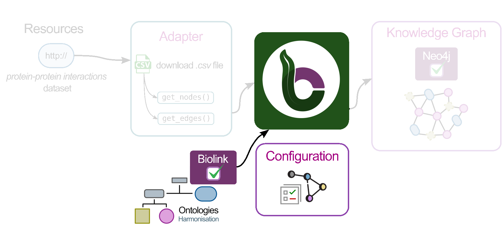{ width="1000" }
<figcaption>Figure 9. Configuration step in the BioCypher pipeline.</figcaption>
</figure>

#### Create a schema for your graph

**Rationale:** the schema file allows us to define the skeleton for our knowledge graph. Nodes, edges, properties are defined here.

The following is an example of how our schema file should look like, all of this is based on how we defined the graph structure (nodes, edges and their properties).

??? example "**File: `config/schema_config.yaml`**"

    ```yaml
    #-------------------------------------------------------------------
    #-------------------------      NODES      -------------------------
    #-------------------------------------------------------------------
    #=========    PARENT NODES
    protein:
        represented_as: node
        preferred_id: uniprot
        input_label: uniprot_protein

    #-------------------------------------------------------------------
    #------------------      RELATIONSHIPS (EDGES)     -----------------
    #-------------------------------------------------------------------
    #=========    PARENT EDGES
    protein protein interaction:
        is_a: pairwise molecular interaction
        represented_as: edge
        input_label: protein_protein_interaction
        properties:
            is_directed: bool
            is_stimulation: bool
            is_inhibition: bool
            consensus_direction: bool
            consensus_stimulation: bool
            consensus_inhibition: bool

    #=========    INHERITED EDGES
    binding:
        is_a: protein protein interaction
        inherit_properties: true
        represented_as: edge
        input_label: binding

    # ...rest of schema_config.yaml omitted for brevity...
    ```

##### Nodes

The `protein` top-level key in the YAML snippet identifies our entity and connects it to the ontological backbone.

| Key              | Value             | Description                                                                                                                                               |
| ---------------- | ----------------- | --------------------------------------------------------------------------------------------------------------------------------------------------------- |
| `represented_as` | `node`            | Specifies how BioCypher should represent each entity in the graph; in this case, as a node.                                                               |
| `preferred_id`   | `uniprot`         | Defines a namespace for our proteins. In this example, all proteins follow the UniProt convention—a 5-character alphanumeric string (e.g., P00533).       |
| `input_label`    | `uniprot_protein` | Indicates the expected label in the node tuple. All other input nodes without this label are ignored unless they are defined in the schema configuration. |

For more information about which other keywords you can use to configure your nodes in the schema file consult [Fields reference](https://biocypher.org/BioCypher/reference/schema-config/#fields-reference).


##### Edges (relationships)

As shown in [Figure 7](#graph-modeling), each edge has the same set of properties (`is_directed`, `consensus_direction`, etc.). At this stage, we have two options for defining the edges:

- Option 1: Create each edge and explicitly define the same set of property fields for every edge.

??? example "**File: `config/schema_config.yaml`**"

    ```yaml
    #-------------------------------------------------------------------
    #------------------      RELATIONSHIPS (EDGES)     -----------------
    #-------------------------------------------------------------------
    activation:
        is_a: pairwise molecular interaction
        represented_as: edge
        input_label: protein_protein_interaction
        properties:
            is_directed: bool
            is_stimulation: bool
            is_inhibition: bool
            consensus_direction: bool
            consensus_stimulation: bool
            consensus_inhibition: bool

    binding:
        is_a: pairwise molecular interaction
        represented_as: edge
        input_label: protein_protein_interaction
        properties:
            is_directed: bool
            is_stimulation: bool
            is_inhibition: bool
            consensus_direction: bool
            consensus_stimulation: bool
            consensus_inhibition: bool

    # ...rest of schema_config.yaml omitted for brevity...
    ```

- Option 2 (**recommended**): Create a base edge with the properties, and then create edges that inherit the behavior of this base edge. This approach reduces lines of code and avoids repetition. For example, if you have more than 20 edges, Option 1 would likely not be practical.

??? example "**File: `config/schema_config.yaml`**"

    ```yaml
    #-------------------------------------------------------------------
    #------------------      RELATIONSHIPS (EDGES)     -----------------
    #-------------------------------------------------------------------uniprot
    #====   BASE EDGE or PARENT EDGE
    protein protein interaction:
        is_a: pairwise molecular interaction
        represented_as: edge
        input_label: protein_protein_interaction
        properties:
            is_directed: bool
            is_stimulation: bool
            is_inhibition: bool
            consensus_direction: bool
            consensus_stimulation: bool
            consensus_inhibition: bool

    #====   INHERITED EDGES
    activation:
        is_a: protein protein interaction
        inherit_properties: true
        represented_as: edge
        input_label: activation

    binding:
        is_a: protein protein interaction
        inherit_properties: true
        represented_as: edge
        input_label: binding

    # ...rest of schema_config.yaml omitted for brevity...
    ```

Let's explain the keys and values for the second case (Option 2), because we are going to use the second option approach.

**Base Edge**
The `protein protein interaction` top-level key in the YAML snippet identifies our edge entity.

| Key              | Value                                             | Description                                                                                             |
| ---------------- | ------------------------------------------------- | ------------------------------------------------------------------------------------------------------- |
| `is_a`           | `pairwise molecular interaction`                  | Defines the type of entity based on the ontology.                                                       |
| `represented_as` | `edge`                                            | Explicitly specifies that this entity is an edge.                                                       |
| `input_label`    | `protein_protein_interaction`                     | Defines a namespace for our relationships.                                                              |
| `properties`     | *property*: *datatype* (i.e. `is_directed: bool`) | Contains all properties associated with this edge; each property has a name and an associated datatype. |


**Inherited Edges**
The `activation:` top-level key in the YAML snippet identifies our edge entity.

| Key                  | Value                         | Description                                                                                           |
| -------------------- | ----------------------------- | ----------------------------------------------------------------------------------------------------- |
| `is_a`               | `protein protein interaction` | Defines the type of entity; in this case, it is a child of the base edge we defined previously.       |
| `inherit_properties` | `true`                        | Indicates whether all propertuniproties defined in the base edge should be inherited.                        |
| `represented_as`     | `edge`                        | Specifies that BioCypher will treat this entity (`activation`) as an edge.                            |
| `input_label`        | `binding`                     | Specifies the expected edge label; edges without this label are ignored unless defined in the schema. |

#### A comment about the connection between BioCypher and Ontologies

In BioCypher, ontologies are integrated through the schema configuration file. This YAML file defines the structure of the graph by specifying which entities and relationships should be included. At the same time, it links those entities to the biomedical domain by aligning them with an ontological hierarchy. In this tutorial, we use the Biolink Model as the backbone of that hierarchy. The guiding principle is simple: only entities that are defined in the schema configuration **and** present in the input data are incorporated into the final knowledge graph.

Figure 10 illustrates the Biolink Model and some of its components organized in a hierarchy. Notice that entities such as *protein* (nodes) and *pairwise molecular interaction* (edges) appear both in the schema configuration and in the ontology. This alignment ensures that BioCypher graphs are not only structured consistently but also grounded in standardized biomedical concepts. For a deeper exploration of ontologies in BioCypher, see our [ontology tutorial](https://biocypher.org/BioCypher/learn/tutorials/tutorial002_handling_ontologies/).

<figure markdown="span">
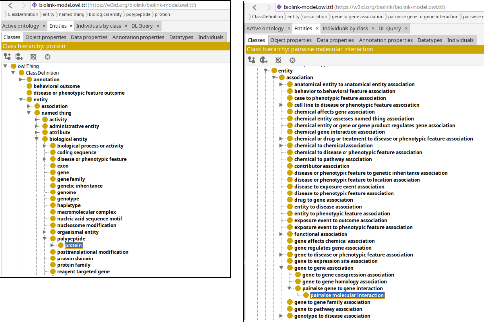{ width="1000" }
<figcaption>Figure 10. The Biolink Model as an ontology backbone. On the right, <b>protein</b> is represented as an entity; on the left, <b>pairwise molecular interaction</b> is defined as an association. Together, these demonstrate how the schema anchors graph components to standardized biomedical concepts.</figcaption>
</figure>


> 📝 **Exercise:**
> Revise and complete the `schema_config.yaml` file, and make sure it is located in the `config` folder.

??? success "Answer:"
    See the example below for a completed <code>schema_config.yaml</code>.

    **File: `config/schema_config.yaml`**

    ```yaml
    #-------------------------------------------------------------------
    #-------------------------      NODES      -------------------------
    #-------------------------------------------------------------------
    #====   PARENT NODES
    protein:
        represented_as: node
        preferred_id: uniprot
        input_label: protein

    #-------------------------------------------------------------------
    #------------------      RELATIONSHIPS (EDGES)     -----------------
    #-------------------------------------------------------------------
    #====   PARENT EDGES
    protein protein interaction:
        is_a: pairwise molecular interaction
        represented_as: edge
        input_label: protein_protein_interaction
        properties:
            is_directed: bool
            is_stimulation: bool
            is_inhibition: bool
            consensus_direction: bool
            consensus_stimulation: bool
            consensus_inhibition: bool

    #====   INHERITED EDGES
    activation:
        is_a: protein protein interaction
        inherit_properties: true
        represented_as: edge
        input_label: activation

    binding:
        is_a: protein protein interaction
        inherit_properties: true
        represented_as: edge
        input_label: binding

    inhibition:
        is_a: protein protein interaction
        inherit_properties: true
        represented_as: edge
        input_label: inhibition

    phosphorylation:
        is_a: protein protein interactionuniprot
        inherit_properties: true
        represented_as: edge
        input_label: phosphorylation

    ubiquitination:
        is_a: protein protein interaction
        inherit_properties: true
        represented_as: edge
        input_label: ubiquitination

    ```

#### Configure BioCypher behavior

**Rationale:** The purpose of writing a `biocypher_config.yaml` is to define how BioCypher should operate for your project—specifying settings for data import, graph creation, and database interaction—all in one place for clarity and easy customization.

??? example "**File: `config/biocypher_config.yaml`**"

    ```yaml
    #---------------------------------------------------------------
    #--------        BIOCYPHER GENERAL CONFIGURATION        --------
    #---------------------------------------------------------------
    biocypher:
        offline: true
        debug: false
        schema_config_path: config/schema_config.yaml
        cache_directory: .cache

        # Ontology configuration
        head_ontology:
            url: https://github.com/biolink/biolink-model/raw/v3.2.1/biolink-model.owl.ttl
            root_node: entity

    #----------------------------------------------------
    #--------        OUTPUT CONFIGURATION        --------
    #----------------------------------------------------
    neo4j:
        database_name: neo4j
        delimiter: '\t'
        array_delimiter: '|'
        skip_duplicate_nodes: true
        skip_bad_relationships: true
        import_call_bin_prefix: <path to your Neo4j instance from Setup Neo4j section>/bin/
    ```

The first block is the BioCypher Core Settings, which starts with `biocypher:`

| key                  | value                       | description                                                          |
| -------------------- | --------------------------- | -------------------------------------------------------------------- |
| `offline`            | `true`                      | Whether to run in offline mode (no running DBMS or in-memory object) |
| `debug`              | `false`                     | Whether to enable debug logging                                      |
| `schema_config_path` | `config/schema_config.yaml` | Path to the schema configuration file                                |
| `cache_directory`    | `.cache`                    | Path to the schema configuration file                                |
| `head_ontology`      | `url`, `root_node`          | Specification of the ontology to use, here: Biolink                  |


The second block is the Database Management System Settings, which starts with the name of the DBMS, in this case it's `neo4j:`

| key                      | value             | description                                          |
| ------------------------ | ----------------- | ---------------------------------------------------- |
| `delimiter`              | `'\t'`            | Field delimiter for TSV import files                 |
| `array_delimiter`        | `';'`             | Delimiter for array values                           |
| `skip_duplicate_nodes`   | `true`            | Whether to skip duplicate nodes during import        |
| `skip_bad_relationships` | `true`            | Whether to skip relationships with missing endpoints |
| `import_call_bin_prefix` | i.e., `/usr/bin/` | Prefix for the import command binary (optional)      |

The `import_call_bin_prefix` is the path to your Neo4j instance that you looked up in [section Setup Neo4j](###setup-neo4j) together with the prefix `/bin`.

The default configuration that comes with BioCypher and more configuration parameters for the Settings are listed in [BioCypher Configuration Reference](https://biocypher.org/BioCypher/reference/biocypher-config/).

> 📝 **Exercise:**
> Revise and complete the `biocypher_config.yaml` file, and make sure it is located in the `config` folder.

??? success "Answer:"
    See the example below for a completed <code>biocypher_config.yaml</code>. Note, the path in the  <code>import_call_bin_prefix</code> correspond to my personal instance, <strong>you MUST update this path with yours, do not forget to add /bin/</strong> as in my example

    **File: `biocypher_config.yaml`**

    ```yaml
    #---------------------------------------------------------------
    #--------        BIOCYPHER GENERAL CONFIGURATION        --------
    #---------------------------------------------------------------
    biocypher:
        offline: true
        debug: false
        schema_config_path: config/schema_config.yaml
        cache_directory: .cache

        # Ontology configuration
        head_ontology:
            url: https://github.com/biolink/biolink-model/raw/v3.2.1/biolink-model.owl.ttl
            root_node: entity# Map a column to an edge.

    #----------------------------------------------------
    #--------        OUTPUT CONFIGURATION        --------
    #----------------------------------------------------
    neo4j:
        database_name: neo4j
        delimiter: '\t'
        array_delimiter: '|'
        skip_duplicate_nodes: true
        skip_bad_relationships: true
        import_call_bin_prefix: /home/egcarren/.config/neo4j-desktop/Application/Data/dbmss/dbms-08155706-b96e-4e74-a965-7d6d27b78db8/bin/
    ```

### Step 2. Create the mapping

**Rationale:** The purpose of creating a mapping is to define how OntoWeaver should prepare the data for the knowledge graph creation with OntoWeaver.

In the Python UI track, the knowledge graph is created from the relational data using an adapter, that is, Python code. OntoWeaver offers a pathway to sidestepping this adapter by using a mapping. The mapping indicates what column of the table shall map on which type of the ontology.

We need to create a mapping file in the `config` folder, that contains information like

??? example "**File: `config/protein_interactions_mapping.yaml`**"

    ```yaml
    row: # The meaning of an entry in the input table.
      map:
        column: source
        to_subject: protein

    transformers: # How to map cells to nodes and edges.
      - map: # Map a column to a node.
            column: target
            to_object: protein
            via_relation: protein protein interaction
      - map: # Map a column to an edge.
            column: is_directed
            to_property: is_directed
            for_object: protein protein interaction
      - map: # Map a column to an edge.
            column: is_stimulation
            to_property: is_stimulation
            for_object: protein protein interaction

    metadata: # Optional properties added to every node and edge.
      - source: "Synthetic protein interaction dataset"
      - version: "tutorial-example-ontoweaver"
    ```

The first block is maps the rows and starts with `row`: This mapping explains the meaning of each row in the input table. In this case, each row of the column `source` in the tabular data is mapped to `protein`.

The section `transformers` then links the other nodes to it using the described transformations.

Consult the full [mapping reference](https://ontoweaver.readthedocs.io/en/latest/sections/mapping_api.html) for more information.

## Mapping structure explanation

```yaml
row: # The meaning of an entry in the input table.
   map:
      column: <column name in your CSV>
      to_subject: <ontology node type to use for representing a row>

transformers: # How to map cells to nodes and edges.
    - map: # Map a column to a node.
        column: <column name>
        to_object: <ontology node type to use for representing a column>
        via_relation: <edge type for linking subject and object nodes>

    - map: # Map a column to a property.
        column: <another name>
        to_property: <property name>
        for_object: <type holding the property>

metadata: # Optional properties added to every node and edge.
    - source: "My OntoWeaver adapter"
    - version: "v1.2.3"
```

> 📝 **Exercise:**
> Revise and complete the `protein_interactions_mapping.yaml` file, and make sure it is located in the `config` folder.

??? success "Answer:"
    See the example below for a completed <code>protein_interactions_mapping.yaml</code>.

    **File: `protein_interactions_mapping.yaml`**

    ```yaml
    row: # The meaning of an entry in the input table.
       map:
          column: source
          to_subject: protein

    transformers: # How to map cells to nodes and edges.
        - map: # Map a column to a node.
            column: target
            to_object: protein
            via_relation: protein_protein_interaction
        - map: # Map a column to an edge.
            column: is_directed
            to_property: is_directed
            for_object: protein_protein_interaction
        - map:
            column: is_stimulation
            to_property: is_stimulation
            for_object: protein_protein_interaction
        - map:
            column: is_inhibition
            to_property: is_inhibition
            for_object: protein_protein_interaction
        - map:
            column: consensus_direction
            to_property: consensus_direction
            for_object: protein_protein_interaction
        - map:
            column: consensus_stimulation
            to_property: consensus_stimulation
            for_object: protein_protein_interaction
        - map:
            column: consensus_inhibition
            to_property: consensus_inhibition
            for_object: protein_protein_interaction
        - map:
            column: source_genesymbol
            to_property: genesymbol
            for_subject: protein
        - map:
            column: ncbi_tax_id_source
            to_property: ncbi_tax_id
            for_subject: protein
        - map:
            column: entity_type_source
            to_property: entity_type
            for_subject: protein
        - map:
            column: target_genesymbol
            to_property: genesymbol
            for_object: protein
        - map:
            column: ncbi_tax_id_target
            to_property: ncbi_tax_id
            for_object: protein
        - map:
            column: entity_type_target
            to_property: entity_type
            for_object: protein

    metadata: # Optional properties added to every node and edge.
        - source: "Synthetic protein interaction dataset"
        - version: "tutorial-example"
    ```


## Step 3. Create the knowledge graph by running OntoWeaver

**Rationale:** OntoWeaver will use the mapping and the ontology that are provided to create the required input for BioCypher, and run BioCypher.

Run Ontoweaver with the following command:

```bash
ontoweave \
  --biocypher-config config/biocypher_config.yaml \
  --biocypher-schema config/schema_config.yaml \
  data/in/synthetic_protein_interactions.tsv:config/protein_interactions_mapping.yaml
```
This triggers the command-line interface to OntoWeaver and passes the necessary configuration files. You should see an output like
```
INFO -- This is BioCypher v0.15.0.
INFO -- Logging into `biocypher-log/biocypher-20260603-091220.log`.
WARNING:ontoweaver:Skip output validation for columns: `target`. This could result in some empty or `nan` nodes. To enable output validation set `validate_output` to `True`.
WARNING -- Neo4j supports only edge_labels_order: 'Leaves', I'll set it for you, but you should fix your configuration file in the `neo4j` section.
WARNING:biocypher:Neo4j supports only edge_labels_order: 'Leaves', I'll set it for you, but you should fix your configuration file in the `neo4j` section.
/home/inga/projects/biocypher/adapters/ontoweaver-adapter/biocypher-out/20260603091221/neo4j-admin-import-call.sh
```

## Section 4. Interacting with your graph using Neo4j

### Load the graph using an import script

When you create the knowledge graph with OntoWeaver and it completes successfully, it generates several CSV files and an import script to load the graph data into Neo4j.

a. Look for a folder whose name starts with `biocypher-out`. Each time you run the script, a new folder is created inside `biocypher-out` with a timestamp. Inside this folder, you should see the following:

🟨 CSV files associated to **nodes**.

🟦 CSV files associated to **edges**.

🟥 admin import script

```
/biocypher-out
└── 20250818153026
    ├── 🟦 ProteinProteinInteraction-header.csv
    ├── 🟦 ProteinProteinInteraction-part000.csv
    ├── 🟥 neo4j-admin-import-call.sh
    ├── 🟨 Protein-header.csv
    ├── 🟨 Protein-part000.csv
```

b. Stop the neo4j instance. You can do this on the GUI or in terminal. In terminal, you must locate the `neo4j` executable in the Neo4j instance path. 

```bash
<path of your Neo4j instance>/bin/neo4j stop
```

c. Run the  `neo4j-admin-import-call.sh` script in your `biocypher-output/`. **If needed, install and activate Java 21 before running** (TODO verify this is required on Windows)**:
```bash
bash ./biocypher-out/20260603085652/neo4j-admin-import-call.sh
```

!!! warning "Neo4j Java version"

    Recent Neo4j versions may require Java 21 or newer for offline imports.

    Check your Java version:

    ```bash
    java -version
    ```

d. If everything has been successfully, you should see in terminal something similar to this:

??? info "Terminal output:"

    ```
    Neo4j detected version: 2026
    Starting to import, the following output will be saved in the directory: /home/inga/neo4j_data/Application/Data/dbmss/dbms-00aec91a-7031-49e0-b119-efb693863648/logs/neo4j-admin-import-2026-06-03.08.47.52
      Logging information: import.log
      Detailed progress reporting (JSON formatted): progress.json.log
      Import data errors / violations (JSON formatted): report.json.log

    NOTE this directory will be cleared on the completion of a successful import.

    Neo4j version: 2026.04.0
    Importing the contents of these files into /home/inga/neo4j_data/Application/Data/dbmss/dbms-00aec91a-7031-49e0-b119-efb693863648/data/databases/neo4j:
    Nodes:
      /home/inga/projects/biocypher/adapters/ontoweaver-adapter/biocypher-out/20260603084611/Protein-header.csv
      /home/inga/projects/biocypher/adapters/ontoweaver-adapter/biocypher-out/20260603084611/Protein-part000.csv

    Relationships:
      null:
      /home/inga/projects/biocypher/adapters/ontoweaver-adapter/biocypher-out/20260603084611/ProteinProteinInteraction-header.csv
      /home/inga/projects/biocypher/adapters/ontoweaver-adapter/biocypher-out/20260603084611/ProteinProteinInteraction-part000.csv


    Available resources:
      Total machine memory: 30.33GiB
      Free machine memory: 15.70GiB
      Max heap memory : 910.5MiB
      Max worker threads: 16
      Configured max memory: 13.42GiB
      High parallel IO: true

    Import starting
      Page cache size: 1.992GiB
      Number of worker threads: 16
      Estimated number of nodes: 15
      Estimated number of relationships: 21

    Importing nodes
    .......... .......... .......... .......... ..........   5% ∆87ms [87ms] 
    .......... .......... .......... .......... ..........  10% ∆0ms [88ms] 
    .......... .......... .......... .......... ..........  15% ∆0ms [88ms] 
    .......... .......... .......... .......... ..........  20% ∆0ms [88ms] 
    .......... .......... .......... .......... ..........  25% ∆0ms [88ms] 
    .......... .......... .......... .......... ..........  30% ∆0ms [88ms] 
    .......... .......... .......... .......... ..........  35% ∆0ms [88ms] 
    .......... .......... .......... .......... ..........  40% ∆0ms [89ms] 
    .......... .......... .......... .......... ..........  45% ∆0ms [89ms] 
    .......... .......... .......... .......... ..........  50% ∆0ms [89ms] 
    .......... .......... .......... .......... ..........  55% ∆0ms [89ms] 
    .......... .......... .......... .......... ..........  60% ∆0ms [89ms] 
    .......... .......... .......... .......... ..........  65% ∆0ms [89ms] 
    .......... .......... .......... .......... ..........  70% ∆0ms [89ms] 
    .......... .......... .......... .......... ..........  75% ∆0ms [89ms] 
    .......... .......... .......... .......... ..........  80% ∆0ms [89ms] 
    .......... .......... .......... .......... ..........  85% ∆0ms [89ms] 
    .......... .......... .......... .......... ..........  90% ∆0ms [89ms] 
    .......... .......... .......... .......... ..........  95% ∆0ms [89ms] 
    .......... .......... .......... .......... .......... 100% ∆0ms [89ms] 
    Prepare ID mapper
    .......... .......... .......... .......... ..........   5% ∆51ms [51ms] 
    .......... .......... .......... .......... ..........  10% ∆0ms [51ms] 
    .......... .......... .......... .......... ..........  15% ∆0ms [52ms] 
    .......... .......... .......... .......... ..........  20% ∆0ms [52ms] 
    .......... .......... .......... .......... ..........  25% ∆0ms [52ms] 
    .......... .......... .......... .......... ..........  30% ∆0ms [52ms] 
    .......... .......... .......... .......... ..........  35% ∆6ms [59ms] 
    .......... .......... .......... .......... ..........  40% ∆0ms [59ms] 
    .......... .......... .......... .......... ..........  45% ∆0ms [59ms] 
    .......... .......... .......... .......... ..........  50% ∆0ms [59ms] 
    .......... .......... .......... .......... ..........  55% ∆0ms [60ms] 
    .......... .......... .......... .......... ..........  60% ∆0ms [60ms] 
    .......... .......... .......... .......... ..........  65% ∆0ms [60ms] 
    .......... .......... .......... .......... ..........  70% ∆0ms [60ms] 
    .......... .......... .......... .......... ..........  75% ∆0ms [60ms] 
    .......... .......... .......... .......... ..........  80% ∆0ms [60ms] 
    .......... .......... .......... .......... ..........  85% ∆0ms [60ms] 
    .......... .......... .......... .......... ..........  90% ∆0ms [60ms] 
    .......... .......... .......... .......... ..........  95% ∆0ms [60ms] 
    .......... .......... .......... .......... .......... 100% ∆0ms [60ms] 
    Imported Stats[processed=15, created=15, updated=0, deleted=0] nodes in 199ms
      using configuration:Configuration[numberOfWorkers=16, temporaryPath=/home/inga/neo4j_data/Application/Data/dbmss/dbms-00aec91a-7031-49e0-b119-efb693863648/data/databases/neo4j/temp, applyBatchSize=64, sorterSizeSwitchFactor=0.35]
    Importing relationships
    .......... .......... .......... .......... ..........   5% ∆38ms [38ms] 
    .......... .......... .......... .......... ..........  10% ∆0ms [38ms] 
    .......... .......... .......... .......... ..........  15% ∆0ms [38ms] 
    .......... .......... .......... .......... ..........  20% ∆0ms [38ms] 
    .......... .......... .......... .......... ..........  25% ∆0ms [38ms] 
    .......... .......... .......... .......... ..........  30% ∆0ms [38ms] 
    .......... .......... .......... .......... ..........  35% ∆0ms [38ms] 
    .......... .......... .......... .......... ..........  40% ∆0ms [38ms] 
    .......... .......... .......... .......... ..........  45% ∆0ms [38ms] 
    .......... .......... .......... .......... ..........  50% ∆0ms [39ms] 
    .......... .......... .......... .......... ..........  55% ∆0ms [39ms] 
    .......... .......... .......... .......... ..........  60% ∆0ms [39ms] 
    .......... .......... .......... .......... ..........  65% ∆0ms [39ms] 
    .......... .......... .......... .......... ..........  70% ∆0ms [39ms] 
    .......... .......... .......... .......... ..........  75% ∆0ms [39ms] 
    .......... .......... .......... .......... ..........  80% ∆0ms [39ms] 
    .......... .......... .......... .......... ..........  85% ∆0ms [39ms] 
    .......... .......... .......... .......... ..........  90% ∆0ms [39ms] 
    .......... .......... .......... .......... ..........  95% ∆0ms [39ms] 
    .......... .......... .......... .......... .......... 100% ∆0ms [39ms] 
    Imported Stats[processed=21, created=21, updated=0, deleted=0] relationships in 105ms
    Flushing stores
    Flush completed in 48ms
    IMPORT DONE in 1s 344ms.
    ```

### Visualize the graph
a. Connect to your instance by running Neo4j desktop again. Select your instance and click on "Connect" - the little arrow on the button allows you to expand a menu. Select the option *Query*.

<figure markdown="span">
{ width="1000" }
<figcaption>Figure 13. Query and Explore options to run on a Neo4j instance.</figcaption>
</figure>

b. Now, click on the asterisk under the Relationships category. You now should see your graph! Compare to the sketch you did previosly in this tutorial

<figure markdown="span">
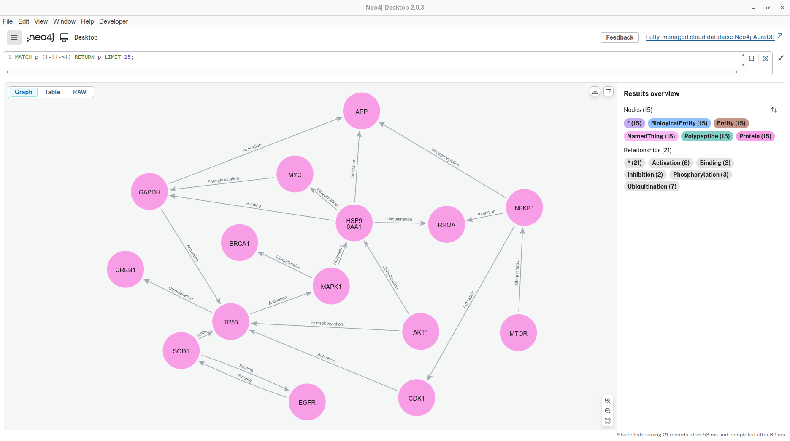{ width="1000" }
<figcaption>Figure 14. Neo4j graph based on our data.</figcaption>
</figure>


### Execute cypher queries

Try the following queries:

1. Find relationships between two nodes
```cypher
MATCH (a)-[r]->(b)
RETURN a, r, b;
```
Result:

<figure markdown="span">
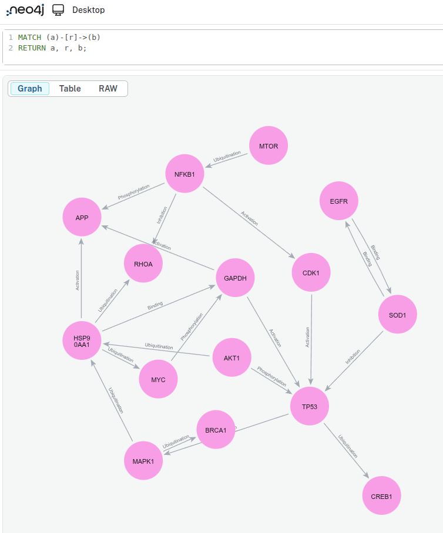{ width="500" }
</figure>

2. Find all the nodes

```cypher
MATCH (n)
RETURN n;
```
Result:

<figure markdown="span">
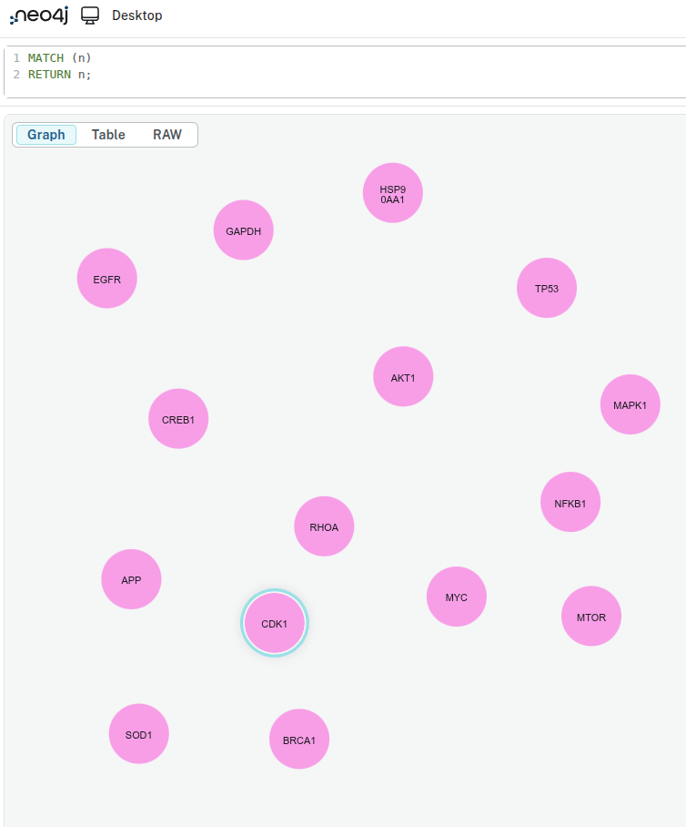{ width="500" }
</figure>

3. Find all nodes of a specific type(e.g. `Protein` in the following query)

```cypher
MATCH (n:Protein)
RETURN n;
```
Result:

<figure markdown="span">
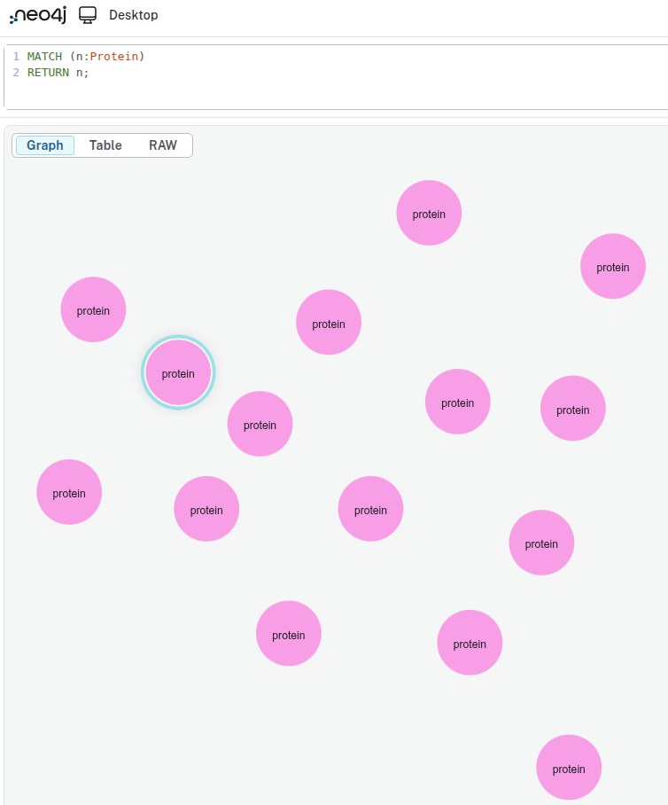{ width="500" }
</figure>

4. Find all relationships of a specific type(e.g. `Binding` in the following query)

```cypher
MATCH (a)-[r:Binding]->(b)
RETURN a, r, b;
```
Result:

<figure markdown="span">
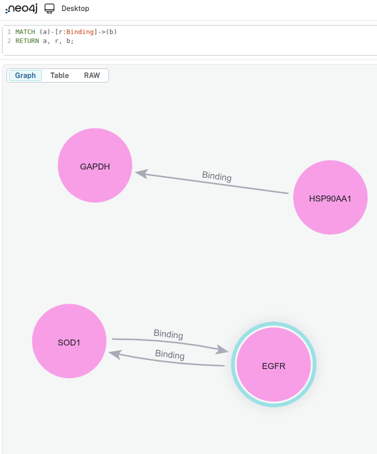{ width="500" }
</figure>

5. Count relationships of a given type(e.g. `Binding` in the following query)

```cypher
MATCH (a)-[r:Binding]->(b)
RETURN COUNT(r) AS totalBindings;
```
Result:

<figure markdown="span">
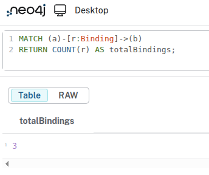{ width="250" }
</figure>

---

## Next Steps
- Explore more advanced queries and graph analytics in Neo4j.
- Try integrating additional datasets or expanding your graph model. For guidance, see the [Basics](https://biocypher.org/BioCypher/learn/tutorials/tutorial001_basics/) tutorial.
- Review the [BioCypher documentation](https://biocypher.org/) for deeper insights.

## Feedback & Contributions

If you found this tutorial helpful or have suggestions for improvement, please **open an issue** or **submit a pull request** in the [BioCypher repository](https://github.com/biocypher/biocypher/issues/new/choose). Specific feedback on examples, clarity of instructions, or missing details is especially appreciated.

---

| Last Update | Developed by                                            | Affiliation                                                                                                                                                                  |
| :---------: | :------------------------------------------------------ | ---------------------------------------------------------------------------------------------------------------------------------------------------------------------------- |
| 2026.06.03  | Inga Ulusoy (GH @iulusoy) <br> Yasamin Fazeli (GH @yasfazl) | [Scientific Software Center](https://www.ssc.uni-heidelberg.de/en) <br> [Saezlab](https://saezlab.org/) - [Scientific Software Center](https://www.ssc.uni-heidelberg.de/en) |


## Summary

In this tutorial, you:

- installed OntoWeaver,
- downloaded a dataset,
- created a mapping,
- created a schema,
- configured Neo4j offline output,
- generated import files,
- imported the graph into Neo4j,
- queried the graph.
