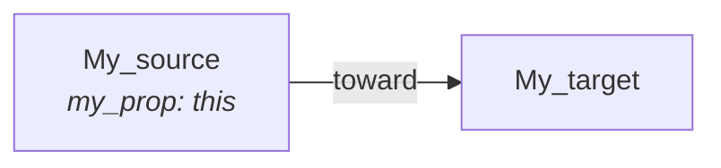
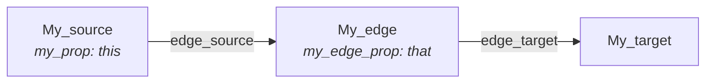

# Web Ontology Language (OWL)

The Web Ontology Language (OWL) is a (family of) knowledge representation
language(s) for authoring ontologies. BioCypher can use taxonomies written in
OWL as an input, and it can also output a knowledge graph in an OWL file.

OWL is one of the most common knowledge representation languages. It is built
on the Resource Description Framework (RDF) and is partly compatible with
the RDF Schema data model. It can be serialized in several formats (the most
well-known being XML and Turtle). The [Protégé](https://protege.stanford.edu/)
software is the *de facto* standard graphical user interface to design OWL
ontologies.

In BioCypher, selecting the `owl` output format will call the `_OWLWriter` class
and generate a self-contained OWL file. The file is said to be "self-contained"
because it holds both the vocabulary (i.e. a part of the hierarchy of classes
from the input ontology) and the instances (i.e. "nodes", for BioCypher).


## Edge Model

The behavior of edge creation in the RDF output relies mainly on the
`edge_model` parameter, which can take two values: "ObjectProperty" or
"Association".


### Note on vocabulary

To understand the following rationale, note that OWL uses a different vocabulary
than BioCypher (which is more aligned with labelled property graphs); a rough
translation is:

| BioCypher | OWL                        |
| --------- | -------------------------- |
| node      | individual                 |
| edge      | object property            |
| label     | class                      |
| property  | annotation / data property |
| ID        | label / IRI                |

!!! note "Note"
    There is a particular danger of ambiguity in the term "label"; in labelled
    property graphs, this is the type or class of entity, while in OWL it refers
    to the identifier of a single entity.

### In a nutshell

When using `edge_model: ObjectProperty`, the resulting ontology will follow
more closely the spirit of the OWL modelling approach; but the ID and the
properties attached to the edges are lost.

Example:



When using `edge_model: Association`, the edges are created as OWL individuals,
with attached annotations, and an IRI; however, this introduces two object
properties around a new individual, between pairs of individuals. This is very
similar to the "reification" that BioCypher does for relationships that are set
to `represented_as: node` in the schema configuration.

Example:




### ObjectProperty

This edge model translates BioCypher's edges into
OWL's "object properties" (if they are available under the
selected root term). Object properties are the natural way
to model edges in OWL, but they do not support annotation,
thus being incompatible with having BioCypher's "properties"
on edges.


#### Example

For instance, the following BioCypher tuples (two nodes and one edge):
```python
# Nodes:
# ID           label           properties
("My_source", "thisNodeType", {"my_prop":"this"}),
("My_target", "thatNodeType", {}),

# Edge:
# ID         source ID    target ID    properties               label
("My_edge", "My_source", "My_target", {"my_edge_prop":"that"}, "toward")
```
would be translated into the following OWL statements (here shown in the Turtle
format, not showing the taxonomy ancestors):
```turtle
# Declaration of types:
:toward a owl:ObjectProperty ;
    rdfs:range :thisNodeType ;
    rdfs:domain :thatNodetype ;
    rdfs:subPropertyOf owl:topObjectProperty ;

# Actual data:
:My_source a :thisNodeType, owl:NamedIndividual ;
    biocypher:my_prop "this" ;
    :toward :My_target

:My_target a :thatNodeType, owl:NamedIndividual ;
```
Note how the properties of the edge are lost.


#### Root node and ObjectProperty

As most OWL files do not model a common term on top of both
`owl:topObjectProperty` and `owl:Thing`, you may need to ensure
that the input OWL contains a "meta-root", that is, a
common ancestor honoring both:

- owl:Thing rdfs:subClassOf <root_node>
- owl:topObjectProperty rdfs:subPropertyOf <root_node>

It is this meta-root that you should select as a `root_node` in your BioCypher
configuration.

For example, a classical OWL taxonomy is often structured like:
```
 - owl:Thing
   ├ Entity
   ├ My_class
   └ etc.
 - owl:topObjectProperty
   ├ My_link_type
   └ etc.
```

To allow BioCypher to "see" both the `owl:Thing` and `owl:topObjectProperty`
subtrees, you need to add your own root node:
```
- my_meta_root
  ├ owl:Thing
  │ ├ Entity
  │ ├ My_class
  │ └ etc.
  └ owl:topObjectProperty
    ├ My_link_type
    └ etc.
```
and then set `root_node: my_meta_root` in BioCypher's configuration.


### Association

This edge model (the default) translates BioCypher's
edges into OWL's class instances. Those edge instances are
inserted in between the instances coming from BioCypher's nodes.
This allows to retain edge properties, but adds OWL instances
to model relationships, which does not follow the classical
OWL model.

In this approach, all OWL instances are linked
with a generic "edge\_source" (linking source instance to
the association instance) and "edge\_target" (linking the association
instance to the target instance). Both inherit from "edge"
and are in the biocypher namespace.


#### Example

For instance, the following BioCypher tuples (two nodes and one edge):
```python
# Nodes:
# ID           label           properties
("My_source", "thisNodeType", {"my_prop":"this"}),
("My_target", "thatNodeType", {}),

# Edges:
# ID         source ID    target ID    properties               label
("My_edge", "My_source", "My_target", {"my_edge_prop":"that"}, "toward")
```
would be translated into the following OWL statements (here shown in the Turtle
format, not showing the taxonomy ancestors):
```turtle
# Declaration of BioCypher's generic edge types:
biocypher:edge a owl:ObjectProperty ;
    rdfs:subPropertyOf owl:topObjectProperty ;

biocypher:edge_source a biocypher:edge ;

biocypher:edge_target a biocypher:edge ;

# The edge type becomes an OWL class:
:toward a owl:Class ;

# Actual data:
:My_source a :thisNodeType, owl:NamedIndividual ;
    biocypher:my_prop "this" ;

:My_target a :thatNodeType, owl:NamedIndividual ;

# An edge is an OWL individual, with properties:
:My_edge a :toward, owl:NamedIndividual ;
    biocypher:edge_source :My_source ;
    biocypher:edge_target :My_target ;
    biocypher:my_edge_prop "that" ;
```
Note how the properties of the edge are kept.


#### Root node and Association

If you use this edge model, you may select one of the subclasses of
owl:Thing as a `root_node`, and not select any part of the object property tree.

For instance, if you have a taxonomy with a common root node, the "Association"
edge model only requires that you select a subclass of owl:Thing, and you do not
need to select the meta root:
```
- my_meta_root
  ├ owl:Thing   <= it is only necessary to use `root_node: Thing`
  │ ├ Entity
  │ ├ My_class
  │ └ etc.
  └ owl:topObjectProperty  <= This subtree will not be used.
    ├ My_link_type
    └ etc.
```


## Taxonomy Management

This class takes care of keeping the vocabulary underneath the
selected root node and exports it along the instances in the
resulting OWL file. It discards all terms that are not in the
tree below the selected root node.

The configuration parameter `rdf_namespaces` can be used to specify which
namespaces exist in the input ontology (or the data). If the data contain IDs
with a given prefix, they will be converted into valid Internationalized
Resource Identifiers (IRI) to allow referencing. If no namespace is specified,
BioCypher will search for them in the input ontology.


## Settings

Important parameters are:

- `root_node`, which must be a meta-root on top of both owl:Thing and
  owl:topObjectProperty.
- `edge_model` heavily impacts the output ontology, most notably the graph
  structure, and thus the queries that can be made on it (see above).
- `file_stem` is the name of the output file (without the extension or the path)
  which will be written in the output directory.
- `file_format` is the output serialization format. Note that if set to "turtle",
  the output file extension will be ".ttl".

### For the ObjectProperty edge model

```yaml
:caption: biocypher_config.yaml

biocypher:
    strict_mode: true
    schema_config_path: config/schema_config.yaml
    dbms: owl # <- Use the OWL output writer.

    head_ontology:
        url: file:///home/superb/owl_file.ttl
        root_node: BioCypherRoot # <- The "meta-root" class.

owl:
    file_format: turtle
    # Can be either: xml, n3, turtle or ttl, nt, pretty-xml, trix, trig, nquads, json-ld

    edge_model: ObjectProperty
    # Can also be: Association (the default)

    file_stem: my_ontology # "biocypher" by default, do not put an extension

    # Optional:
    rdf_namespaces:
        so: http://purl.obolibrary.org/obo/SO_
        efo: http://www.ebi.ac.uk/efo/EFO_
```

### For the Association edge model

```yaml
:caption: biocypher_config.yaml

biocypher:
    strict_mode: true
    schema_config_path: config/schema_config.yaml
    dbms: owl # <- Use the OWL output writer.

    head_ontology:
        url: file:///home/superb/owl_file.ttl
        root_node: Entity # <- NOT the meta-root!

owl:
    file_format: turtle
    # Can be either: xml, n3, turtle or ttl, nt, pretty-xml, trix, trig, nquads, json-ld

    edge_model: Association

    file_stem: my_ontology # "biocypher" by default, do not put an extension

    # Optional:
    rdf_namespaces:
        so: http://purl.obolibrary.org/obo/SO_
        efo: http://www.ebi.ac.uk/efo/EFO_
```

## Possible Issues

BioCypher is not able to read all OWL ontologies, and not all of the terms
hosted in an OWL ontology. Most notably, it only reads (a part of) the taxonomy
to build up its input. Some logical predicates may also be incompatible with
the selected edge model (especially "Association").

Note that Protégé may show a couple of impediments:

- It displays owl:Entity as if it inherits from owl:Thing, but that is not
  necessarily actually implemented by a predicate. You may have to add it
  manually.
- It displays all owl:ObjectProperty as if they inherit from
  owl:topObjectProperty, but you may also have to add the predicate manually.
- It provides no easy way to add a meta-root on top of both classes, and a
  manually added one will appear as a *subclass* of both owl:Thing and
  owl:topObjectProperty.

Double-checking the ontology file source code itself should help you ensure
compatibility with BioCypher's constraints.

Also, note that BioCypher requires that classes (and object properties) have an
RDFS label, and will use it (and not the IRI) to find the necessary types.
